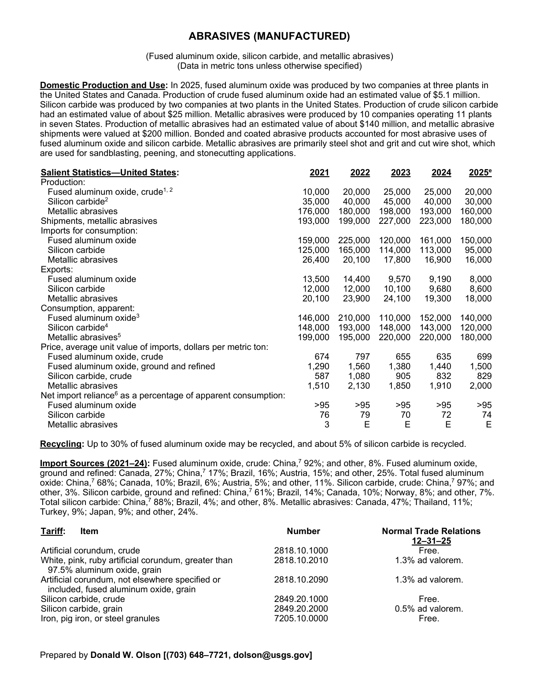
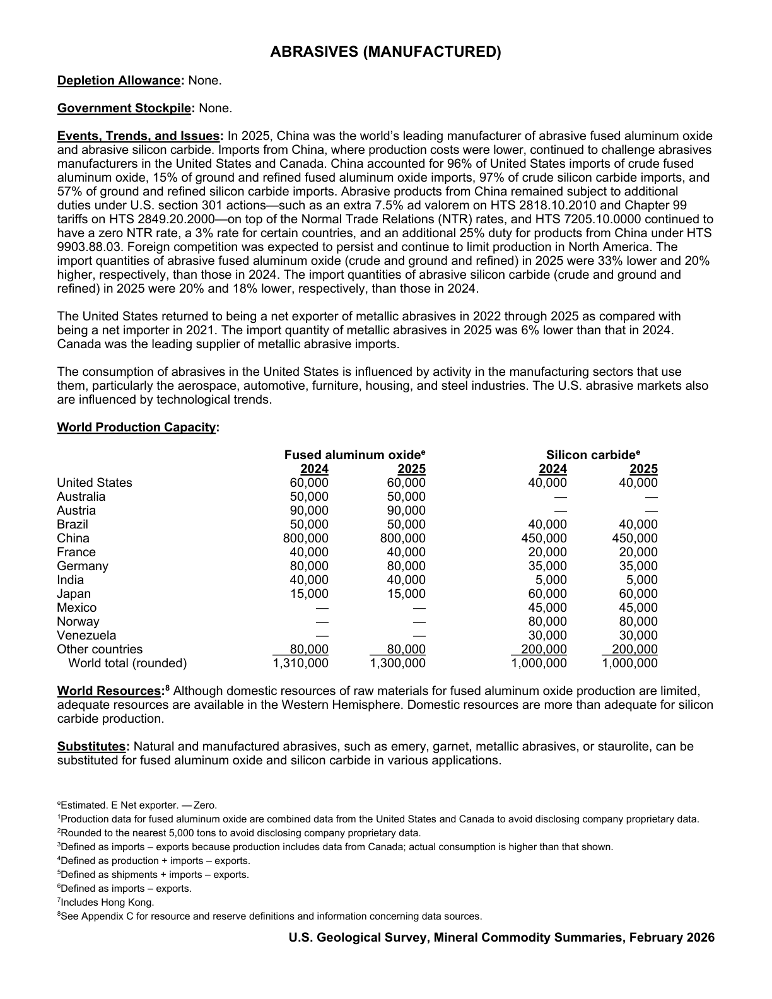

# Audit — Abrasives (manufactured) (abrasives)

- **Source**: <https://pubs.usgs.gov/periodicals/mcs2026/mcs2026-abrasives.pdf>
- **Edition**: MCS 2026 (2026-02)
- **Captured**: 2026-05-19
- **PDF SHA-256**: `b905055f426b2cce…`
- **Pages**: 2
- **Units note (verbatim)**: (Fused aluminum oxide, silicon carbide, and metallic abrasives)

## Latest-year US summary

| field | value |
| --- | --- |
| Mined production (US) | N/A |
| Primary smelting / refinery (US) | N/A |
| Secondary smelting / scrap (US) | N/A |
| Imports for consumption (total) | 261,000 |
| Exports (total) | 34,600 |
| Apparent consumption | N/A |
| Price, $ per pound | 699 |
| Net import reliance (% of apparent consumption) | 95 |

## Salient Statistics (US) — full table

_`2025e` = 2025 USGS estimate (preliminary); 2021–2024 are reported actuals._

| Row | Footnote | 2021 | 2022 | 2023 | 2024 | 2025e |
| --- | --- | ---: | ---: | ---: | ---: | ---: |
| Fused aluminum oxide, crude |  | 10,000 | 20,000 | 25,000 | 25,000 | 20,000 |
| Silicon carbide | 2 | 35,000 | 40,000 | 45,000 | 40,000 | 30,000 |
| Metallic abrasives |  | 176,000 | 180,000 | 198,000 | 193,000 | 160,000 |
| Shipments, metallic abrasives |  | 193,000 | 199,000 | 227,000 | 223,000 | 180,000 |
| Fused aluminum oxide |  | 159,000 | 225,000 | 120,000 | 161,000 | 150,000 |
| Silicon carbide |  | 125,000 | 165,000 | 114,000 | 113,000 | 95,000 |
| Metallic abrasives |  | 26,400 | 20,100 | 17,800 | 16,900 | 16,000 |
| Fused aluminum oxide |  | 13,500 | 14,400 | 9,570 | 9,190 | 8,000 |
| Silicon carbide |  | 12,000 | 12,000 | 10,100 | 9,680 | 8,600 |
| Metallic abrasives |  | 20,100 | 23,900 | 24,100 | 19,300 | 18,000 |
| Fused aluminum oxide | 3 | 146,000 | 210,000 | 110,000 | 152,000 | 140,000 |
| Silicon carbide | 4 | 148,000 | 193,000 | 148,000 | 143,000 | 120,000 |
| Metallic abrasives | 5 | 199,000 | 195,000 | 220,000 | 220,000 | 180,000 |
| Fused aluminum oxide, crude |  | 674 | 797 | 655 | 635 | 699 |
| Fused aluminum oxide, ground and refined |  | 1,290 | 1,560 | 1,380 | 1,440 | 1,500 |
| Silicon carbide, crude |  | 587 | 1,080 | 905 | 832 | 829 |
| Metallic abrasives |  | 1,510 | 2,130 | 1,850 | 1,910 | 2,000 |
| Fused aluminum oxide |  | >95 | >95 | >95 | >95 | >95 |
| Silicon carbide |  | 76 | 79 | 70 | 72 | 74 |
| Metallic abrasives |  | 3 | E | E | E | E |

## Import Sources (2021-24)

**Fused aluminum oxide, crude**
- China: 92%
- other: 8%

**Fused aluminum oxide, ground and refined**
- Canada: 27%
- China: 17%
- Brazil: 16%
- Austria: 15%
- other: 25%

**Total fused aluminum oxide**
- China: 68%
- Canada: 10%
- Brazil: 6%
- Austria: 5%
- other: 11%

**Silicon carbide, crude**
- China: 97%
- other: 3%

**Silicon carbide, ground and refined**
- China: 61%
- Brazil: 14%
- Canada: 10%
- Norway: 8%
- other: 7%

**Total silicon carbide**
- China: 88%
- Brazil: 4%
- other: 8%

**Metallic abrasives**
- Canada: 47%
- Thailand: 11%
- Turkey: 9%
- Japan: 9%
- other: 24%

## World Production Capacity

| country | prev-yr | latest-yr | capacity | reserves | note |
| --- | ---: | ---: | ---: | ---: | --- |
| United States | 60,000 | 60,000 | N/A | N/A |  |
| Australia | 50,000 | 50,000 | N/A | N/A |  |
| Austria | 90,000 | 90,000 | N/A | N/A |  |
| Brazil | 50,000 | 50,000 | N/A | N/A |  |
| China | 800,000 | 800,000 | N/A | N/A |  |
| France | 40,000 | 40,000 | N/A | N/A |  |
| Germany | 80,000 | 80,000 | N/A | N/A |  |
| India | 40,000 | 40,000 | N/A | N/A |  |
| Japan | 15,000 | 15,000 | N/A | N/A |  |
| Mexico | 0 | 0 | N/A | N/A |  |
| Norway | 0 | 0 | N/A | N/A |  |
| Venezuela | 0 | 0 | N/A | N/A |  |
| Other countries | 80,000 | 80,000 | N/A | N/A |  |
| World total (rounded) | 1,310,000 | 1,300,000 | N/A | N/A |  |

## Footnotes (verbatim)

- **1**: Production data for fused aluminum oxide are combined data from the United States and Canada to avoid disclosing company proprietary data.
- **2**: Rounded to the nearest 5,000 tons to avoid disclosing company proprietary data.
- **3**: Defined as imports – exports because production includes data from Canada; actual consumption is higher than that shown.
- **4**: Defined as production + imports – exports.
- **5**: Defined as shipments + imports – exports.
- **6**: Defined as imports – exports.
- **7**: Includes Hong Kong.
- **8**: See Appendix C for resource and reserve definitions and information concerning data sources.
- **e**: Estimated. E Net exporter. —Zero.

## Source page screenshots

### Page 1

### Page 2

