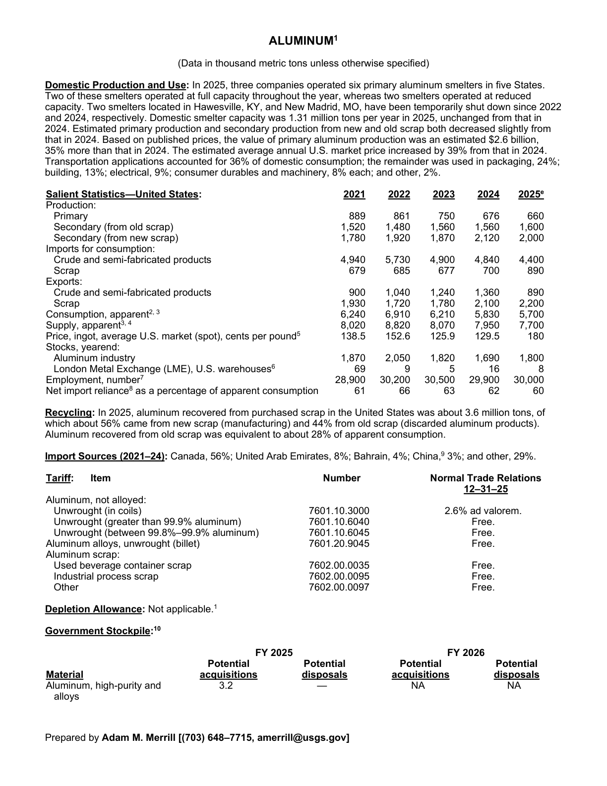
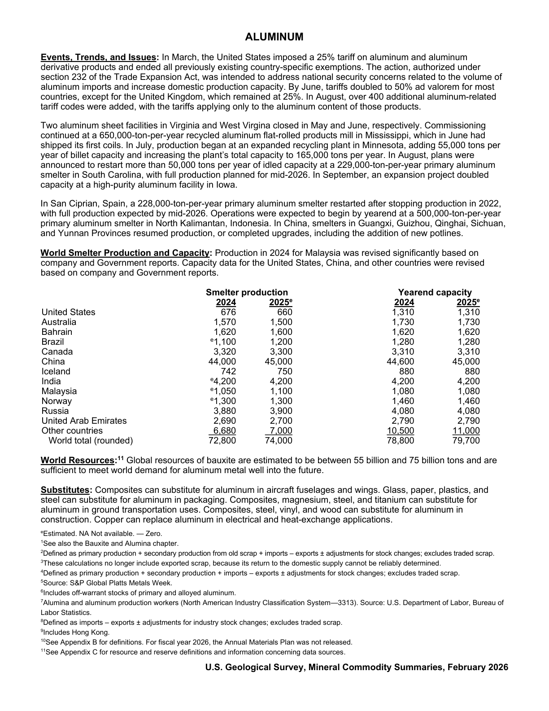

# Audit — Aluminum (aluminum)

- **Source**: <https://pubs.usgs.gov/periodicals/mcs2026/mcs2026-aluminum.pdf>
- **Edition**: MCS 2026 (2026-02)
- **Captured**: 2026-05-19
- **PDF SHA-256**: `2995b3e9e412eed5…`
- **Pages**: 2
- **Units note (verbatim)**: (Data in thousand metric tons unless otherwise specified)

## Latest-year US summary

| field | value |
| --- | --- |
| Mined production (US) | N/A |
| Primary smelting / refinery (US) | 660 |
| Secondary smelting / scrap (US) | 1,600 |
| Imports for consumption (total) | 5,290 |
| Exports (total) | 3,090 |
| Apparent consumption | 5,700 |
| Price, $ per pound | 180 |
| Net import reliance (% of apparent consumption) | 60 |

## Salient Statistics (US) — full table

_`2025e` = 2025 USGS estimate (preliminary); 2021–2024 are reported actuals._

| Row | Footnote | 2021 | 2022 | 2023 | 2024 | 2025e |
| --- | --- | ---: | ---: | ---: | ---: | ---: |
| Primary |  | 889 | 861 | 750 | 676 | 660 |
| Secondary (from old scrap) |  | 1,520 | 1,480 | 1,560 | 1,560 | 1,600 |
| Secondary (from new scrap) |  | 1,780 | 1,920 | 1,870 | 2,120 | 2,000 |
| Crude and semi-fabricated products |  | 4,940 | 5,730 | 4,900 | 4,840 | 4,400 |
| Scrap |  | 679 | 685 | 677 | 700 | 890 |
| Crude and semi-fabricated products |  | 900 | 1,040 | 1,240 | 1,360 | 890 |
| Scrap |  | 1,930 | 1,720 | 1,780 | 2,100 | 2,200 |
| Consumption, apparent |  | 6,240 | 6,910 | 6,210 | 5,830 | 5,700 |
| Supply, apparent |  | 8,020 | 8,820 | 8,070 | 7,950 | 7,700 |
| Price, ingot, average U.S. market (spot), cents per pound | 5 | 138.50 | 152.60 | 125.90 | 129.50 | 180 |
| Aluminum industry |  | 1,870 | 2,050 | 1,820 | 1,690 | 1,800 |
| London Metal Exchange (LME), U.S. warehouses | 6 | 69 | 9 | 5 | 16 | 8 |
| Employment, number | 7 | 28,900 | 30,200 | 30,500 | 29,900 | 30,000 |
| Net import reliance as a percentage of apparent consumption |  | 61 | 66 | 63 | 62 | 60 |

## Import Sources (2021-24)

**(all)**
- Canada: 56%
- United Arab Emirates: 8%
- Bahrain: 4%
- China: 3%
- other: 29%

## World Smelter Production and Capacity

| country | prev-yr | latest-yr | capacity | reserves | note |
| --- | ---: | ---: | ---: | ---: | --- |
| United States | 676 | 660 | 1,310 | N/A |  |
| Australia | 1,570 | 1,500 | 1,730 | N/A |  |
| Bahrain | 1,620 | 1,600 | 1,620 | N/A |  |
| Brazil | 1,100 | 1,200 | 1,280 | N/A |  |
| Canada | 3,320 | 3,300 | 3,310 | N/A |  |
| China | 44,000 | 45,000 | 44,600 | N/A |  |
| Iceland | 742 | 750 | 880 | N/A |  |
| India | 4,200 | 4,200 | 4,200 | N/A |  |
| Malaysia | 1,050 | 1,100 | 1,080 | N/A |  |
| Norway | 1,300 | 1,300 | 1,460 | N/A |  |
| Russia | 3,880 | 3,900 | 4,080 | N/A |  |
| United Arab Emirates | 2,690 | 2,700 | 2,790 | N/A |  |
| Other countries | 6,680 | 7,000 | 10,500 | N/A |  |
| World total (rounded) | 72,800 | 74,000 | 78,800 | N/A |  |

## Footnotes (verbatim)

- **1**: See also the Bauxite and Alumina chapter.
- **2**: Defined as primary production + secondary production from old scrap + imports – exports ± adjustments for stock changes; excludes traded scrap.
- **3**: These calculations no longer include exported scrap, because its return to the domestic supply cannot be reliably determined.
- **4**: Defined as primary production + secondary production + imports – exports ± adjustments for stock changes; excludes traded scrap.
- **5**: Source: S&P Global Platts Metals Week.
- **6**: Includes off-warrant stocks of primary and alloyed aluminum.
- **7**: Alumina and aluminum production workers (North American Industry Classification System—3313). Source: U.S. Department of Labor, Bureau of Labor Statistics.
- **8**: Defined as imports – exports ± adjustments for industry stock changes; excludes traded scrap.
- **9**: Includes Hong Kong.
- **10**: See Appendix B for definitions. For fiscal year 2026, the Annual Materials Plan was not released.
- **11**: See Appendix C for resource and reserve definitions and information concerning data sources.
- **e**: Estimated. NA Not available. — Zero.

## Source page screenshots

### Page 1

### Page 2

