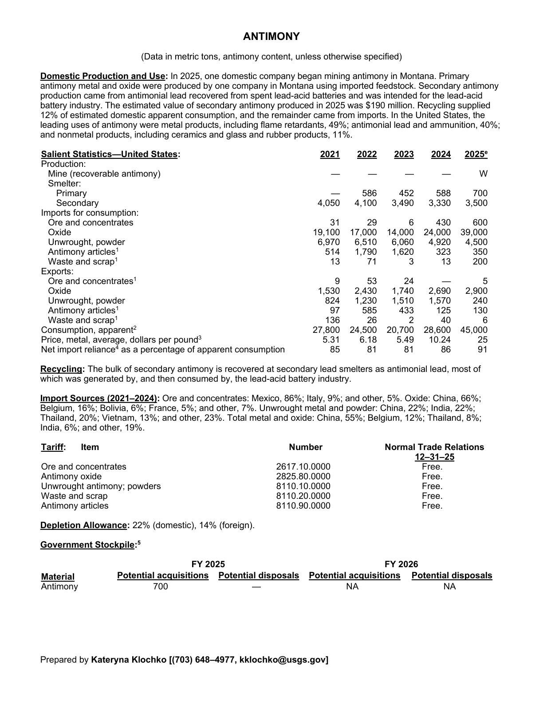
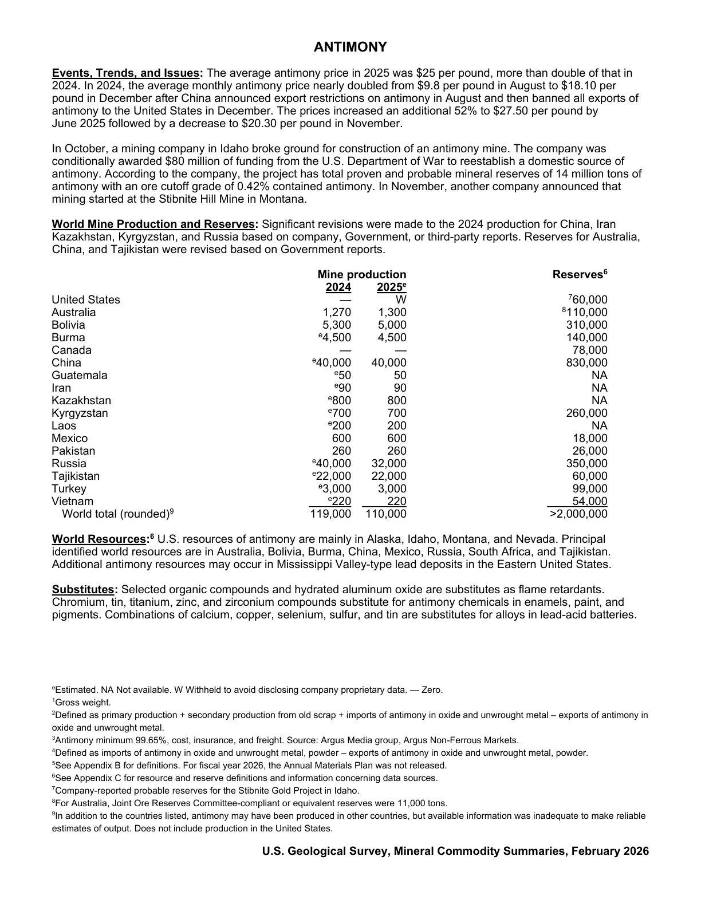

# Audit — Antimony (antimony)

- **Source**: <https://pubs.usgs.gov/periodicals/mcs2026/mcs2026-antimony.pdf>
- **Edition**: MCS 2026 (2026-02)
- **Captured**: 2026-05-19
- **PDF SHA-256**: `18c4498ac13ecd98…`
- **Pages**: 2
- **Units note (verbatim)**: (Data in metric tons, antimony content, unless otherwise specified)

## Latest-year US summary

| field | value |
| --- | --- |
| Mined production (US) | N/A |
| Primary smelting / refinery (US) | 700 |
| Secondary smelting / scrap (US) | 3,500 |
| Imports for consumption (total) | 44,650 |
| Exports (total) | 3,281 |
| Apparent consumption | 45,000 |
| Price, $ per pound | 25 |
| Net import reliance (% of apparent consumption) | 91 |

## Salient Statistics (US) — full table

_`2025e` = 2025 USGS estimate (preliminary); 2021–2024 are reported actuals._

| Row | Footnote | 2021 | 2022 | 2023 | 2024 | 2025e |
| --- | --- | ---: | ---: | ---: | ---: | ---: |
| Mine (recoverable antimony) |  | 0 | 0 | 0 | 0 | W |
| Primary |  | 0 | 586 | 452 | 588 | 700 |
| Secondary |  | 4,050 | 4,100 | 3,490 | 3,330 | 3,500 |
| Ore and concentrates |  | 31 | 29 | 6 | 430 | 600 |
| Oxide |  | 19,100 | 17,000 | 14,000 | 24,000 | 39,000 |
| Unwrought, powder |  | 6,970 | 6,510 | 6,060 | 4,920 | 4,500 |
| Antimony articles | 1 | 514 | 1,790 | 1,620 | 323 | 350 |
| Waste and scrap | 1 | 13 | 71 | 3 | 13 | 200 |
| Ore and concentrates | 1 | 9 | 53 | 24 | 0 | 5 |
| Oxide |  | 1,530 | 2,430 | 1,740 | 2,690 | 2,900 |
| Unwrought, powder |  | 824 | 1,230 | 1,510 | 1,570 | 240 |
| Antimony articles | 1 | 97 | 585 | 433 | 125 | 130 |
| Waste and scrap | 1 | 136 | 26 | 2 | 40 | 6 |
| Consumption, apparent | 2 | 27,800 | 24,500 | 20,700 | 28,600 | 45,000 |
| Price, metal, average, dollars per pound | 3 | 5.31 | 6.18 | 5.49 | 10.24 | 25 |
| Net import reliance as a percentage of apparent consumption |  | 85 | 81 | 81 | 86 | 91 |

## Import Sources (2021-2024)

**Ore and concentrates**
- Mexico: 86%
- Italy: 9%
- other: 5%

**Oxide**
- China: 66%
- Belgium: 16%
- Bolivia: 6%
- France: 5%
- other: 7%

**Unwrought metal and powder**
- China: 22%
- India: 22%
- Thailand: 20%
- Vietnam: 13%
- other: 23%

**Total metal and oxide**
- China: 55%
- Belgium: 12%
- Thailand: 8%
- India: 6%
- other: 19%

## World Mine Production and Reserves

| country | prev-yr | latest-yr | capacity | reserves | note |
| --- | ---: | ---: | ---: | ---: | --- |
| United States | 0 | W | N/A | 60,000 | footnote 7 |
| Australia | 1,270 | 1,300 | N/A | 110,000 | footnote 8 |
| Bolivia | 5,300 | 5,000 | N/A | 310,000 |  |
| Burma | 4,500 | 4,500 | N/A | 140,000 |  |
| Canada | 0 | 0 | N/A | 78,000 |  |
| China | 40,000 | 40,000 | N/A | 830,000 |  |
| Guatemala | 50 | 50 | N/A | NA |  |
| Iran | 90 | 90 | N/A | NA |  |
| Kazakhstan | 800 | 800 | N/A | NA |  |
| Kyrgyzstan | 700 | 700 | N/A | 260,000 |  |
| Laos | 200 | 200 | N/A | NA |  |
| Mexico | 600 | 600 | N/A | 18,000 |  |
| Pakistan | 260 | 260 | N/A | 26,000 |  |
| Russia | 40,000 | 32,000 | N/A | 350,000 |  |
| Tajikistan | 22,000 | 22,000 | N/A | 60,000 |  |
| Turkey | 3,000 | 3,000 | N/A | 99,000 |  |
| Vietnam | 220 | 220 | N/A | 54,000 |  |
| World total (rounded) | 119,000 | 110,000 | N/A | >2,000,000 | footnote 9 |

## Footnotes (verbatim)

- **1**: Gross weight.
- **2**: Defined as primary production + secondary production from old scrap + imports of antimony in oxide and unwrought metal – exports of antimony in oxide and unwrought metal.
- **3**: Antimony minimum 99.65%, cost, insurance, and freight. Source: Argus Media group, Argus Non-Ferrous Markets.
- **4**: Defined as imports of antimony in oxide and unwrought metal, powder – exports of antimony in oxide and unwrought metal, powder.
- **5**: See Appendix B for definitions. For fiscal year 2026, the Annual Materials Plan was not released.
- **6**: See Appendix C for resource and reserve definitions and information concerning data sources.
- **7**: Company-reported probable reserves for the Stibnite Gold Project in Idaho.
- **8**: For Australia, Joint Ore Reserves Committee-compliant or equivalent reserves were 11,000 tons.
- **9**: In addition to the countries listed, antimony may have been produced in other countries, but available information was inadequate to make reliable estimates of output. Does not include production in the United States.
- **e**: Estimated. NA Not available. W Withheld to avoid disclosing company proprietary data. — Zero.

## Source page screenshots

### Page 1

### Page 2

