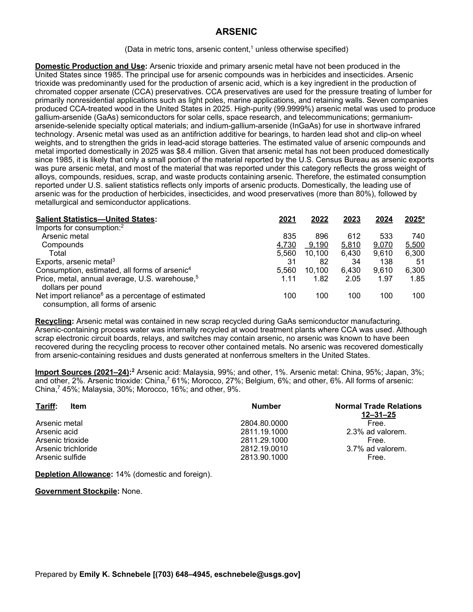
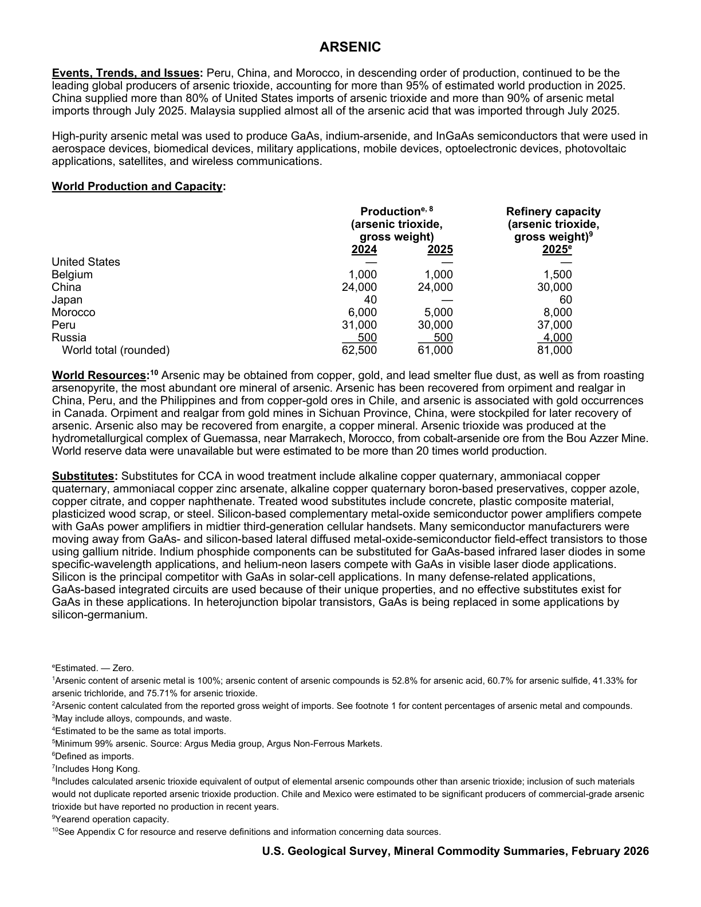

# Audit — Arsenic (arsenic)

- **Source**: <https://pubs.usgs.gov/periodicals/mcs2026/mcs2026-arsenic.pdf>
- **Edition**: MCS 2026 (2026-02)
- **Captured**: 2026-06-02
- **PDF SHA-256**: `2344d21a385e4fad…`
- **Pages**: 2
- **Units note (verbatim)**: (Data in metric tons, arsenic content, unless otherwise specified)

## Latest-year US summary

| field | value |
| --- | --- |
| Mined production (US) | N/A |
| Primary smelting / refinery (US) | N/A |
| Secondary smelting / scrap (US) | N/A |
| Imports for consumption (total) | 6,300 |
| Exports (total) | 51 |
| Apparent consumption | 6,300 |
| Price, $ per pound | 1.85 |
| Net import reliance (% of apparent consumption) | 100 |

## Salient Statistics (US) — full table

_`2025e` = 2025 USGS estimate (preliminary); 2021–2024 are reported actuals._

| Row | Footnote | 2021 | 2022 | 2023 | 2024 | 2025e |
| --- | --- | ---: | ---: | ---: | ---: | ---: |
| Arsenic metal |  | 835 | 896 | 612 | 533 | 740 |
| Compounds |  | 4,730 | 9,190 | 5,810 | 9,070 | 5,500 |
| Total |  | 5,560 | 10,100 | 6,430 | 9,610 | 6,300 |
| Exports, arsenic metal | 3 | 31 | 82 | 34 | 138 | 51 |
| Consumption, estimated, all forms of arsenic | 4 | 5,560 | 10,100 | 6,430 | 9,610 | 6,300 |
| Price, metal, annual average, U.S. warehouse, dollars per pound | 5 | 1.11 | 1.82 | 2.05 | 1.97 | 1.85 |
| Net import reliance as a percentage of estimated consumption, all forms of arsenic |  | 100 | 100 | 100 | 100 | 100 |

## Import Sources (2021-24)

**Arsenic acid**
- Malaysia: 99%
- other: 1%

**Arsenic metal**
- China: 95%
- Japan: 3%
- other: 2%

**Arsenic trioxide**
- China: 61%
- Morocco: 27%
- Belgium: 6%
- other: 6%

**All forms of arsenic**
- China: 45%
- Malaysia: 30%
- Morocco: 16%
- other: 9%

## World Production and Capacity

| country | prev-yr | latest-yr | capacity | reserves | note |
| --- | ---: | ---: | ---: | ---: | --- |
| United States | 0 | 0 | 0 | N/A |  |
| Belgium | 1,000 | 1,000 | 1,500 | N/A |  |
| China | 24,000 | 24,000 | 30,000 | N/A |  |
| Japan | 40 | 0 | 60 | N/A |  |
| Morocco | 6,000 | 5,000 | 8,000 | N/A |  |
| Peru | 31,000 | 30,000 | 37,000 | N/A |  |
| Russia | 500 | 500 | 4,000 | N/A |  |
| World total (rounded) | 62,500 | 61,000 | 81,000 | N/A |  |

## Footnotes (verbatim)

- **1**: Arsenic content of arsenic metal is 100%; arsenic content of arsenic compounds is 52.8% for arsenic acid, 60.7% for arsenic sulfide, 41.33% for arsenic trichloride, and 75.71% for arsenic trioxide.
- **2**: Arsenic content calculated from the reported gross weight of imports. See footnote 1 for content percentages of arsenic metal and compounds.
- **3**: May include alloys, compounds, and waste.
- **4**: Estimated to be the same as total imports.
- **5**: Minimum 99% arsenic. Source: Argus Media group, Argus Non-Ferrous Markets.
- **6**: Defined as imports.
- **7**: Includes Hong Kong.
- **8**: Includes calculated arsenic trioxide equivalent of output of elemental arsenic compounds other than arsenic trioxide; inclusion of such materials would not duplicate reported arsenic trioxide production. Chile and Mexico were estimated to be significant producers of commercial-grade arsenic trioxide but have reported no production in recent years.
- **9**: Yearend operation capacity.
- **10**: See Appendix C for resource and reserve definitions and information concerning data sources.
- **e**: Estimated. — Zero.

## Source page screenshots

### Page 1

### Page 2

