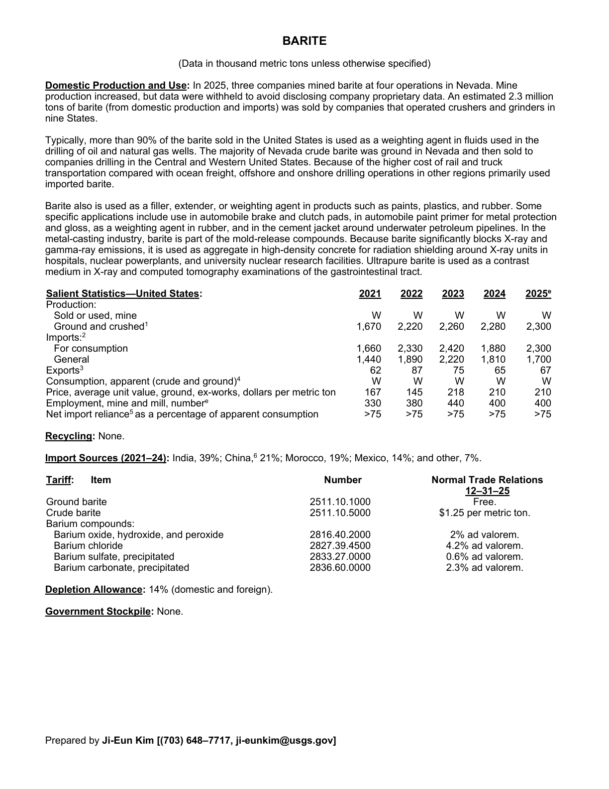
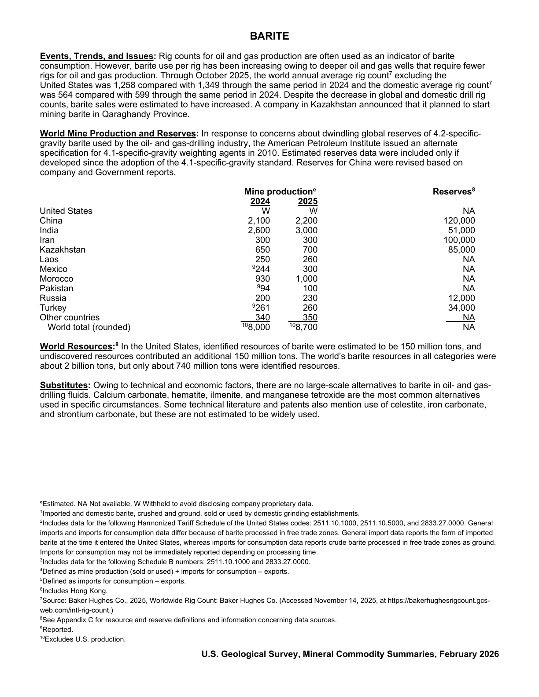

# Audit — Barite (barite)

- **Source**: <https://pubs.usgs.gov/periodicals/mcs2026/mcs2026-barite.pdf>
- **Edition**: MCS 2026 (2026-02)
- **Captured**: 2026-06-02
- **PDF SHA-256**: `78c4191315efe0a1…`
- **Pages**: 2
- **Units note (verbatim)**: (Data in thousand metric tons unless otherwise specified)

## Latest-year US summary

| field | value |
| --- | --- |
| Mined production (US) | N/A |
| Primary smelting / refinery (US) | N/A |
| Secondary smelting / scrap (US) | N/A |
| Imports for consumption (total) | 4,000 |
| Exports (total) | 67 |
| Apparent consumption | N/A |
| Price, $ per pound | 210 |
| Net import reliance (% of apparent consumption) | 75 |

## Salient Statistics (US) — full table

_`2025e` = 2025 USGS estimate (preliminary); 2021–2024 are reported actuals._

| Row | Footnote | 2021 | 2022 | 2023 | 2024 | 2025e |
| --- | --- | ---: | ---: | ---: | ---: | ---: |
| Sold or used, mine |  | W | W | W | W | W |
| Ground and crushed | 1 | 1,670 | 2,220 | 2,260 | 2,280 | 2,300 |
| For consumption |  | 1,660 | 2,330 | 2,420 | 1,880 | 2,300 |
| General |  | 1,440 | 1,890 | 2,220 | 1,810 | 1,700 |
| Exports | 3 | 62 | 87 | 75 | 65 | 67 |
| Consumption, apparent (crude and ground) | 4 | W | W | W | W | W |
| Price, average unit value, ground, ex-works, dollars per metric ton |  | 167 | 145 | 218 | 210 | 210 |
| Employment, mine and mill, number |  | 330 | 380 | 440 | 400 | 400 |
| Net import relianceas a percentage of apparent consumption |  | >75 | >75 | >75 | >75 | >75 |

## Import Sources (2021-24)

**(all)**
- India: 39%
- China: 21%
- Morocco: 19%
- Mexico: 14%
- other: 7%

## World Mine Production and Reserves

| country | prev-yr | latest-yr | capacity | reserves | note |
| --- | ---: | ---: | ---: | ---: | --- |
| United States | W | W | N/A | NA |  |
| China | 2,100 | 2,200 | N/A | 120,000 |  |
| India | 2,600 | 3,000 | N/A | 51,000 |  |
| Iran | 300 | 300 | N/A | 100,000 |  |
| Kazakhstan | 650 | 700 | N/A | 85,000 |  |
| Laos | 250 | 260 | N/A | NA |  |
| Mexico | 244 | 300 | N/A | NA | footnote 9 |
| Morocco | 930 | 1,000 | N/A | NA |  |
| Pakistan | 94 | 100 | N/A | NA | footnote 9 |
| Russia | 200 | 230 | N/A | 12,000 |  |
| Turkey | 261 | 260 | N/A | 34,000 | footnote 9 |
| Other countries | 340 | 350 | N/A | NA |  |
| World total (rounded) | 8,000 | 8,700 | N/A | NA | footnote 10 |

## Footnotes (verbatim)

- **1**: Imported and domestic barite, crushed and ground, sold or used by domestic grinding establishments.
- **2**: Includes data for the following Harmonized Tariff Schedule of the United States codes: 2511.10.1000, 2511.10.5000, and 2833.27.0000. General imports and imports for consumption data differ because of barite processed in free trade zones. General import data reports the form of imported barite at the time it entered the United States, whereas imports for consumption data reports crude barite processed in free trade zones as ground. Imports for consumption may not be immediately reported depending on processing time.
- **3**: Includes data for the following Schedule B numbers: 2511.10.1000 and 2833.27.0000.
- **4**: Defined as mine production (sold or used) + imports for consumption – exports.
- **5**: Defined as imports for consumption – exports.
- **6**: Includes Hong Kong.
- **7**: Source: Baker Hughes Co., 2025, Worldwide Rig Count: Baker Hughes Co. (Accessed November 14, 2025, at https://bakerhughesrigcount.gcs- web.com/intl-rig-count.)
- **8**: See Appendix C for resource and reserve definitions and information concerning data sources.
- **9**: Reported.
- **10**: Excludes U.S. production.
- **e**: Estimated. NA Not available. W Withheld to avoid disclosing company proprietary data.

## Source page screenshots

### Page 1

### Page 2

