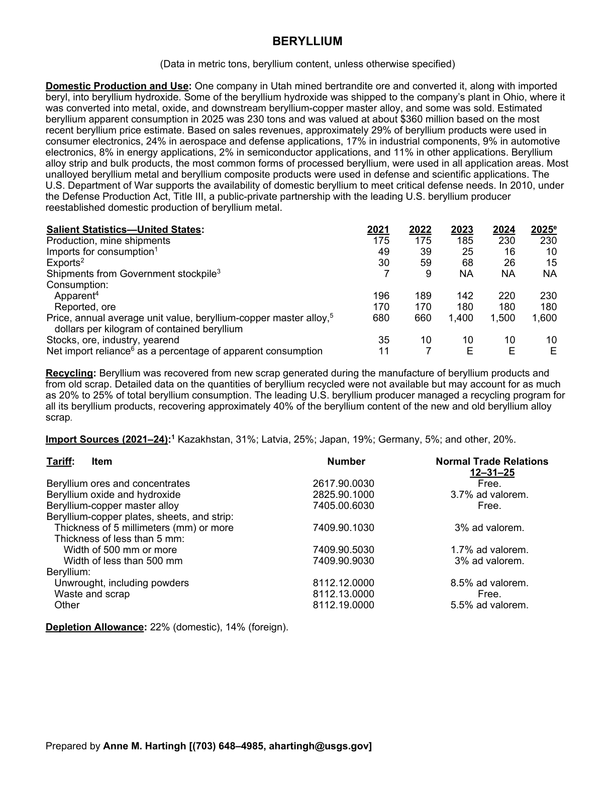
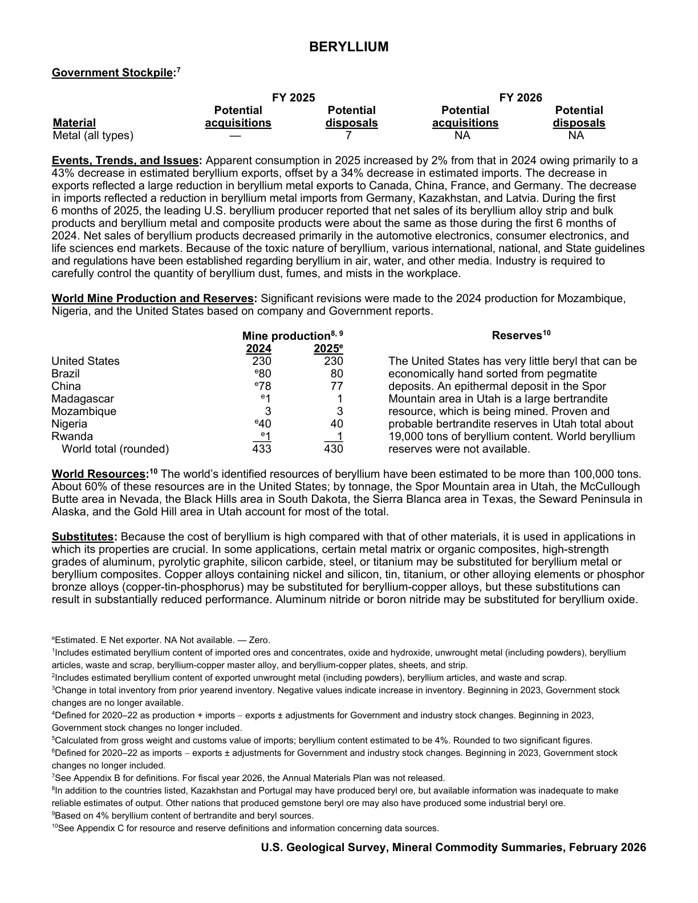

# Audit — Beryllium (beryllium)

- **Source**: <https://pubs.usgs.gov/periodicals/mcs2026/mcs2026-beryllium.pdf>
- **Edition**: MCS 2026 (2026-02)
- **Captured**: 2026-06-02
- **PDF SHA-256**: `dee2faa35a4a824d…`
- **Pages**: 2
- **Units note (verbatim)**: (Data in metric tons, beryllium content, unless otherwise specified)

## Latest-year US summary

| field | value |
| --- | --- |
| Mined production (US) | 230 |
| Primary smelting / refinery (US) | N/A |
| Secondary smelting / scrap (US) | N/A |
| Imports for consumption (total) | 10 |
| Exports (total) | 15 |
| Apparent consumption | 230 |
| Price, $ per pound | 1,600 |
| Net import reliance (% of apparent consumption) | N/A |

## Salient Statistics (US) — full table

_`2025e` = 2025 USGS estimate (preliminary); 2021–2024 are reported actuals._

| Row | Footnote | 2021 | 2022 | 2023 | 2024 | 2025e |
| --- | --- | ---: | ---: | ---: | ---: | ---: |
| Production, mine shipments |  | 175 | 175 | 185 | 230 | 230 |
| Imports for consumption | 1 | 49 | 39 | 25 | 16 | 10 |
| Exports | 2 | 30 | 59 | 68 | 26 | 15 |
| Shipments from Government stockpile | 3 | 7 | 9 | NA | NA | NA |
| Apparent | 4 | 196 | 189 | 142 | 220 | 230 |
| Reported, ore |  | 170 | 170 | 180 | 180 | 180 |
| Price, annual average unit value, beryllium-copper master alloy, dollars per kilogram of contained beryllium | 5 | 680 | 660 | 1,400 | 1,500 | 1,600 |
| Stocks, ore, industry, yearend |  | 35 | 10 | 10 | 10 | 10 |
| Net import reliance as a percentage of apparent consumption |  | 11 | 7 | E | E | E |

## Import Sources (2021-24)

**(all)**
- Kazakhstan: 31%
- Latvia: 25%
- Japan: 19%
- Germany: 5%
- other: 20%

## World Mine Production and Reserves

| country | prev-yr | latest-yr | capacity | reserves | note |
| --- | ---: | ---: | ---: | ---: | --- |
| United States | 230 | 230 | N/A | N/A |  |
| Brazil | 80 | 80 | N/A | N/A |  |
| China | 78 | 77 | N/A | N/A |  |
| Madagascar | 1 | 1 | N/A | N/A |  |
| Mozambique | 3 | 3 | N/A | N/A |  |
| Nigeria | 40 | 40 | N/A | N/A |  |
| Rwanda | 1 | 1 | N/A | N/A |  |
| World total (rounded) | 433 | 430 | N/A | N/A |  |

## Footnotes (verbatim)

- **1**: Includes estimated beryllium content of imported ores and concentrates, oxide and hydroxide, unwrought metal (including powders), beryllium articles, waste and scrap, beryllium-copper master alloy, and beryllium-copper plates, sheets, and strip.
- **2**: Includes estimated beryllium content of exported unwrought metal (including powders), beryllium articles, and waste and scrap.
- **3**: Change in total inventory from prior yearend inventory. Negative values indicate increase in inventory. Beginning in 2023, Government stock changes are no longer available.
- **4**: Defined for 2020–22 as production + imports − exports ± adjustments for Government and industry stock changes. Beginning in 2023, Government stock changes no longer included.
- **5**: Calculated from gross weight and customs value of imports; beryllium content estimated to be 4%. Rounded to two significant figures.
- **6**: Defined for 2020–22 as imports − exports ± adjustments for Government and industry stock changes. Beginning in 2023, Government stock changes no longer included.
- **7**: See Appendix B for definitions. For fiscal year 2026, the Annual Materials Plan was not released.
- **8**: In addition to the countries listed, Kazakhstan and Portugal may have produced beryl ore, but available information was inadequate to make reliable estimates of output. Other nations that produced gemstone beryl ore may also have produced some industrial beryl ore.
- **9**: Based on 4% beryllium content of bertrandite and beryl sources.
- **10**: See Appendix C for resource and reserve definitions and information concerning data sources. Reserves The United States has very little beryl that can be economically hand sorted from pegmatite deposits. An epithermal deposit in the Spor Mountain area in Utah is a large bertrandite resource, which is being mined. Proven and probable bertrandite reserves in Utah total about 19,000 tons of beryllium content. World beryllium reserves were not available.
- **e**: Estimated. E Net exporter. NA Not available. — Zero.

## Source page screenshots

### Page 1

### Page 2

