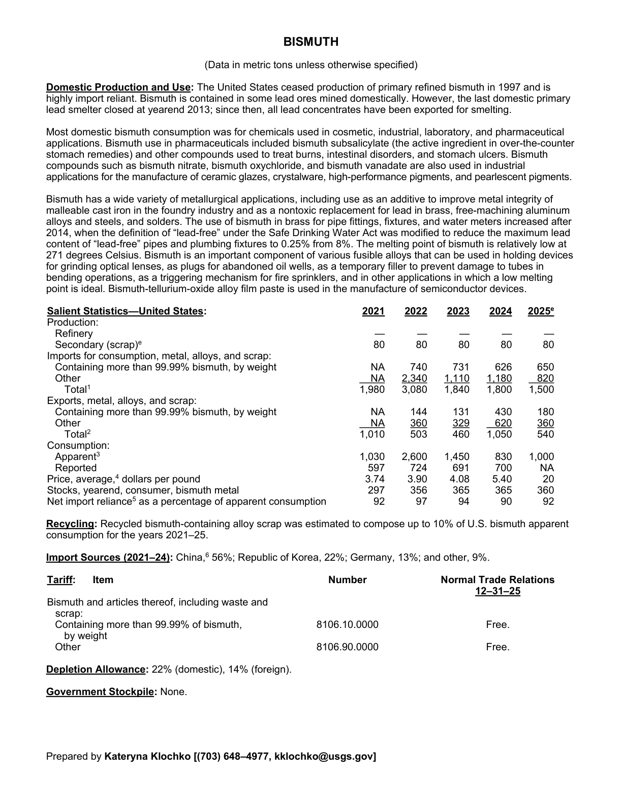
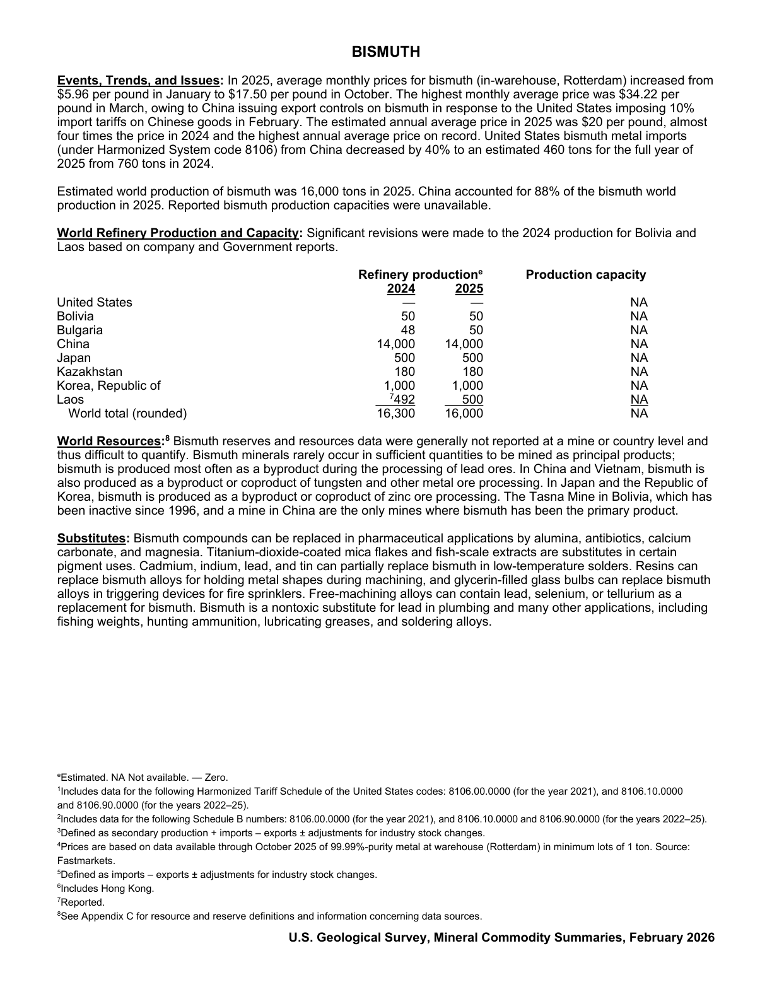

# Audit — Bismuth (bismuth)

- **Source**: <https://pubs.usgs.gov/periodicals/mcs2026/mcs2026-bismuth.pdf>
- **Edition**: MCS 2026 (2026-02)
- **Captured**: 2026-05-19
- **PDF SHA-256**: `9f2f3d99adeee708…`
- **Pages**: 2
- **Units note (verbatim)**: (Data in metric tons unless otherwise specified)

## Latest-year US summary

| field | value |
| --- | --- |
| Mined production (US) | N/A |
| Primary smelting / refinery (US) | 0 |
| Secondary smelting / scrap (US) | 80 |
| Imports for consumption (total) | 1,500 |
| Exports (total) | 540 |
| Apparent consumption | 1,000 |
| Price, $ per pound | 20 |
| Net import reliance (% of apparent consumption) | 92 |

## Salient Statistics (US) — full table

| Row | Footnote | 2021 | 2022 | 2023 | 2024 | 2025e |
| --- | --- | ---: | ---: | ---: | ---: | ---: |
| Refinery |  | 0 | 0 | 0 | 0 | 0 |
| Secondary (scrap) |  | 80 | 80 | 80 | 80 | 80 |
| Containing more than 99.99% bismuth, by weight |  | NA | 740 | 731 | 626 | 650 |
| Other |  | NA | 2,340 | 1,110 | 1,180 | 820 |
| Total | 1 | 1,980 | 3,080 | 1,840 | 1,800 | 1,500 |
| Containing more than 99.99% bismuth, by weight |  | NA | 144 | 131 | 430 | 180 |
| Other |  | NA | 360 | 329 | 620 | 360 |
| Total | 2 | 1,010 | 503 | 460 | 1,050 | 540 |
| Apparent | 3 | 1,030 | 2,600 | 1,450 | 830 | 1,000 |
| Reported |  | 597 | 724 | 691 | 700 | NA |
| Price, average, dollars per pound |  | 3.74 | 3.90 | 4.08 | 5.40 | 20 |
| Stocks, yearend, consumer, bismuth metal |  | 297 | 356 | 365 | 365 | 360 |
| Net import reliance as a percentage of apparent consumption |  | 92 | 97 | 94 | 90 | 92 |

## Import Sources (2021-24)

**(all)**
- China: 56%
- Republic of Korea: 22%
- Germany: 13%
- other: 9%

## World Refinery Production and Capacity

| country | prev-yr | latest-yr | capacity | reserves | note |
| --- | ---: | ---: | ---: | ---: | --- |
| United States | 0 | 0 | N/A | N/A |  |
| Bolivia | 50 | 50 | N/A | N/A |  |
| Bulgaria | 48 | 50 | N/A | N/A |  |
| China | 14,000 | 14,000 | N/A | N/A |  |
| Japan | 500 | 500 | N/A | N/A |  |
| Kazakhstan | 180 | 180 | N/A | N/A |  |
| Korea, Republic of | 1,000 | 1,000 | N/A | N/A |  |
| Laos | 492 | 500 | N/A | N/A | footnote 7 |
| World total (rounded) | 16,300 | 16,000 | N/A | N/A |  |

## Footnotes (verbatim)

- **1**: Includes data for the following Harmonized Tariff Schedule of the United States codes: 8106.00.0000 (for the year 2021), and 8106.10.0000 and 8106.90.0000 (for the years 2022–25).
- **2**: Includes data for the following Schedule B numbers: 8106.00.0000 (for the year 2021), and 8106.10.0000 and 8106.90.0000 (for the years 2022–25).
- **3**: Defined as secondary production + imports – exports ± adjustments for industry stock changes.
- **4**: Prices are based on data available through October 2025 of 99.99%-purity metal at warehouse (Rotterdam) in minimum lots of 1 ton. Source: Fastmarkets.
- **5**: Defined as imports – exports ± adjustments for industry stock changes.
- **6**: Includes Hong Kong.
- **7**: Reported.
- **8**: See Appendix C for resource and reserve definitions and information concerning data sources.
- **e**: Estimated. NA Not available. — Zero.

## Source page screenshots

### Page 1

### Page 2

