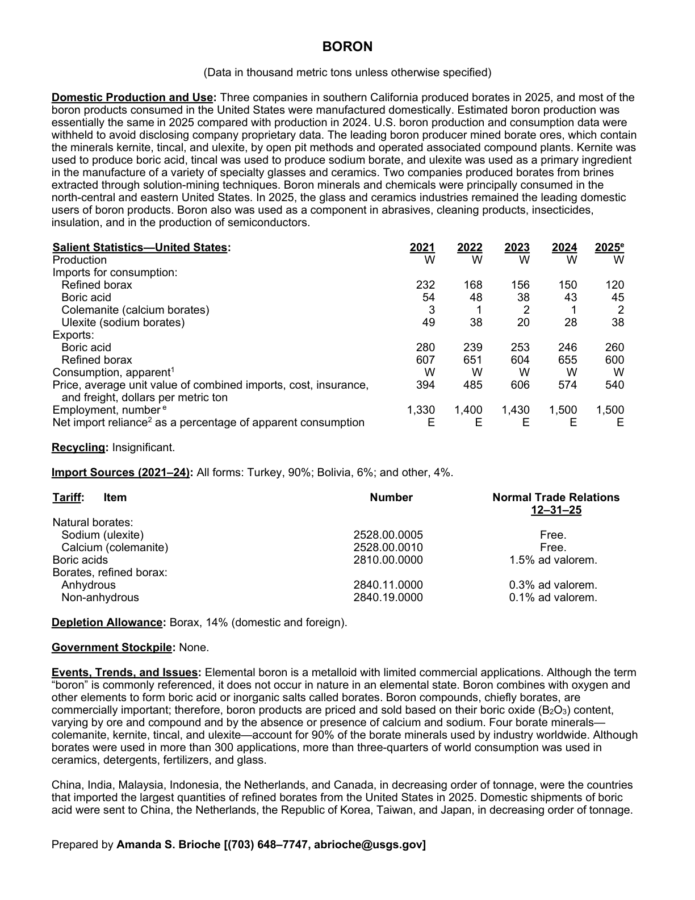
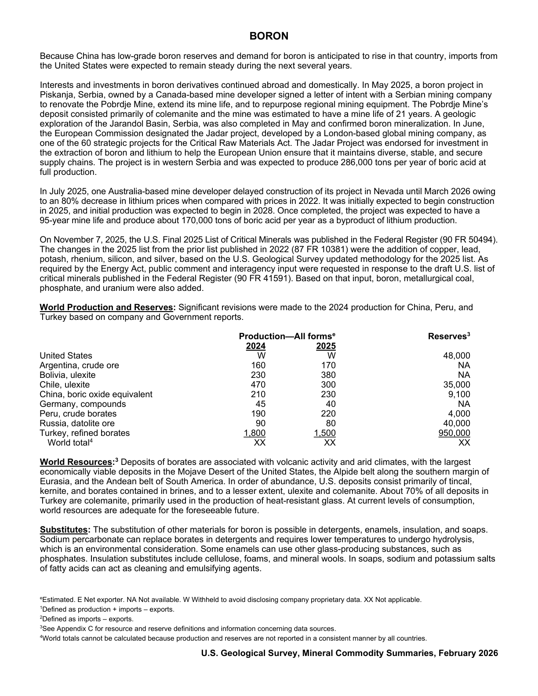

# Audit — Boron (boron)

- **Source**: <https://pubs.usgs.gov/periodicals/mcs2026/mcs2026-boron.pdf>
- **Edition**: MCS 2026 (2026-02)
- **Captured**: 2026-06-02
- **PDF SHA-256**: `a7606ad4a3c2b0b2…`
- **Pages**: 2
- **Units note (verbatim)**: (Data in thousand metric tons unless otherwise specified)

## Latest-year US summary

| field | value |
| --- | --- |
| Mined production (US) | N/A |
| Primary smelting / refinery (US) | N/A |
| Secondary smelting / scrap (US) | N/A |
| Imports for consumption (total) | 205 |
| Exports (total) | 860 |
| Apparent consumption | N/A |
| Price, $ per pound | 540 |
| Net import reliance (% of apparent consumption) | N/A |

## Salient Statistics (US) — full table

_`2025e` = 2025 USGS estimate (preliminary); 2021–2024 are reported actuals._

| Row | Footnote | 2021 | 2022 | 2023 | 2024 | 2025e |
| --- | --- | ---: | ---: | ---: | ---: | ---: |
| Production |  | W | W | W | W | W |
| Refined borax |  | 232 | 168 | 156 | 150 | 120 |
| Boric acid |  | 54 | 48 | 38 | 43 | 45 |
| Colemanite (calcium borates) |  | 3 | 1 | 2 | 1 | 2 |
| Ulexite (sodium borates) |  | 49 | 38 | 20 | 28 | 38 |
| Boric acid |  | 280 | 239 | 253 | 246 | 260 |
| Refined borax |  | 607 | 651 | 604 | 655 | 600 |
| Consumption, apparent | 1 | W | W | W | W | W |
| Price, average unit value of combined imports, cost, insurance, and freight, dollars per metric ton |  | 394 | 485 | 606 | 574 | 540 |
| Employment, number |  | 1,330 | 1,400 | 1,430 | 1,500 | 1,500 |
| Net import reliance as a percentage of apparent consumption |  | E | E | E | E | E |

## Import Sources (2021-24)

**All forms**
- Turkey: 90%
- Bolivia: 6%
- other: 4%

## World Production and Reserves

| country | prev-yr | latest-yr | capacity | reserves | note |
| --- | ---: | ---: | ---: | ---: | --- |
| United States | W | W | N/A | N/A |  |
| Argentina, crude ore | 160 | 170 | N/A | N/A |  |
| Bolivia, ulexite | 230 | 380 | N/A | N/A |  |
| Chile, ulexite | 470 | 300 | N/A | N/A |  |
| China, boric oxide equivalent | 210 | 230 | N/A | N/A |  |
| Germany, compounds | 45 | 40 | N/A | N/A |  |
| Peru, crude borates | 190 | 220 | N/A | N/A |  |
| Russia, datolite ore | 90 | 80 | N/A | N/A |  |
| Turkey, refined borates | 1,800 | 1,500 | N/A | N/A |  |
| World total | N/A | N/A | N/A | N/A | footnote 4 |

## Footnotes (verbatim)

- **1**: Defined as production + imports – exports.
- **2**: Defined as imports – exports.
- **3**: See Appendix C for resource and reserve definitions and information concerning data sources.
- **4**: World totals cannot be calculated because production and reserves are not reported in a consistent manner by all countries.
- **e**: Estimated. E Net exporter. NA Not available. W Withheld to avoid disclosing company proprietary data. XX Not applicable.

## Source page screenshots

### Page 1

### Page 2

