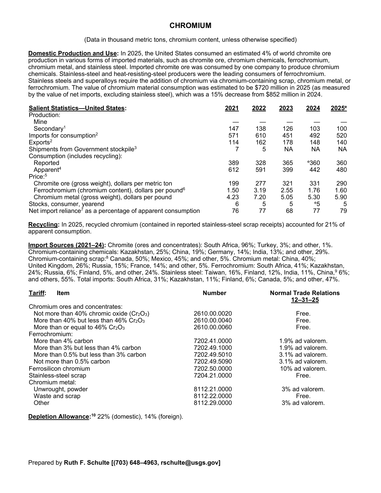
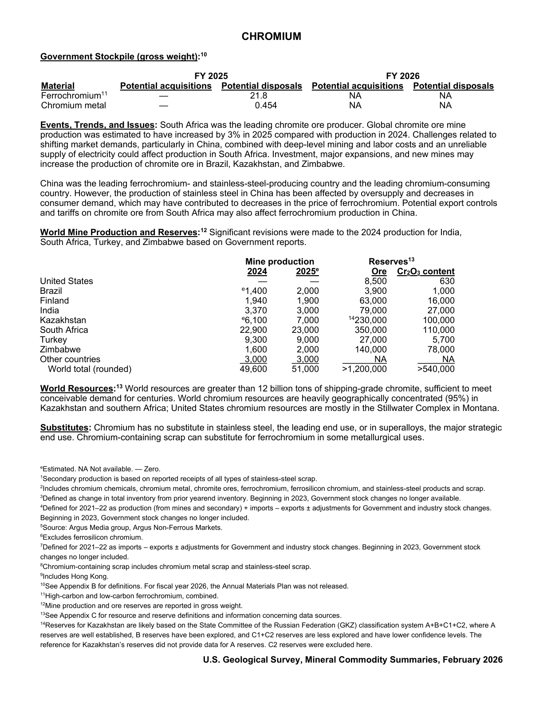

# Audit — Chromium (chromium)

- **Source**: <https://pubs.usgs.gov/periodicals/mcs2026/mcs2026-chromium.pdf>
- **Edition**: MCS 2026 (2026-02)
- **Captured**: 2026-05-19
- **PDF SHA-256**: `c19e412f65eddf60…`
- **Pages**: 2
- **Units note (verbatim)**: (Data in thousand metric tons, chromium content, unless otherwise specified)

## Latest-year US summary

| field | value |
| --- | --- |
| Mined production (US) | 0 |
| Primary smelting / refinery (US) | N/A |
| Secondary smelting / scrap (US) | 100 |
| Imports for consumption (total) | 520 |
| Exports (total) | 140 |
| Apparent consumption | 480 |
| Price, $ per pound | 290 |
| Net import reliance (% of apparent consumption) | 79 |

## Salient Statistics (US) — full table

| Row | Footnote | 2021 | 2022 | 2023 | 2024 | 2025e |
| --- | --- | ---: | ---: | ---: | ---: | ---: |
| Mine |  | 0 | 0 | 0 | 0 | 0 |
| Secondary | 1 | 147 | 138 | 126 | 103 | 100 |
| Imports for consumption | 2 | 571 | 610 | 451 | 492 | 520 |
| Exports | 2 | 114 | 162 | 178 | 148 | 140 |
| Shipments from Government stockpile | 3 | 7 | 5 | NA | NA | NA |
| Reported |  | 389 | 328 | 365 | 360 | 360 |
| Apparent | 4 | 612 | 591 | 399 | 442 | 480 |
| Chromite ore (gross weight), dollars per metric ton |  | 199 | 277 | 321 | 331 | 290 |
| Ferrochromium (chromium content), dollars per pound | 6 | 1.50 | 3.19 | 2.55 | 1.76 | 1.60 |
| Chromium metal (gross weight), dollars per pound |  | 4.23 | 7.20 | 5.05 | 5.30 | 5.90 |
| Stocks, consumer, yearend |  | 6 | 5 | 5 | 5 | 5 |
| Net import reliance as a percentage of apparent consumption |  | 76 | 77 | 68 | 77 | 79 |

## Import Sources (2021-24)

**Chromite (ores and concentrates)**
- South Africa: 96%
- Turkey: 3%
- other: 1%

**Chromium-containing chemicals**
- Kazakhstan: 25%
- China: 19%
- Germany: 14%
- India: 13%
- other: 29%

**Chromium-containing scrap**
- Canada: 50%
- Mexico: 45%
- other: 5%

**Chromium metal**
- China: 40%
- United Kingdom: 26%
- Russia: 15%
- France: 14%
- other: 5%

**Ferrochromium**
- South Africa: 41%
- Kazakhstan: 24%
- Russia: 6%
- Finland: 5%

**Stainless steel**
- Taiwan: 16%
- others: 55%

**Total imports**
- South Africa: 31%
- Kazakhstan: 11%
- Finland: 6%
- Canada: 5%
- other: 47%

## World Mine Production and Reserves

| country | prev-yr | latest-yr | capacity | reserves | note |
| --- | ---: | ---: | ---: | ---: | --- |
| 2024 | 2,025 | N/A | N/A | N/A | footnote 2,3 |
| United States | 0 | 0 | N/A | 8,500 |  |
| Brazil | 1,400 | 2,000 | N/A | 3,900 |  |
| Finland | 1,940 | 1,900 | N/A | 63,000 |  |
| India | 3,370 | 3,000 | N/A | 79,000 |  |
| Kazakhstan | 6,100 | 7,000 | N/A | 230,000 | footnote 14 |
| South Africa | 22,900 | 23,000 | N/A | 350,000 |  |
| Turkey | 9,300 | 9,000 | N/A | 27,000 |  |
| Zimbabwe | 1,600 | 2,000 | N/A | 140,000 |  |
| Other countries | 3,000 | 3,000 | N/A | NA |  |
| World total (rounded) | 49,600 | 51,000 | N/A | >1,200,000 |  |

## Footnotes (verbatim)

- **1**: Secondary production is based on reported receipts of all types of stainless-steel scrap.
- **2**: Includes chromium chemicals, chromium metal, chromite ores, ferrochromium, ferrosilicon chromium, and stainless-steel products and scrap.
- **3**: Defined as change in total inventory from prior yearend inventory. Beginning in 2023, Government stock changes no longer available.
- **4**: Defined for 2021–22 as production (from mines and secondary) + imports – exports ± adjustments for Government and industry stock changes. Beginning in 2023, Government stock changes no longer included.
- **5**: Source: Argus Media group, Argus Non-Ferrous Markets.
- **6**: Excludes ferrosilicon chromium.
- **7**: Defined for 2021–22 as imports – exports ± adjustments for Government and industry stock changes. Beginning in 2023, Government stock changes no longer included.
- **8**: Chromium-containing scrap includes chromium metal scrap and stainless-steel scrap.
- **9**: Includes Hong Kong.
- **10**: See Appendix B for definitions. For fiscal year 2026, the Annual Materials Plan was not released.
- **11**: High-carbon and low-carbon ferrochromium, combined.
- **12**: Mine production and ore reserves are reported in gross weight.
- **13**: See Appendix C for resource and reserve definitions and information concerning data sources.
- **14**: Reserves for Kazakhstan are likely based on the State Committee of the Russian Federation (GKZ) classification system A+B+C1+C2, where A reserves are well established, B reserves have been explored, and C1+C2 reserves are less explored and have lower confidence levels. The reference for Kazakhstan’s reserves did not provide data for A reserves. C2 reserves were excluded here.
- **e**: Estimated. NA Not available. — Zero.

## Source page screenshots

### Page 1

### Page 2

