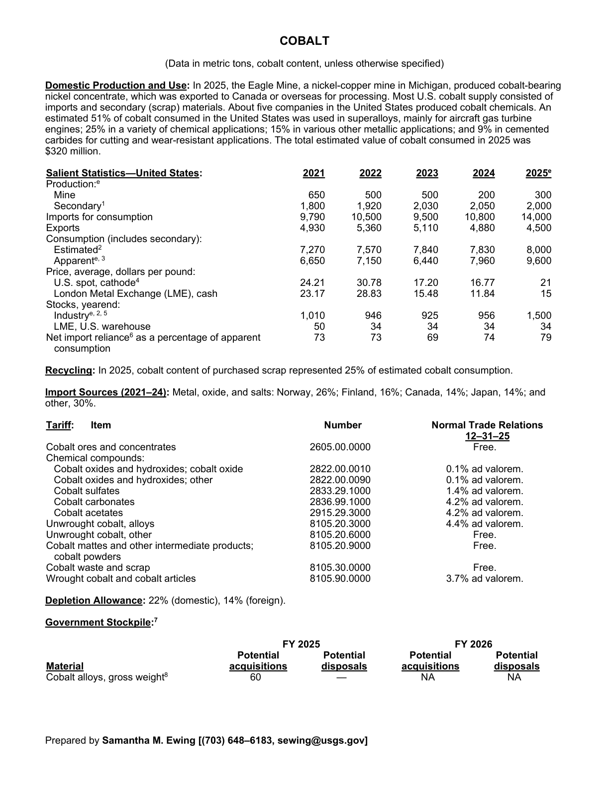
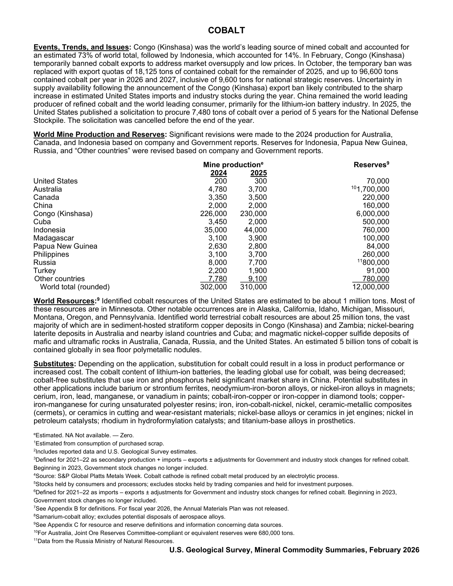

# Audit — Cobalt (cobalt)

- **Source**: <https://pubs.usgs.gov/periodicals/mcs2026/mcs2026-cobalt.pdf>
- **Edition**: MCS 2026 (2026-02)
- **Captured**: 2026-05-19
- **PDF SHA-256**: `cdfe86c808872800…`
- **Pages**: 2
- **Units note (verbatim)**: (Data in metric tons, cobalt content, unless otherwise specified)

## Latest-year US summary

| field | value |
| --- | --- |
| Mined production (US) | 300 |
| Primary smelting / refinery (US) | N/A |
| Secondary smelting / scrap (US) | 2,000 |
| Imports for consumption (total) | 14,000 |
| Exports (total) | 4,500 |
| Apparent consumption | 9,600 |
| Price, $ per pound | 21 |
| Net import reliance (% of apparent consumption) | 79 |

## Salient Statistics (US) — full table

| Row | Footnote | 2021 | 2022 | 2023 | 2024 | 2025e |
| --- | --- | ---: | ---: | ---: | ---: | ---: |
| Mine |  | 650 | 500 | 500 | 200 | 300 |
| Secondary | 1 | 1,800 | 1,920 | 2,030 | 2,050 | 2,000 |
| Imports for consumption |  | 9,790 | 10,500 | 9,500 | 10,800 | 14,000 |
| Exports |  | 4,930 | 5,360 | 5,110 | 4,880 | 4,500 |
| Estimated | 2 | 7,270 | 7,570 | 7,840 | 7,830 | 8,000 |
| Apparent |  | 6,650 | 7,150 | 6,440 | 7,960 | 9,600 |
| U.S. spot, cathode | 4 | 24.21 | 30.78 | 17.20 | 16.77 | 21 |
| London Metal Exchange (LME), cash |  | 23.17 | 28.83 | 15.48 | 11.84 | 15 |
| Industry |  | 1,010 | 946 | 925 | 956 | 1,500 |
| LME, U.S. warehouse |  | 50 | 34 | 34 | 34 | 34 |
| Net import reliance as a percentage of apparent consumption |  | 73 | 73 | 69 | 74 | 79 |

## Import Sources (2021-24)

**Metal, oxide, and salts**
- Norway: 26%
- Finland: 16%
- Canada: 14%
- Japan: 14%
- other: 30%

## World Mine Production and Reserves

| country | prev-yr | latest-yr | capacity | reserves | note |
| --- | ---: | ---: | ---: | ---: | --- |
| United States | 200 | 300 | N/A | 70,000 |  |
| Australia | 4,780 | 3,700 | N/A | 1,700,000 | footnote 10 |
| Canada | 3,350 | 3,500 | N/A | 220,000 |  |
| China | 2,000 | 2,000 | N/A | 160,000 |  |
| Congo (Kinshasa) | 226,000 | 230,000 | N/A | 6,000,000 |  |
| Cuba | 3,450 | 2,000 | N/A | 500,000 |  |
| Indonesia | 35,000 | 44,000 | N/A | 760,000 |  |
| Madagascar | 3,100 | 3,900 | N/A | 100,000 |  |
| Papua New Guinea | 2,630 | 2,800 | N/A | 84,000 |  |
| Philippines | 3,100 | 3,700 | N/A | 260,000 |  |
| Russia | 8,000 | 7,700 | N/A | 800,000 | footnote 11 |
| Turkey | 2,200 | 1,900 | N/A | 91,000 |  |
| Other countries | 7,780 | 9,100 | N/A | 780,000 |  |
| World total (rounded) | 302,000 | 310,000 | N/A | 12,000,000 |  |

## Footnotes (verbatim)

- **1**: Estimated from consumption of purchased scrap.
- **2**: Includes reported data and U.S. Geological Survey estimates.
- **3**: Defined for 2021–22 as secondary production + imports – exports ± adjustments for Government and industry stock changes for refined cobalt. Beginning in 2023, Government stock changes no longer included.
- **4**: Source: S&P Global Platts Metals Week. Cobalt cathode is refined cobalt metal produced by an electrolytic process.
- **5**: Stocks held by consumers and processors; excludes stocks held by trading companies and held for investment purposes.
- **6**: Defined for 2021–22 as imports – exports ± adjustments for Government and industry stock changes for refined cobalt. Beginning in 2023, Government stock changes no longer included.
- **7**: See Appendix B for definitions. For fiscal year 2026, the Annual Materials Plan was not released.
- **8**: Samarium-cobalt alloy; excludes potential disposals of aerospace alloys.
- **9**: See Appendix C for resource and reserve definitions and information concerning data sources.
- **10**: For Australia, Joint Ore Reserves Committee-compliant or equivalent reserves were 680,000 tons.
- **11**: Data from the Russia Ministry of Natural Resources.
- **e**: Estimated. NA Not available. — Zero.

## Source page screenshots

### Page 1

### Page 2

