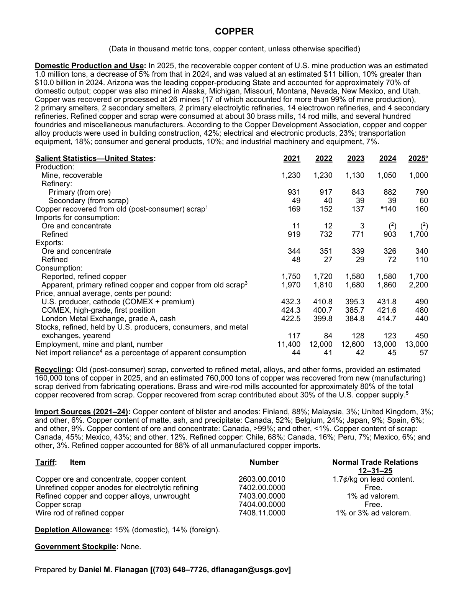
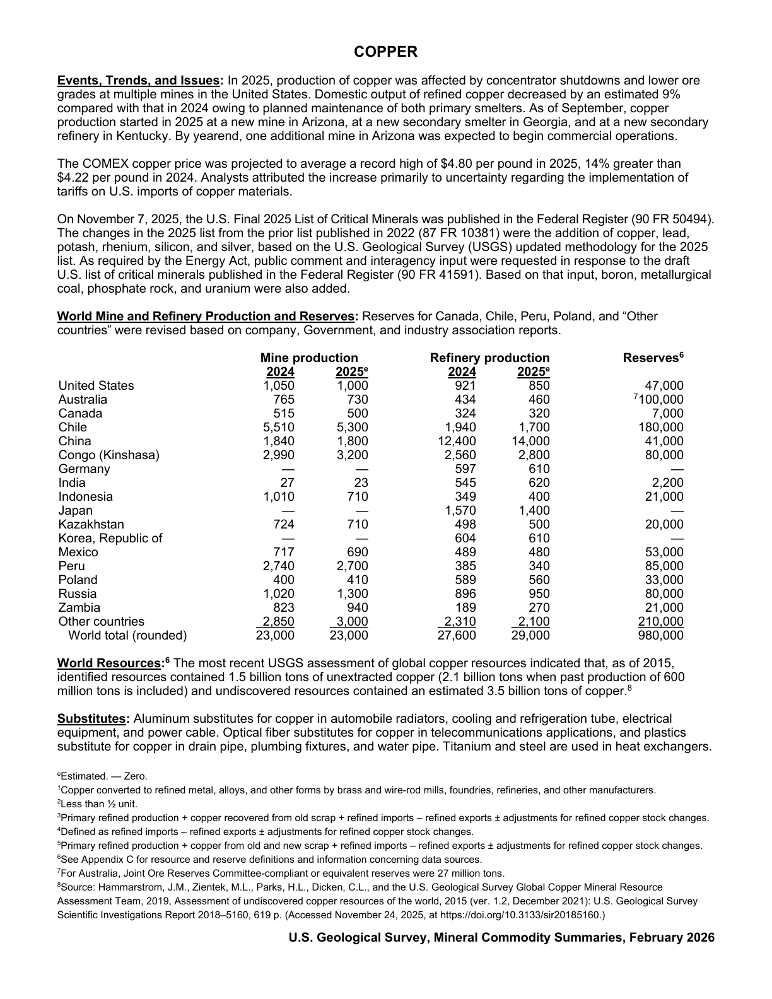

# Audit — Copper (copper)

- **Source**: <https://pubs.usgs.gov/periodicals/mcs2026/mcs2026-copper.pdf>
- **Edition**: MCS 2026 (2026-02)
- **Captured**: 2026-05-19
- **PDF SHA-256**: `c4971f7edfa38fee…`
- **Pages**: 2
- **Units note (verbatim)**: (Data in thousand metric tons, copper content, unless otherwise specified)

## Latest-year US summary

| field | value |
| --- | --- |
| Mined production (US) | 1,000 |
| Primary smelting / refinery (US) | 790 |
| Secondary smelting / scrap (US) | 60 |
| Imports for consumption (total) | 1,700 |
| Exports (total) | 450 |
| Apparent consumption | 2,200 |
| Price, $ per pound | 490 |
| Net import reliance (% of apparent consumption) | 57 |

## Salient Statistics (US) — full table

_`2025e` = 2025 USGS estimate (preliminary); 2021–2024 are reported actuals._

| Row | Footnote | 2021 | 2022 | 2023 | 2024 | 2025e |
| --- | --- | ---: | ---: | ---: | ---: | ---: |
| Mine, recoverable |  | 1,230 | 1,230 | 1,130 | 1,050 | 1,000 |
| Primary (from ore) |  | 931 | 917 | 843 | 882 | 790 |
| Secondary (from scrap) |  | 49 | 40 | 39 | 39 | 60 |
| Copper recovered from old (post-consumer) scrap | 1 | 169 | 152 | 137 | 140 | 160 |
| () Refined |  | 919 | 732 | 771 | 903 | 1,700 |
| Ore and concentrate |  | 344 | 351 | 339 | 326 | 340 |
| Refined |  | 48 | 27 | 29 | 72 | 110 |
| Reported, refined copper |  | 1,750 | 1,720 | 1,580 | 1,580 | 1,700 |
| Apparent, primary refined copper and copper from old scrap | 3 | 1,970 | 1,810 | 1,680 | 1,860 | 2,200 |
| U.S. producer, cathode (COMEX + premium) |  | 432.30 | 410.80 | 395.30 | 431.80 | 490 |
| COMEX, high-grade, first position |  | 424.30 | 400.70 | 385.70 | 421.60 | 480 |
| London Metal Exchange, grade A, cash |  | 422.50 | 399.80 | 384.80 | 414.70 | 440 |
| Stocks, refined, held by U.S. producers, consumers, and metal exchanges, yearend |  | 117 | 84 | 128 | 123 | 450 |
| Employment, mine and plant, number |  | 11,400 | 12,000 | 12,600 | 13,000 | 13,000 |
| Net import reliance as a percentage of apparent consumption |  | 44 | 41 | 42 | 45 | 57 |

## Import Sources (2021-24)

**Copper content of blister and anodes**
- Finland: 88%
- Malaysia: 3%
- United Kingdom: 3%
- other: 6%

**Copper content of matte, ash, and precipitate**
- Canada: 52%
- Belgium: 24%
- Japan: 9%
- Spain: 6%
- other: 9%

**Copper content of ore and concentrate**
- Canada: 99%
- other: 1%

**Copper content of scrap**
- Canada: 45%
- Mexico: 43%
- other: 12%

**Refined copper**
- Chile: 68%
- Canada: 16%
- Peru: 7%
- Mexico: 6%
- other: 3%

## World Mine and Refinery Production and Reserves

| country | prev-yr | latest-yr | capacity | reserves | note |
| --- | ---: | ---: | ---: | ---: | --- |
| United States | 921 | 850 | N/A | 47,000 |  |
| Australia | 434 | 460 | N/A | 100,000 | footnote 7 |
| Canada | 324 | 320 | N/A | 7,000 |  |
| Chile | 1,940 | 1,700 | N/A | 180,000 |  |
| China | 12,400 | 14,000 | N/A | 41,000 |  |
| Congo (Kinshasa) | 2,560 | 2,800 | N/A | 80,000 |  |
| Germany | 597 | 610 | N/A | 0 |  |
| India | 545 | 620 | N/A | 2,200 |  |
| Indonesia | 349 | 400 | N/A | 21,000 |  |
| Japan | 1,570 | 1,400 | N/A | 0 |  |
| Kazakhstan | 498 | 500 | N/A | 20,000 |  |
| Korea, Republic of | 604 | 610 | N/A | 0 |  |
| Mexico | 489 | 480 | N/A | 53,000 |  |
| Peru | 385 | 340 | N/A | 85,000 |  |
| Poland | 589 | 560 | N/A | 33,000 |  |
| Russia | 896 | 950 | N/A | 80,000 |  |
| Zambia | 189 | 270 | N/A | 21,000 |  |
| Other countries | 2,310 | 2,100 | N/A | 210,000 |  |
| World total (rounded) | 27,600 | 29,000 | N/A | 980,000 |  |

## Footnotes (verbatim)

- **1**: Copper converted to refined metal, alloys, and other forms by brass and wire-rod mills, foundries, refineries, and other manufacturers.
- **2**: Less than ½ unit.
- **3**: Primary refined production + copper recovered from old scrap + refined imports – refined exports ± adjustments for refined copper stock changes.
- **4**: Defined as refined imports – refined exports ± adjustments for refined copper stock changes.
- **5**: Primary refined production + copper from old and new scrap + refined imports – refined exports ± adjustments for refined copper stock changes.
- **6**: See Appendix C for resource and reserve definitions and information concerning data sources.
- **7**: For Australia, Joint Ore Reserves Committee-compliant or equivalent reserves were 27 million tons.
- **8**: Source: Hammarstrom, J.M., Zientek, M.L., Parks, H.L., Dicken, C.L., and the U.S. Geological Survey Global Copper Mineral Resource Assessment Team, 2019, Assessment of undiscovered copper resources of the world, 2015 (ver. 1.2, December 2021): U.S. Geological Survey Scientific Investigations Report 2018–5160, 619 p. (Accessed November 24, 2025, at https://doi.org/10.3133/sir20185160.)
- **e**: Estimated. — Zero.

## Source page screenshots

### Page 1

### Page 2

