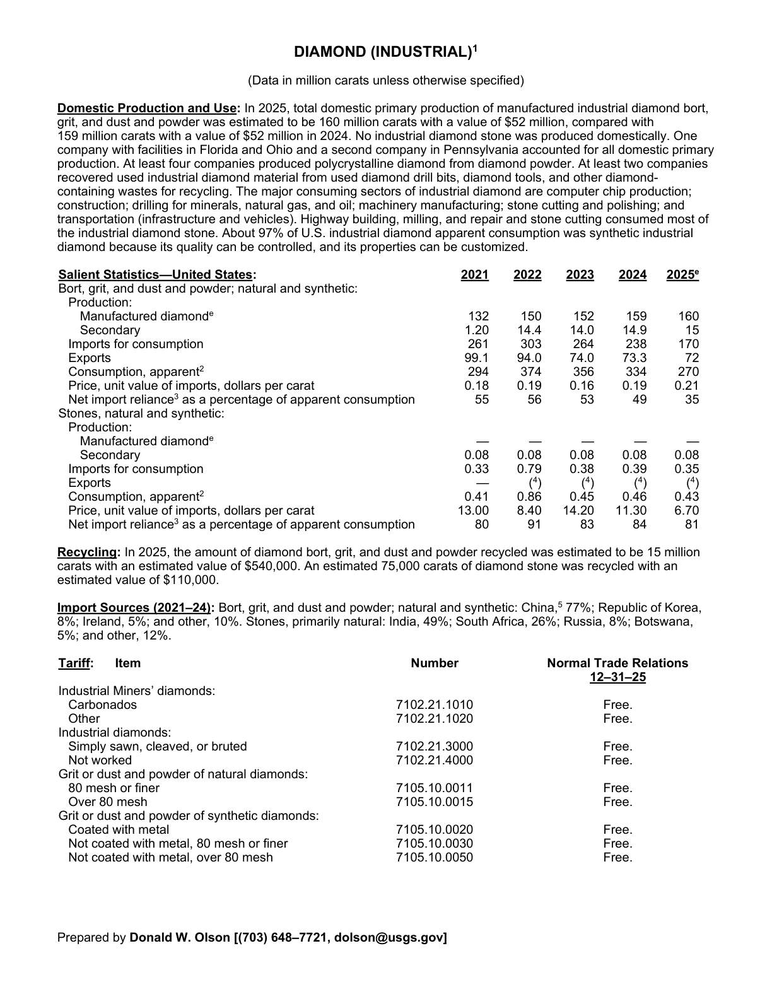
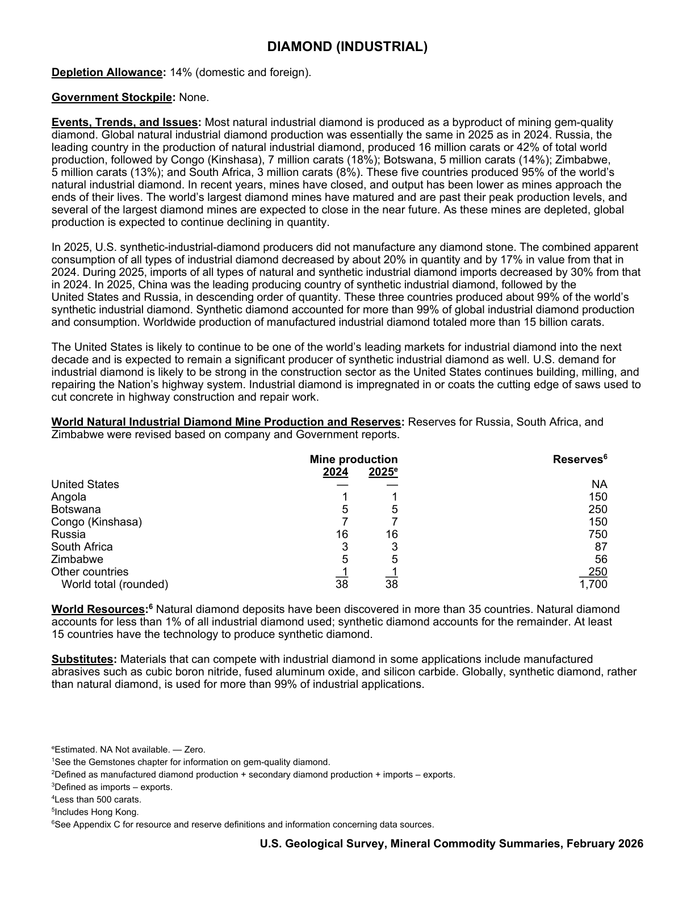

# Audit — Diamond (industrial) (diamond)

- **Source**: <https://pubs.usgs.gov/periodicals/mcs2026/mcs2026-diamond.pdf>
- **Edition**: MCS 2026 (2026-02)
- **Captured**: 2026-05-19
- **PDF SHA-256**: `b80adb50e11d2d5f…`
- **Pages**: 2
- **Units note (verbatim)**: (Data in million carats unless otherwise specified)

## Latest-year US summary

| field | value |
| --- | --- |
| Mined production (US) | N/A |
| Primary smelting / refinery (US) | N/A |
| Secondary smelting / scrap (US) | 15 |
| Imports for consumption (total) | 170.35 |
| Exports (total) | 72.43 |
| Apparent consumption | 270 |
| Price, $ per pound | 0.21 |
| Net import reliance (% of apparent consumption) | 35 |

## Salient Statistics (US) — full table

_`2025e` = 2025 USGS estimate (preliminary); 2021–2024 are reported actuals._

| Row | Footnote | 2021 | 2022 | 2023 | 2024 | 2025e |
| --- | --- | ---: | ---: | ---: | ---: | ---: |
| Manufactured diamond |  | 132 | 150 | 152 | 159 | 160 |
| Secondary |  | 1.20 | 14.40 | 14 | 14.90 | 15 |
| Imports for consumption |  | 261 | 303 | 264 | 238 | 170 |
| Exports |  | 99.10 | 94 | 74 | 73.30 | 72 |
| Consumption, apparent | 2 | 294 | 374 | 356 | 334 | 270 |
| Price, unit value of imports, dollars per carat |  | 0.18 | 0.19 | 0.16 | 0.19 | 0.21 |
| Net import reliance as a percentage of apparent consumption |  | 55 | 56 | 53 | 49 | 35 |
| Manufactured diamond |  | 0 | 0 | 0 | 0 | 0 |
| Secondary |  | 0.08 | 0.08 | 0.08 | 0.08 | 0.08 |
| Imports for consumption |  | 0.33 | 0.79 | 0.38 | 0.39 | 0.35 |
| () Consumption, apparent | 2 | 0.41 | 0.86 | 0.45 | 0.46 | 0.43 |
| Price, unit value of imports, dollars per carat |  | 13 | 8.40 | 14.20 | 11.30 | 6.70 |
| Net import reliance as a percentage of apparent consumption |  | 80 | 91 | 83 | 84 | 81 |

## Import Sources (2021-24)

**Bort, grit, and dust and powder; natural and synthetic**
- China: 77%
- Republic of Korea: 8%
- Ireland: 5%
- other: 10%

**Stones, primarily natural**
- India: 49%
- South Africa: 26%
- Russia: 8%
- Botswana: 5%
- other: 12%

## World Natural Industrial Diamond Mine Production and Reserves

| country | prev-yr | latest-yr | capacity | reserves | note |
| --- | ---: | ---: | ---: | ---: | --- |
| United States | 0 | 0 | N/A | NA |  |
| Angola | 1 | 1 | N/A | 150 |  |
| Botswana | 5 | 5 | N/A | 250 |  |
| Congo (Kinshasa) | 7 | 7 | N/A | 150 |  |
| Russia | 16 | 16 | N/A | 750 |  |
| South Africa | 3 | 3 | N/A | 87 |  |
| Zimbabwe | 5 | 5 | N/A | 56 |  |
| Other countries | 1 | 1 | N/A | 250 |  |
| World total (rounded) | 38 | 38 | N/A | 1,700 |  |

## Footnotes (verbatim)

- **1**: See the Gemstones chapter for information on gem-quality diamond.
- **2**: Defined as manufactured diamond production + secondary diamond production + imports – exports.
- **3**: Defined as imports – exports.
- **4**: Less than 500 carats.
- **5**: Includes Hong Kong.
- **6**: See Appendix C for resource and reserve definitions and information concerning data sources.
- **e**: Estimated. NA Not available. — Zero.

## Source page screenshots

### Page 1

### Page 2

