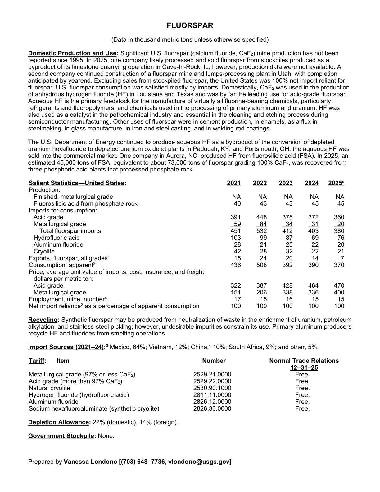
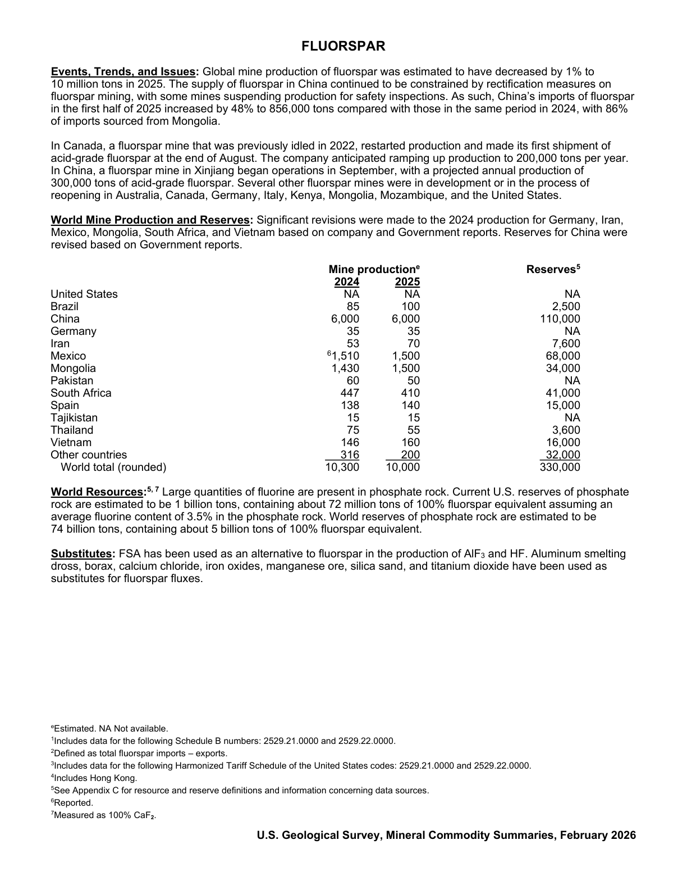

# Audit — Fluorspar (fluorspar)

- **Source**: <https://pubs.usgs.gov/periodicals/mcs2026/mcs2026-fluorspar.pdf>
- **Edition**: MCS 2026 (2026-02)
- **Captured**: 2026-06-02
- **PDF SHA-256**: `7cb5aa4a162fadf7…`
- **Pages**: 2
- **Units note (verbatim)**: (Data in thousand metric tons unless otherwise specified)

## Latest-year US summary

| field | value |
| --- | --- |
| Mined production (US) | N/A |
| Primary smelting / refinery (US) | N/A |
| Secondary smelting / scrap (US) | N/A |
| Imports for consumption (total) | 877 |
| Exports (total) | 7 |
| Apparent consumption | 370 |
| Price, $ per pound | 470 |
| Net import reliance (% of apparent consumption) | 100 |

## Salient Statistics (US) — full table

_`2025e` = 2025 USGS estimate (preliminary); 2021–2024 are reported actuals._

| Row | Footnote | 2021 | 2022 | 2023 | 2024 | 2025e |
| --- | --- | ---: | ---: | ---: | ---: | ---: |
| Finished, metallurgical grade |  | NA | NA | NA | NA | NA |
| Fluorosilicic acid from phosphate rock |  | 40 | 43 | 43 | 45 | 45 |
| Acid grade |  | 391 | 448 | 378 | 372 | 360 |
| Metallurgical grade |  | 59 | 84 | 34 | 31 | 20 |
| Total fluorspar imports |  | 451 | 532 | 412 | 403 | 380 |
| Hydrofluoric acid |  | 103 | 99 | 87 | 69 | 76 |
| Aluminum fluoride |  | 28 | 21 | 25 | 22 | 20 |
| Cryolite |  | 42 | 28 | 32 | 22 | 21 |
| Exports, fluorspar, all grades | 1 | 15 | 24 | 20 | 14 | 7 |
| Consumption, apparent | 2 | 436 | 508 | 392 | 390 | 370 |
| Acid grade |  | 322 | 387 | 428 | 464 | 470 |
| Metallurgical grade |  | 151 | 206 | 338 | 336 | 400 |
| Employment, mine, number |  | 17 | 15 | 16 | 15 | 15 |
| Net import reliance as a percentage of apparent consumption |  | 100 | 100 | 100 | 100 | 100 |

## Import Sources (2021-24)

**(all)**
- Mexico: 64%
- Vietnam: 12%
- China: 10%
- South Africa: 9%
- other: 5%

## World Mine Production and Reserves

| country | prev-yr | latest-yr | capacity | reserves | note |
| --- | ---: | ---: | ---: | ---: | --- |
| United States | NA | NA | N/A | NA |  |
| Brazil | 85 | 100 | N/A | 2,500 |  |
| China | 6,000 | 6,000 | N/A | 110,000 |  |
| Germany | 35 | 35 | N/A | NA |  |
| Iran | 53 | 70 | N/A | 7,600 |  |
| Mexico | 1,510 | 1,500 | N/A | 68,000 | footnote 6 |
| Mongolia | 1,430 | 1,500 | N/A | 34,000 |  |
| Pakistan | 60 | 50 | N/A | NA |  |
| South Africa | 447 | 410 | N/A | 41,000 |  |
| Spain | 138 | 140 | N/A | 15,000 |  |
| Tajikistan | 15 | 15 | N/A | NA |  |
| Thailand | 75 | 55 | N/A | 3,600 |  |
| Vietnam | 146 | 160 | N/A | 16,000 |  |
| Other countries | 316 | 200 | N/A | 32,000 |  |
| World total (rounded) | 10,300 | 10,000 | N/A | 330,000 |  |

## Footnotes (verbatim)

- **1**: Includes data for the following Schedule B numbers: 2529.21.0000 and 2529.22.0000.
- **2**: Defined as total fluorspar imports – exports.
- **3**: Includes data for the following Harmonized Tariff Schedule of the United States codes: 2529.21.0000 and 2529.22.0000.
- **4**: Includes Hong Kong.
- **5**: See Appendix C for resource and reserve definitions and information concerning data sources.
- **6**: Reported.
- **7**: Measured as 100% CaF.
- **e**: Estimated. NA Not available.

## Source page screenshots

### Page 1

### Page 2

