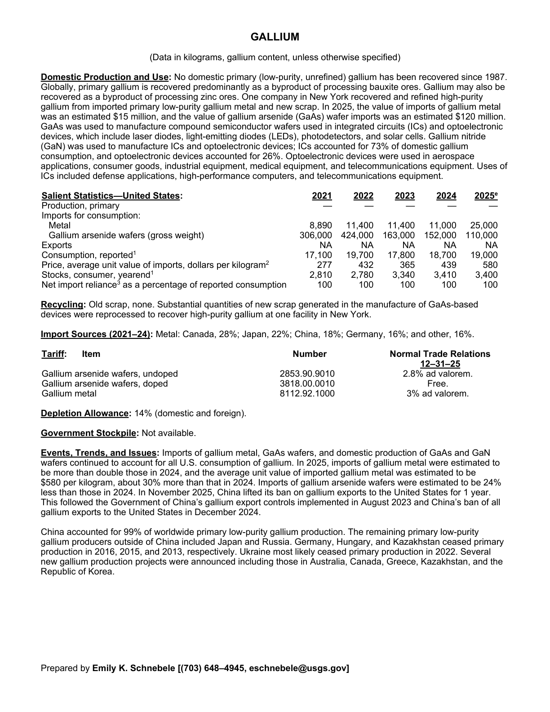
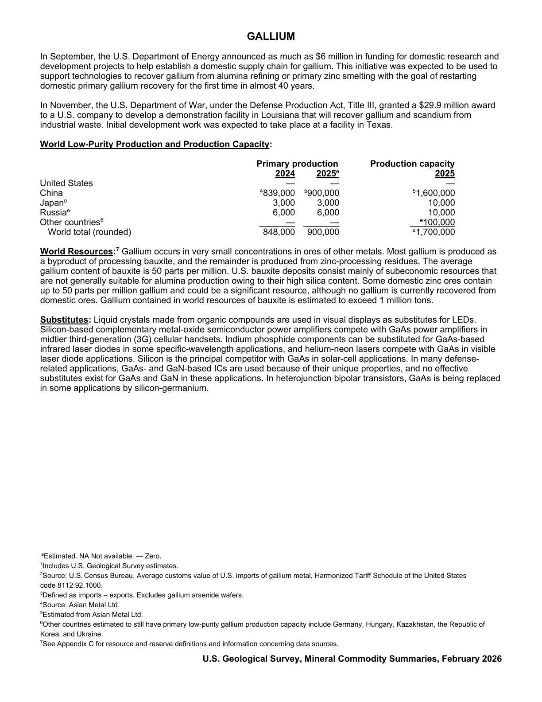

# Audit — Gallium (gallium)

- **Source**: <https://pubs.usgs.gov/periodicals/mcs2026/mcs2026-gallium.pdf>
- **Edition**: MCS 2026 (2026-02)
- **Captured**: 2026-05-19
- **PDF SHA-256**: `15df2a3ef3ed992b…`
- **Pages**: 2
- **Units note (verbatim)**: (Data in kilograms, gallium content, unless otherwise specified)

## Latest-year US summary

| field | value |
| --- | --- |
| Mined production (US) | N/A |
| Primary smelting / refinery (US) | 0 |
| Secondary smelting / scrap (US) | N/A |
| Imports for consumption (total) | 135,000 |
| Exports (total) | N/A |
| Apparent consumption | 19,000 |
| Price, $ per pound | 580 |
| Net import reliance (% of apparent consumption) | 100 |

## Salient Statistics (US) — full table

_`2025e` = 2025 USGS estimate (preliminary); 2021–2024 are reported actuals._

| Row | Footnote | 2021 | 2022 | 2023 | 2024 | 2025e |
| --- | --- | ---: | ---: | ---: | ---: | ---: |
| Production, primary |  | 0 | 0 | 0 | 0 | 0 |
| Metal |  | 8,890 | 11,400 | 11,400 | 11,000 | 25,000 |
| Gallium arsenide wafers (gross weight) |  | 306,000 | 424,000 | 163,000 | 152,000 | 110,000 |
| Exports |  | NA | NA | NA | NA | NA |
| Consumption, reported | 1 | 17,100 | 19,700 | 17,800 | 18,700 | 19,000 |
| Price, average unit value of imports, dollars per kilogram | 2 | 277 | 432 | 365 | 439 | 580 |
| Stocks, consumer, yearend | 1 | 2,810 | 2,780 | 3,340 | 3,410 | 3,400 |
| Net import reliance as a percentage of reported consumption |  | 100 | 100 | 100 | 100 | 100 |

## Import Sources (2021-24)

**Metal**
- Canada: 28%
- Japan: 22%
- China: 18%
- Germany: 16%
- other: 16%

## World Low-Purity Production and Production Capacity

| country | prev-yr | latest-yr | capacity | reserves | note |
| --- | ---: | ---: | ---: | ---: | --- |
| United States | 0 | 0 | 0 | N/A |  |
| China | 839,000 | 900,000 | 1,600,000 | N/A | footnote 4,5 |
| Japan | 3,000 | 3,000 | 10,000 | N/A |  |
| Russia | 6,000 | 6,000 | 10,000 | N/A |  |
| Other countries | 0 | 0 | 100,000 | N/A | footnote 6 |
| World total (rounded) | 848,000 | 900,000 | 1,700,000 | N/A |  |

## Footnotes (verbatim)

- **1**: Includes U.S. Geological Survey estimates.
- **2**: Source: U.S.Census Bureau. Average customs value of U.S. imports of gallium metal, Harmonized Tariff Schedule of the United States code 8112.92.1000.
- **3**: Defined as imports – exports. Excludes gallium arsenide wafers.
- **4**: Source: Asian Metal Ltd.
- **5**: Estimated from Asian Metal Ltd.
- **6**: Other countries estimated to still have primary low-purity gallium production capacity include Germany, Hungary, Kazakhstan, the Republic of Korea, and Ukraine.
- **7**: See Appendix C for resource and reserve definitions and information concerning data sources.
- **e**: Estimated. NA Not available. — Zero.

## Source page screenshots

### Page 1

### Page 2

