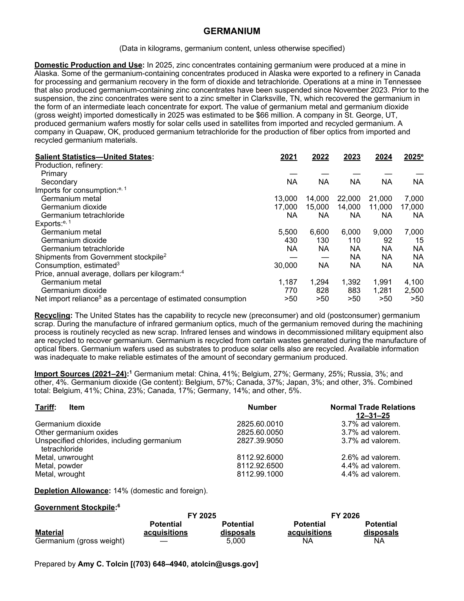
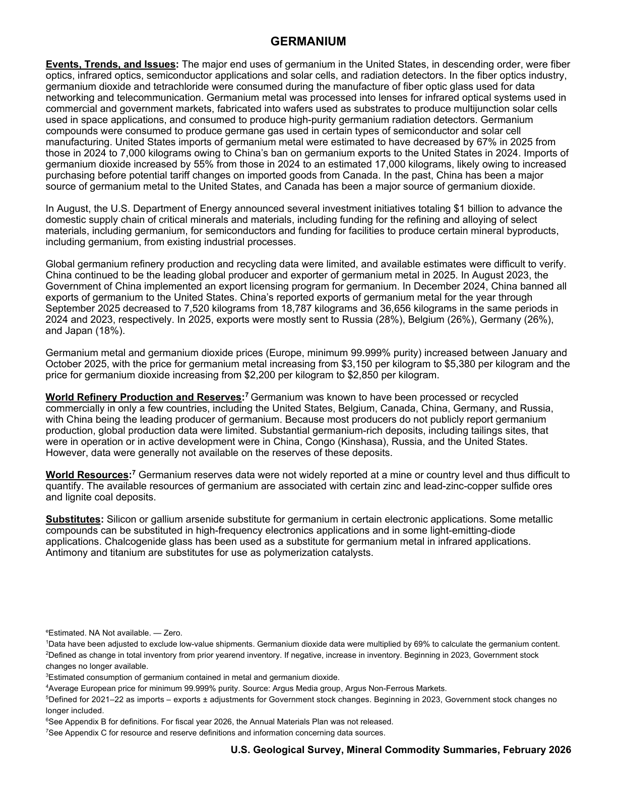

# Audit — Germanium (germanium)

- **Source**: <https://pubs.usgs.gov/periodicals/mcs2026/mcs2026-germanium.pdf>
- **Edition**: MCS 2026 (2026-02)
- **Captured**: 2026-05-19
- **PDF SHA-256**: `52d520ef79c4ad19…`
- **Pages**: 2
- **Units note (verbatim)**: (Data in kilograms, germanium content, unless otherwise specified)

## Latest-year US summary

| field | value |
| --- | --- |
| Mined production (US) | N/A |
| Primary smelting / refinery (US) | 0 |
| Secondary smelting / scrap (US) | N/A |
| Imports for consumption (total) | 24,000 |
| Exports (total) | 7,015 |
| Apparent consumption | N/A |
| Price, $ per pound | 4,100 |
| Net import reliance (% of apparent consumption) | 50 |

## Salient Statistics (US) — full table

_`2025e` = 2025 USGS estimate (preliminary); 2021–2024 are reported actuals._

| Row | Footnote | 2021 | 2022 | 2023 | 2024 | 2025e |
| --- | --- | ---: | ---: | ---: | ---: | ---: |
| Primary |  | 0 | 0 | 0 | 0 | 0 |
| Secondary |  | NA | NA | NA | NA | NA |
| Germanium metal |  | 13,000 | 14,000 | 22,000 | 21,000 | 7,000 |
| Germanium dioxide |  | 17,000 | 15,000 | 14,000 | 11,000 | 17,000 |
| Germanium tetrachloride |  | NA | NA | NA | NA | NA |
| Germanium metal |  | 5,500 | 6,600 | 6,000 | 9,000 | 7,000 |
| Germanium dioxide |  | 430 | 130 | 110 | 92 | 15 |
| Germanium tetrachloride |  | NA | NA | NA | NA | NA |
| Shipments from Government stockpile | 2 | 0 | 0 | NA | NA | NA |
| Consumption, estimated | 3 | 30,000 | NA | NA | NA | NA |
| Germanium metal |  | 1,187 | 1,294 | 1,392 | 1,991 | 4,100 |
| Germanium dioxide |  | 770 | 828 | 883 | 1,281 | 2,500 |
| Net import reliance as a percentage of estimated consumption |  | >50 | >50 | >50 | >50 | >50 |

## Import Sources (2021-24)

**Germanium metal**
- China: 41%
- Belgium: 27%
- Germany: 25%
- Russia: 3%
- other: 4%

**Germanium dioxide (Ge content)**
- Belgium: 57%
- Canada: 37%
- Japan: 3%
- other: 3%

**Combined total**
- Belgium: 41%
- China: 23%
- Canada: 17%
- Germany: 14%
- other: 5%

## World Refinery Production and Reserves

_Not reported._

## Footnotes (verbatim)

- **1**: Data have been adjusted to exclude low-value shipments. Germanium dioxide data were multiplied by 69% to calculate the germanium content.
- **2**: Defined as change in total inventory from prior yearend inventory. If negative, increase in inventory. Beginning in 2023, Government stock changes no longer available.
- **3**: Estimated consumption of germanium contained in metal and germanium dioxide.
- **4**: Average European price for minimum 99.999% purity. Source: Argus Media group, Argus Non-Ferrous Markets.
- **5**: Defined for 2021–22 as imports – exports ± adjustments for Government stock changes. Beginning in 2023, Government stock changes no longer included.
- **6**: See Appendix B for definitions. For fiscal year 2026, the Annual Materials Plan was not released.
- **7**: See Appendix C for resource and reserve definitions and information concerning data sources.
- **e**: Estimated. NA Not available. — Zero.

## Source page screenshots

### Page 1

### Page 2

