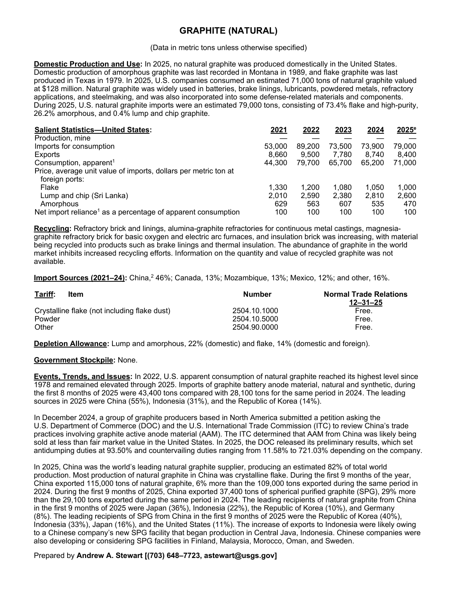
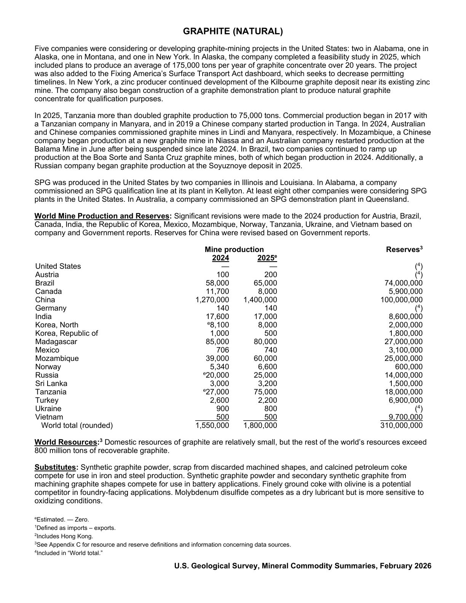

# Audit — Graphite (natural) (graphite)

- **Source**: <https://pubs.usgs.gov/periodicals/mcs2026/mcs2026-graphite.pdf>
- **Edition**: MCS 2026 (2026-02)
- **Captured**: 2026-05-19
- **PDF SHA-256**: `09ec621ed6400162…`
- **Pages**: 2
- **Units note (verbatim)**: (Data in metric tons unless otherwise specified)

## Latest-year US summary

| field | value |
| --- | --- |
| Mined production (US) | 0 |
| Primary smelting / refinery (US) | N/A |
| Secondary smelting / scrap (US) | N/A |
| Imports for consumption (total) | 79,000 |
| Exports (total) | 8,400 |
| Apparent consumption | 71,000 |
| Price, $ per pound | 1,000 |
| Net import reliance (% of apparent consumption) | 100 |

## Salient Statistics (US) — full table

_`2025e` = 2025 USGS estimate (preliminary); 2021–2024 are reported actuals._

| Row | Footnote | 2021 | 2022 | 2023 | 2024 | 2025e |
| --- | --- | ---: | ---: | ---: | ---: | ---: |
| Production, mine |  | 0 | 0 | 0 | 0 | 0 |
| Imports for consumption |  | 53,000 | 89,200 | 73,500 | 73,900 | 79,000 |
| Exports |  | 8,660 | 9,500 | 7,780 | 8,740 | 8,400 |
| Consumption, apparent | 1 | 44,300 | 79,700 | 65,700 | 65,200 | 71,000 |
| Flake |  | 1,330 | 1,200 | 1,080 | 1,050 | 1,000 |
| Lump and chip (Sri Lanka) |  | 2,010 | 2,590 | 2,380 | 2,810 | 2,600 |
| Amorphous |  | 629 | 563 | 607 | 535 | 470 |
| Net import reliance as a percentage of apparent consumption |  | 100 | 100 | 100 | 100 | 100 |

## Import Sources (2021-24)

**(all)**
- China: 46%
- Canada: 13%
- Mozambique: 13%
- Mexico: 12%
- other: 16%

## World Mine Production and Reserves

| country | prev-yr | latest-yr | capacity | reserves | note |
| --- | ---: | ---: | ---: | ---: | --- |
| United States | 0 | 0 | N/A | N/A | footnote 4 |
| Austria | 100 | 200 | N/A | N/A | footnote 4 |
| Brazil | 58,000 | 65,000 | N/A | 74,000,000 |  |
| Canada | 11,700 | 8,000 | N/A | 5,900,000 |  |
| China | 1,270,000 | 1,400,000 | N/A | 100,000,000 |  |
| Germany | 140 | 140 | N/A | N/A | footnote 4 |
| India | 17,600 | 17,000 | N/A | 8,600,000 |  |
| Korea, North | 8,100 | 8,000 | N/A | 2,000,000 |  |
| Korea, Republic of | 1,000 | 500 | N/A | 1,800,000 |  |
| Madagascar | 85,000 | 80,000 | N/A | 27,000,000 |  |
| Mexico | 706 | 740 | N/A | 3,100,000 |  |
| Mozambique | 39,000 | 60,000 | N/A | 25,000,000 |  |
| Norway | 5,340 | 6,600 | N/A | 600,000 |  |
| Russia | 20,000 | 25,000 | N/A | 14,000,000 |  |
| Sri Lanka | 3,000 | 3,200 | N/A | 1,500,000 |  |
| Tanzania | 27,000 | 75,000 | N/A | 18,000,000 |  |
| Turkey | 2,600 | 2,200 | N/A | 6,900,000 |  |
| Ukraine | 900 | 800 | N/A | N/A | footnote 4 |
| Vietnam | 500 | 500 | N/A | 9,700,000 |  |
| World total (rounded) | 1,550,000 | 1,800,000 | N/A | 310,000,000 |  |

## Footnotes (verbatim)

- **1**: Defined as imports – exports.
- **2**: Includes Hong Kong.
- **3**: See Appendix C for resource and reserve definitions and information concerning data sources.
- **4**: Included in “World total.”
- **e**: Estimated. — Zero.

## Source page screenshots

### Page 1

### Page 2

