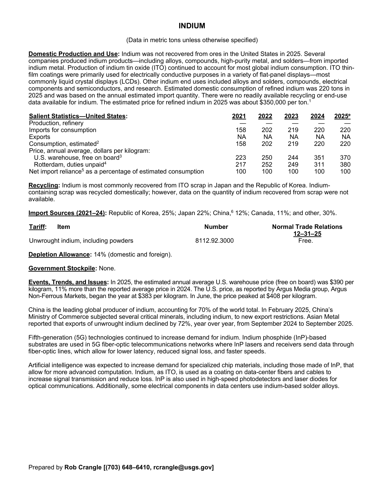
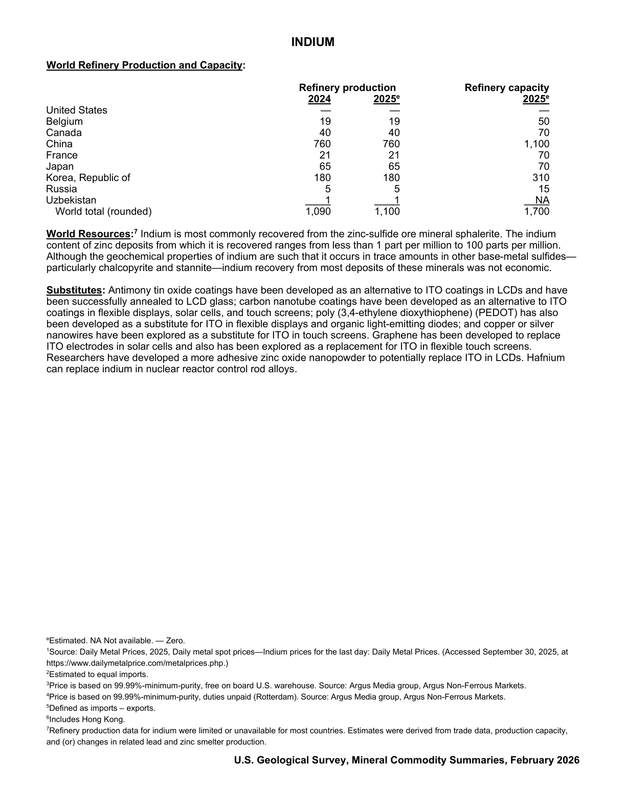

# Audit — Indium (indium)

- **Source**: <https://pubs.usgs.gov/periodicals/mcs2026/mcs2026-indium.pdf>
- **Edition**: MCS 2026 (2026-02)
- **Captured**: 2026-05-19
- **PDF SHA-256**: `43782a8086bf24da…`
- **Pages**: 2
- **Units note (verbatim)**: (Data in metric tons unless otherwise specified)

## Latest-year US summary

| field | value |
| --- | --- |
| Mined production (US) | N/A |
| Primary smelting / refinery (US) | 0 |
| Secondary smelting / scrap (US) | N/A |
| Imports for consumption (total) | 220 |
| Exports (total) | N/A |
| Apparent consumption | 220 |
| Price, $ per pound | 370 |
| Net import reliance (% of apparent consumption) | 100 |

## Salient Statistics (US) — full table

_`2025e` = 2025 USGS estimate (preliminary); 2021–2024 are reported actuals._

| Row | Footnote | 2021 | 2022 | 2023 | 2024 | 2025e |
| --- | --- | ---: | ---: | ---: | ---: | ---: |
| Production, refinery |  | 0 | 0 | 0 | 0 | 0 |
| Imports for consumption |  | 158 | 202 | 219 | 220 | 220 |
| Exports |  | NA | NA | NA | NA | NA |
| Consumption, estimated | 2 | 158 | 202 | 219 | 220 | 220 |
| U.S. warehouse, free on board | 3 | 223 | 250 | 244 | 351 | 370 |
| Rotterdam, duties unpaid | 4 | 217 | 252 | 249 | 311 | 380 |
| Net import reliance as a percentage of estimated consumption |  | 100 | 100 | 100 | 100 | 100 |

## Import Sources (2021-24)

**(all)**
- Republic of Korea: 25%
- China: 12%
- Canada: 11%
- other: 30%

## World Refinery Production and Capacity

| country | prev-yr | latest-yr | capacity | reserves | note |
| --- | ---: | ---: | ---: | ---: | --- |
| United States | 0 | 0 | 0 | N/A |  |
| Belgium | 19 | 19 | 50 | N/A |  |
| Canada | 40 | 40 | 70 | N/A |  |
| China | 760 | 760 | 1,100 | N/A |  |
| France | 21 | 21 | 70 | N/A |  |
| Japan | 65 | 65 | 70 | N/A |  |
| Korea, Republic of | 180 | 180 | 310 | N/A |  |
| Russia | 5 | 5 | 15 | N/A |  |
| Uzbekistan | 1 | 1 | N/A | N/A |  |
| World total (rounded) | 1,090 | 1,100 | 1,700 | N/A |  |

## Footnotes (verbatim)

- **1**: Source: Daily Metal Prices, 2025, Daily metal spot prices—Indium prices for the last day: Daily Metal Prices. (Accessed September 30, 2025, at https://www.dailymetalprice.com/metalprices.php.)
- **2**: Estimated to equal imports.
- **3**: Price is based on 99.99%-minimum-purity, free on board U.S. warehouse. Source: Argus Media group, Argus Non-Ferrous Markets.
- **4**: Price is based on 99.99%-minimum-purity, duties unpaid (Rotterdam). Source: Argus Media group, Argus Non-Ferrous Markets.
- **5**: Defined as imports – exports.
- **6**: Includes Hong Kong.
- **7**: Refinery production data for indium were limited or unavailable for most countries. Estimates were derived from trade data, production capacity, and (or) changes in related lead and zinc smelter production.
- **e**: Estimated. NA Not available. — Zero.

## Source page screenshots

### Page 1

### Page 2

