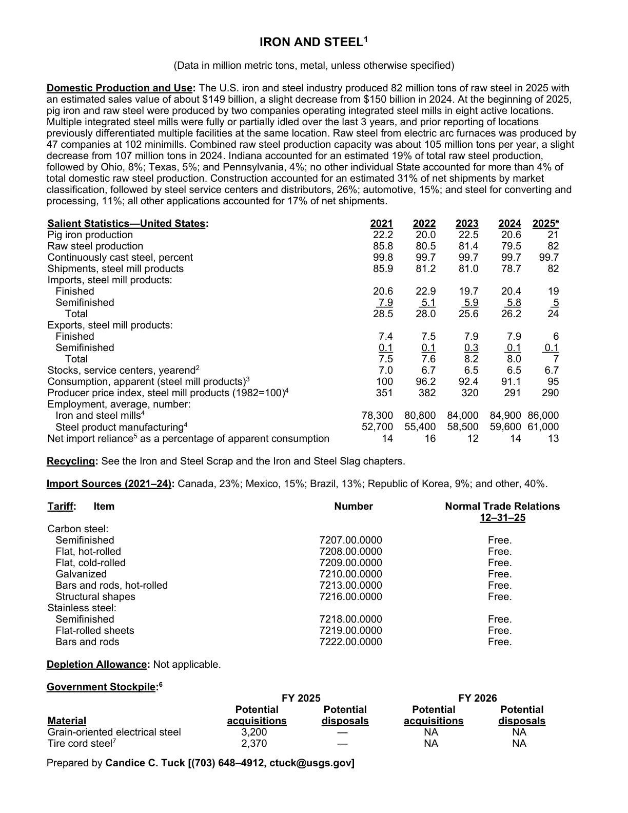
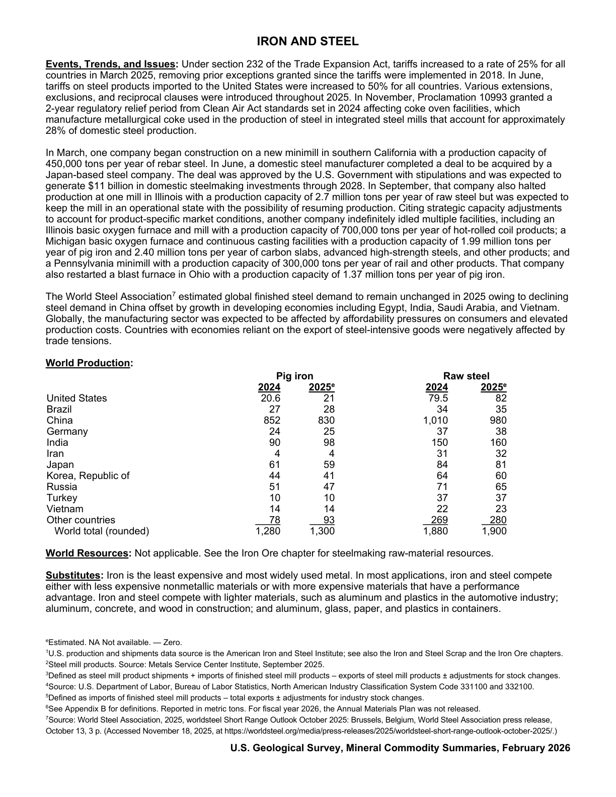

# Audit — Iron and Steel (iron-and-steel)

- **Source**: <https://pubs.usgs.gov/periodicals/mcs2026/mcs2026-iron-steel.pdf>
- **Edition**: MCS 2026 (2026-02)
- **Captured**: 2026-05-19
- **PDF SHA-256**: `99875e4897c8f391…`
- **Pages**: 2
- **Units note (verbatim)**: (Data in million metric tons, metal, unless otherwise specified)

## Latest-year US summary

| field | value |
| --- | --- |
| Mined production (US) | N/A |
| Primary smelting / refinery (US) | N/A |
| Secondary smelting / scrap (US) | N/A |
| Imports for consumption (total) | 24 |
| Exports (total) | 7 |
| Apparent consumption | 95 |
| Price, $ per pound | N/A |
| Net import reliance (% of apparent consumption) | 13 |

## Salient Statistics (US) — full table

| Row | Footnote | 2021 | 2022 | 2023 | 2024 | 2025e |
| --- | --- | ---: | ---: | ---: | ---: | ---: |
| Pig iron production |  | 22.20 | 20 | 22.50 | 20.60 | 21 |
| Raw steel production |  | 85.80 | 80.50 | 81.40 | 79.50 | 82 |
| Continuously cast steel, percent |  | 99.80 | 99.70 | 99.70 | 99.70 | 99.70 |
| Shipments, steel mill products |  | 85.90 | 81.20 | 81 | 78.70 | 82 |
| Finished |  | 20.60 | 22.90 | 19.70 | 20.40 | 19 |
| Semifinished |  | 7.90 | 5.10 | 5.90 | 5.80 | 5 |
| Total |  | 28.50 | 28 | 25.60 | 26.20 | 24 |
| Finished |  | 7.40 | 7.50 | 7.90 | 7.90 | 6 |
| Semifinished |  | 0.10 | 0.10 | 0.30 | 0.10 | 0.10 |
| Total |  | 7.50 | 7.60 | 8.20 | 8 | 7 |
| Stocks, service centers, yearend | 2 | 7 | 6.70 | 6.50 | 6.50 | 6.70 |
| Consumption, apparent (steel mill products) | 3 | 100 | 96.20 | 92.40 | 91.10 | 95 |
| Producer price index, steel mill products (1982=100) | 4 | 351 | 382 | 320 | 291 | 290 |
| Iron and steel mills | 4 | 78,300 | 80,800 | 84,000 | 84,900 | 86,000 |
| Steel product manufacturing | 4 | 52,700 | 55,400 | 58,500 | 59,600 | 61,000 |
| Net import reliance as a percentage of apparent consumption |  | 14 | 16 | 12 | 14 | 13 |

## Import Sources (2021-24)

**(all)**
- Canada: 23%
- Mexico: 15%
- Brazil: 13%
- Republic of Korea: 9%
- other: 40%

## World Production

| country | prev-yr | latest-yr | capacity | reserves | note |
| --- | ---: | ---: | ---: | ---: | --- |
| United States | 20.60 | 21 | N/A | N/A |  |
| Brazil | 27 | 28 | N/A | N/A |  |
| China | 852 | 830 | N/A | N/A |  |
| Germany | 24 | 25 | N/A | N/A |  |
| India | 90 | 98 | N/A | N/A |  |
| Iran | 4 | 4 | N/A | N/A |  |
| Japan | 61 | 59 | N/A | N/A |  |
| Korea, Republic of | 44 | 41 | N/A | N/A |  |
| Russia | 51 | 47 | N/A | N/A |  |
| Turkey | 10 | 10 | N/A | N/A |  |
| Vietnam | 14 | 14 | N/A | N/A |  |
| Other countries | 78 | 93 | N/A | N/A |  |
| World total (rounded) | 1,280 | 1,300 | N/A | N/A |  |

## Footnotes (verbatim)

- **1**: U.S. production and shipments data source is the American Iron and Steel Institute; see also the Iron and Steel Scrap and the Iron Ore chapters.
- **2**: Steel mill products. Source: Metals Service Center Institute, September 2025.
- **3**: Defined as steel mill product shipments + imports of finished steel mill products – exports of steel mill products ± adjustments for stock changes.
- **4**: Source: U.S. Department of Labor, Bureau of Labor Statistics, North American Industry Classification System Code 331100 and 332100.
- **5**: Defined as imports of finished steel mill products – total exports ± adjustments for industry stock changes.
- **6**: See Appendix B for definitions. Reported in metric tons. For fiscal year 2026, the Annual Materials Plan was not released.
- **7**: Source: World Steel Association, 2025, worldsteel Short Range Outlook October 2025: Brussels, Belgium, World Steel Association press release, October 13, 3 p. (Accessed November 18, 2025, at https://worldsteel.org/media/press-releases/2025/worldsteel-short-range-outlook-october-2025/.)
- **e**: Estimated. NA Not available. — Zero.

## Source page screenshots

### Page 1

### Page 2

