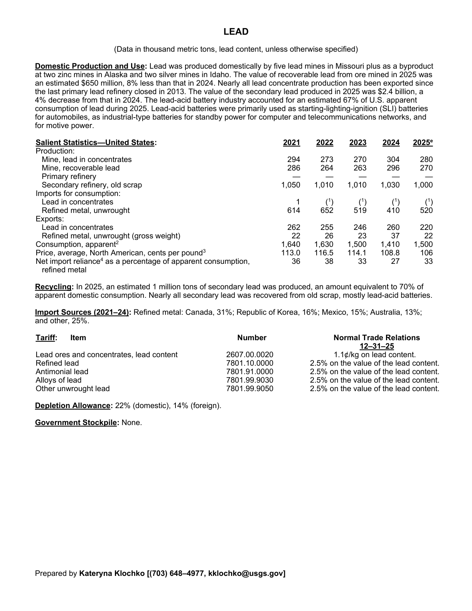
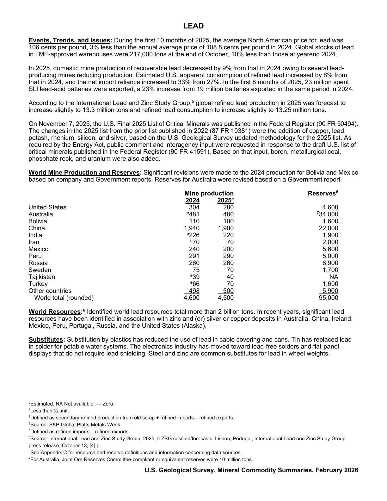

# Audit — Lead (lead)

- **Source**: <https://pubs.usgs.gov/periodicals/mcs2026/mcs2026-lead.pdf>
- **Edition**: MCS 2026 (2026-02)
- **Captured**: 2026-06-02
- **PDF SHA-256**: `7abd4936108c47b9…`
- **Pages**: 2
- **Units note (verbatim)**: (Data in thousand metric tons, lead content, unless otherwise specified)

## Latest-year US summary

| field | value |
| --- | --- |
| Mined production (US) | 280 |
| Primary smelting / refinery (US) | 0 |
| Secondary smelting / scrap (US) | 1,000 |
| Imports for consumption (total) | 520 |
| Exports (total) | 242 |
| Apparent consumption | 1,500 |
| Price, $ per pound | 106 |
| Net import reliance (% of apparent consumption) | 33 |

## Salient Statistics (US) — full table

_`2025e` = 2025 USGS estimate (preliminary); 2021–2024 are reported actuals._

| Row | Footnote | 2021 | 2022 | 2023 | 2024 | 2025e |
| --- | --- | ---: | ---: | ---: | ---: | ---: |
| Mine, lead in concentrates |  | 294 | 273 | 270 | 304 | 280 |
| Mine, recoverable lead |  | 286 | 264 | 263 | 296 | 270 |
| Primary refinery |  | 0 | 0 | 0 | 0 | 0 |
| Secondary refinery, old scrap |  | 1,050 | 1,010 | 1,010 | 1,030 | 1,000 |
| () Refined metal, unwrought |  | 614 | 652 | 519 | 410 | 520 |
| Lead in concentrates |  | 262 | 255 | 246 | 260 | 220 |
| Refined metal, unwrought (gross weight) |  | 22 | 26 | 23 | 37 | 22 |
| Consumption, apparent | 2 | 1,640 | 1,630 | 1,500 | 1,410 | 1,500 |
| Price, average, North American, cents per pound | 3 | 113 | 116.50 | 114.10 | 108.80 | 106 |
| Net import reliance as a percentage of apparent consumption, refined metal |  | 36 | 38 | 33 | 27 | 33 |

## Import Sources (2021-24)

**Refined metal**
- Canada: 31%
- Republic of Korea: 16%
- Mexico: 15%
- Australia: 13%
- other: 25%

## World Mine Production and Reserves

| country | prev-yr | latest-yr | capacity | reserves | note |
| --- | ---: | ---: | ---: | ---: | --- |
| United States | 304 | 280 | N/A | 4,600 |  |
| Australia | 481 | 480 | N/A | 34,000 | footnote 7 |
| Bolivia | 110 | 100 | N/A | 1,600 |  |
| China | 1,940 | 1,900 | N/A | 22,000 |  |
| India | 226 | 220 | N/A | 1,900 |  |
| Iran | 70 | 70 | N/A | 2,000 |  |
| Mexico | 240 | 200 | N/A | 5,600 |  |
| Peru | 291 | 290 | N/A | 5,000 |  |
| Russia | 260 | 260 | N/A | 8,900 |  |
| Sweden | 75 | 70 | N/A | 1,700 |  |
| Tajikistan | 39 | 40 | N/A | NA |  |
| Turkey | 66 | 70 | N/A | 1,600 |  |
| Other countries | 498 | 500 | N/A | 5,900 |  |
| World total (rounded) | 4,600 | 4,500 | N/A | 95,000 |  |

## Footnotes (verbatim)

- **1**: Less than ½ unit.
- **2**: Defined as secondary refined production from old scrap + refined imports – refined exports.
- **3**: Source: S&P Global Platts Metals Week.
- **4**: Defined as refined imports – refined exports.
- **5**: Source: International Lead and Zinc Study Group, 2025, ILZSG session/forecasts: Lisbon, Portugal, International Lead and Zinc Study Group press release, October 13, [4] p.
- **6**: See Appendix C for resource and reserve definitions and information concerning data sources.
- **7**: For Australia, Joint Ore Reserves Committee-compliant or equivalent reserves were 10 million tons.
- **e**: Estimated. NA Not available. — Zero.

## Source page screenshots

### Page 1

### Page 2

