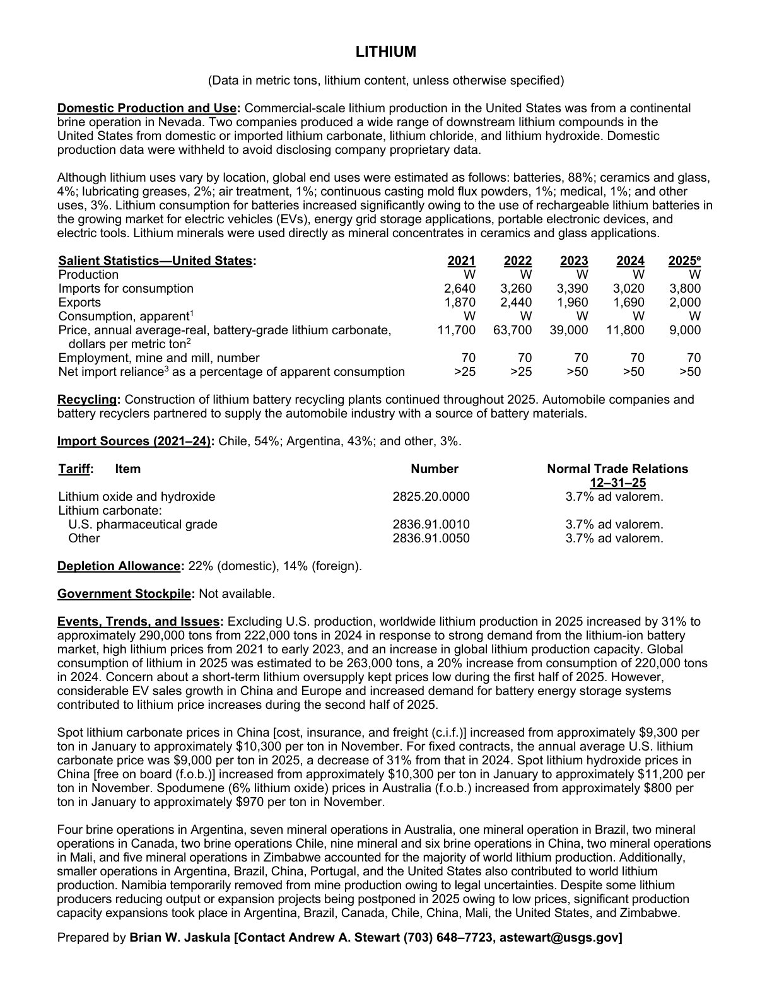
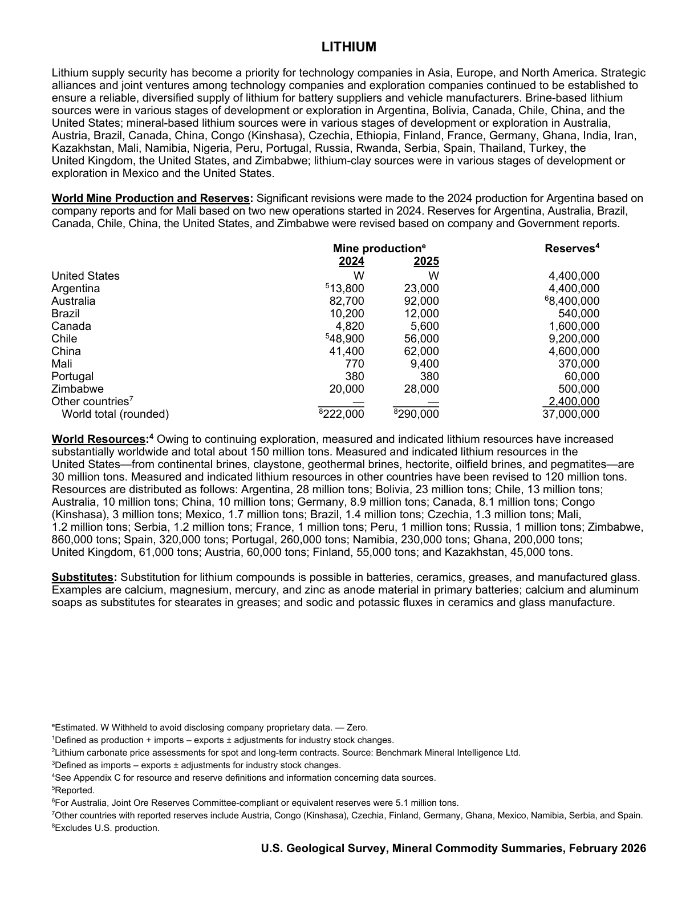

# Audit — Lithium (lithium)

- **Source**: <https://pubs.usgs.gov/periodicals/mcs2026/mcs2026-lithium.pdf>
- **Edition**: MCS 2026 (2026-02)
- **Captured**: 2026-05-18
- **PDF SHA-256**: `53f92ea45c367c36…`
- **Pages**: 2
- **Units note (verbatim)**: (Data in metric tons, lithium content, unless otherwise specified)

## Latest-year US summary

| field | value |
| --- | --- |
| Mined production (US) | _Not available_ |
| Primary smelting / refinery (US) | _Not available_ |
| Secondary smelting / scrap (US) | _Not available_ |
| Imports for consumption (total) | 3,800 |
| Exports (total) | 2,000 |
| Apparent consumption | _Not available_ |
| Price, $ per pound | 9,000 |
| Net import reliance (% of apparent consumption) | 50 |

## Salient Statistics (US) — full table

| Row | Footnote | 2021 | 2022 | 2023 | 2024 | 2025e |
| --- | --- | ---: | ---: | ---: | ---: | ---: |
| Production |  | _Not available_ | _Not available_ | _Not available_ | _Not available_ | _Not available_ |
| Imports for consumption |  | 2,640 | 3,260 | 3,390 | 3,020 | 3,800 |
| Exports |  | 1,870 | 2,440 | 1,960 | 1,690 | 2,000 |
| Consumption, apparent | 1 | _Not available_ | _Not available_ | _Not available_ | _Not available_ | _Not available_ |
| Price, annual average-real, battery-grade lithium carbonate, dollars per metric ton | 2 | 11,700 | 63,700 | 39,000 | 11,800 | 9,000 |
| Employment, mine and mill, number |  | 70 | 70 | 70 | 70 | 70 |
| Net import reliance as a percentage of apparent consumption |  | 25 | 25 | 50 | 50 | 50 |

## Import Sources (2021-24)

**(all)**
- Chile: 54%
- Argentina: 43%
- other: 3%

## World Mine Production and Reserves

| country | prev-yr | latest-yr | capacity | reserves | note |
| --- | ---: | ---: | ---: | ---: | --- |
| United States | _Not available_ | _Not available_ | _Not available_ | 4,400,000 |  |
| Argentina | 13,800 | 23,000 | _Not available_ | 4,400,000 | footnote 5 |
| Australia | 82,700 | 92,000 | _Not available_ | 8,400,000 | footnote 6 |
| Brazil | 10,200 | 12,000 | _Not available_ | 540,000 |  |
| Canada | 4,820 | 5,600 | _Not available_ | 1,600,000 |  |
| Chile | 48,900 | 56,000 | _Not available_ | 9,200,000 | footnote 5 |
| China | 41,400 | 62,000 | _Not available_ | 4,600,000 |  |
| Mali | 770 | 9,400 | _Not available_ | 370,000 |  |
| Portugal | 380 | 380 | _Not available_ | 60,000 |  |
| Zimbabwe | 20,000 | 28,000 | _Not available_ | 500,000 |  |
| Other countries | 0 | 0 | _Not available_ | 2,400,000 | footnote 7 |
| World total (rounded) | 222,000 | 290,000 | _Not available_ | 37,000,000 | footnote 8 |

## Footnotes (verbatim)

- **1**: Defined as production + imports – exports ± adjustments for industry stock changes.
- **2**: Lithium carbonate price assessments for spot and long-term contracts. Source: Benchmark Mineral Intelligence Ltd.
- **3**: Defined as imports – exports ± adjustments for industry stock changes.
- **4**: See Appendix C for resource and reserve definitions and information concerning data sources.
- **5**: Reported.
- **6**: For Australia, Joint Ore Reserves Committee-compliant or equivalent reserves were 5.1 million tons.
- **7**: Other countries with reported reserves include Austria, Congo (Kinshasa), Czechia, Finland, Germany, Ghana, Mexico, Namibia, Serbia, and Spain.
- **8**: Excludes U.S. production.
- **e**: Estimated. W Withheld to avoid disclosing company proprietary data. — Zero.

## Source page screenshots

### Page 1

### Page 2

