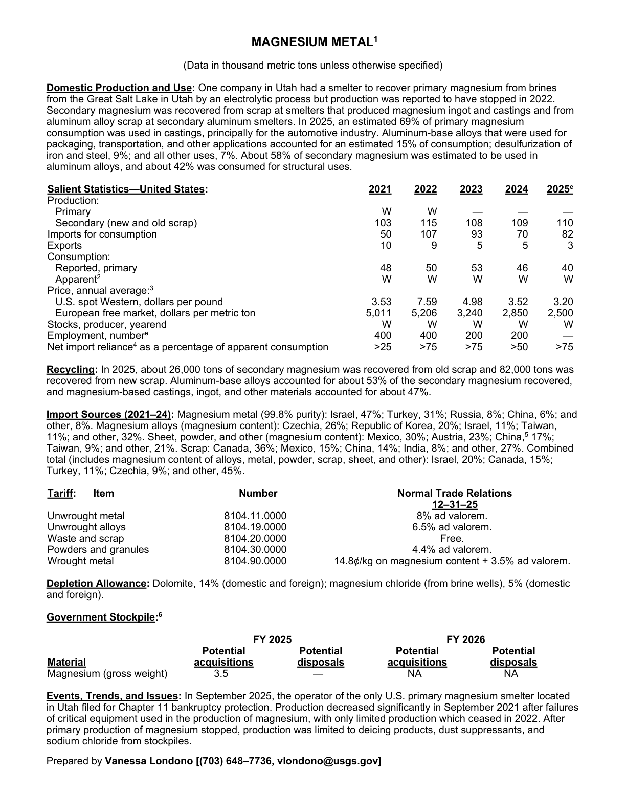
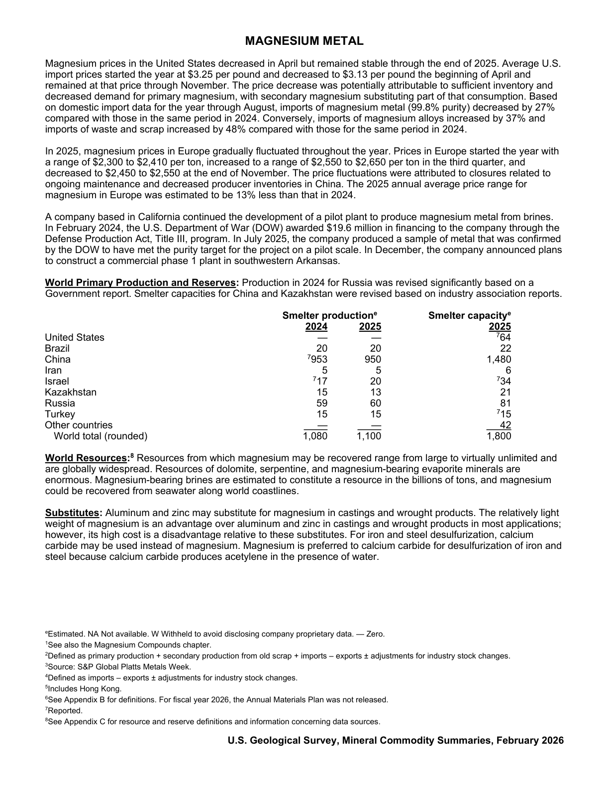

# Audit — Magnesium (magnesium)

- **Source**: <https://pubs.usgs.gov/periodicals/mcs2026/mcs2026-magnesium-metal.pdf>
- **Edition**: MCS 2026 (2026-02)
- **Captured**: 2026-05-19
- **PDF SHA-256**: `33466d52d8273b40…`
- **Pages**: 2
- **Units note (verbatim)**: (Data in thousand metric tons unless otherwise specified)

## Latest-year US summary

| field | value |
| --- | --- |
| Mined production (US) | N/A |
| Primary smelting / refinery (US) | 0 |
| Secondary smelting / scrap (US) | 110 |
| Imports for consumption (total) | 82 |
| Exports (total) | 3 |
| Apparent consumption | N/A |
| Price, $ per pound | 3.20 |
| Net import reliance (% of apparent consumption) | 75 |

## Salient Statistics (US) — full table

| Row | Footnote | 2021 | 2022 | 2023 | 2024 | 2025e |
| --- | --- | ---: | ---: | ---: | ---: | ---: |
| Primary |  | W | W | 0 | 0 | 0 |
| Secondary (new and old scrap) |  | 103 | 115 | 108 | 109 | 110 |
| Imports for consumption |  | 50 | 107 | 93 | 70 | 82 |
| Exports |  | 10 | 9 | 5 | 5 | 3 |
| Reported, primary |  | 48 | 50 | 53 | 46 | 40 |
| Apparent | 2 | W | W | W | W | W |
| U.S. spot Western, dollars per pound |  | 3.53 | 7.59 | 4.98 | 3.52 | 3.20 |
| European free market, dollars per metric ton |  | 5,011 | 5,206 | 3,240 | 2,850 | 2,500 |
| Stocks, producer, yearend |  | W | W | W | W | W |
| Employment, number |  | 400 | 400 | 200 | 200 | 0 |
| Net import reliance as a percentage of apparent consumption |  | >25 | >75 | >75 | >50 | >75 |

## Import Sources (2021-24)

**Magnesium alloys (magnesium content)**
- Czechia: 26%
- Republic of Korea: 20%
- Israel: 11%
- Taiwan: 11%
- other: 32%

**Sheet, powder, and other (magnesium content)**
- Mexico: 30%
- Austria: 23%
- China: 17%
- Taiwan: 9%
- other: 21%

**Scrap**
- Canada: 36%
- Mexico: 15%
- China: 14%
- India: 8%
- other: 27%
- Canada: 15%
- Turkey: 11%
- Czechia: 9%
- other: 45%

## World Primary Production and Reserves

| country | prev-yr | latest-yr | capacity | reserves | note |
| --- | ---: | ---: | ---: | ---: | --- |
| United States | 0 | 0 | N/A | N/A | footnote 7 |
| Brazil | 20 | 20 | N/A | N/A |  |
| China | 953 | 950 | N/A | N/A | footnote 7 |
| Iran | 5 | 5 | N/A | N/A |  |
| Israel | 17 | 20 | N/A | N/A | footnote 7 |
| Kazakhstan | 15 | 13 | N/A | N/A |  |
| Russia | 59 | 60 | N/A | N/A |  |
| Turkey | 15 | 15 | N/A | N/A | footnote 7 |
| Other countries | 0 | 0 | N/A | N/A |  |
| World total (rounded) | 1,080 | 1,100 | N/A | N/A |  |

## Footnotes (verbatim)

- **1**: See also the Magnesium Compounds chapter.
- **2**: Defined as primary production + secondary production from old scrap + imports – exports ± adjustments for industry stock changes.
- **3**: Source: S&P Global Platts Metals Week.
- **4**: Defined as imports – exports ± adjustments for industry stock changes.
- **5**: Includes Hong Kong.
- **6**: See Appendix B for definitions. For fiscal year 2026, the Annual Materials Plan was not released.
- **7**: Reported.
- **8**: See Appendix C for resource and reserve definitions and information concerning data sources.
- **e**: Estimated. NA Not available. W Withheld to avoid disclosing company proprietary data. — Zero.

## Source page screenshots

### Page 1

### Page 2

