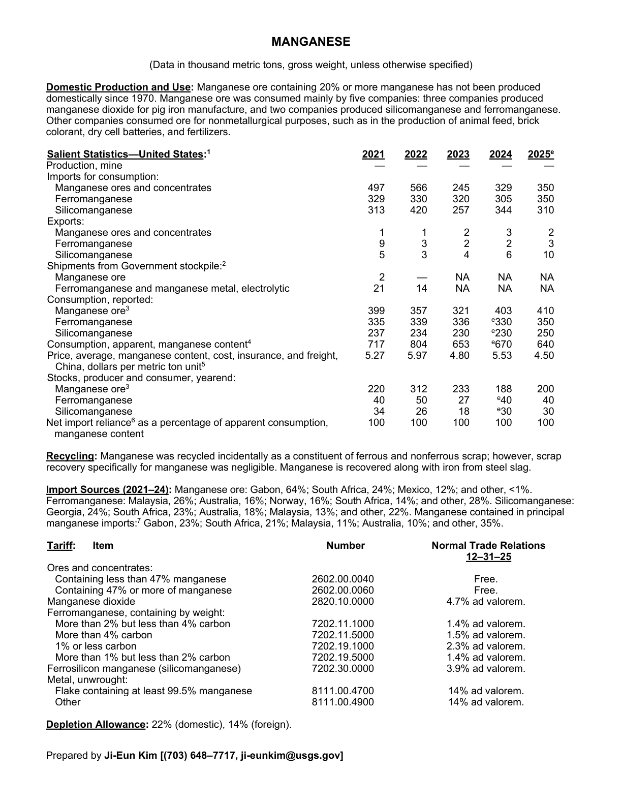
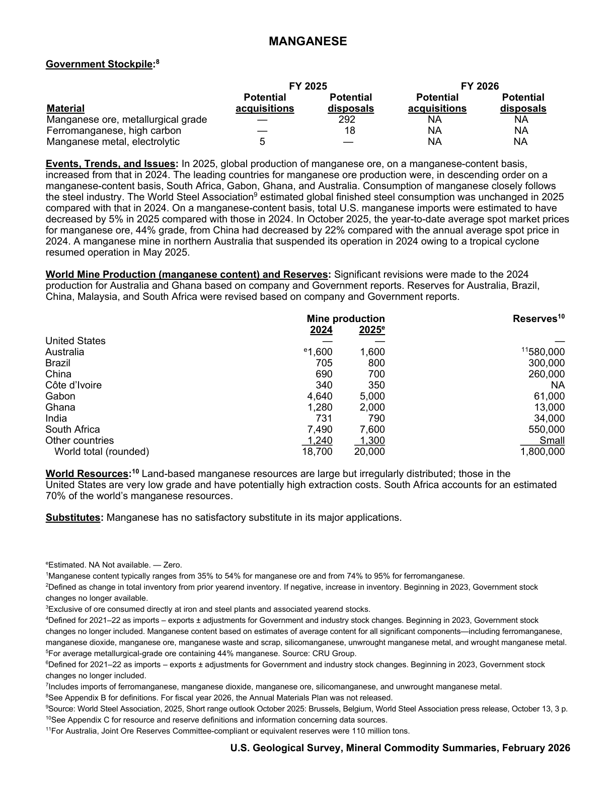

# Audit — Manganese (manganese)

- **Source**: <https://pubs.usgs.gov/periodicals/mcs2026/mcs2026-manganese.pdf>
- **Edition**: MCS 2026 (2026-02)
- **Captured**: 2026-05-19
- **PDF SHA-256**: `05e4fc710af04302…`
- **Pages**: 2
- **Units note (verbatim)**: (Data in thousand metric tons, gross weight, unless otherwise specified)

## Latest-year US summary

| field | value |
| --- | --- |
| Mined production (US) | 0 |
| Primary smelting / refinery (US) | N/A |
| Secondary smelting / scrap (US) | N/A |
| Imports for consumption (total) | 1,010 |
| Exports (total) | 15 |
| Apparent consumption | 640 |
| Price, $ per pound | 4.50 |
| Net import reliance (% of apparent consumption) | 100 |

## Salient Statistics (US) — full table

_`2025e` = 2025 USGS estimate (preliminary); 2021–2024 are reported actuals._

| Row | Footnote | 2021 | 2022 | 2023 | 2024 | 2025e |
| --- | --- | ---: | ---: | ---: | ---: | ---: |
| Production, mine |  | 0 | 0 | 0 | 0 | 0 |
| Manganese ores and concentrates |  | 497 | 566 | 245 | 329 | 350 |
| Ferromanganese |  | 329 | 330 | 320 | 305 | 350 |
| Silicomanganese |  | 313 | 420 | 257 | 344 | 310 |
| Manganese ores and concentrates |  | 1 | 1 | 2 | 3 | 2 |
| Ferromanganese |  | 9 | 3 | 2 | 2 | 3 |
| Silicomanganese |  | 5 | 3 | 4 | 6 | 10 |
| Manganese ore |  | 2 | 0 | NA | NA | NA |
| Ferromanganese and manganese metal, electrolytic |  | 21 | 14 | NA | NA | NA |
| Manganese ore | 3 | 399 | 357 | 321 | 403 | 410 |
| Ferromanganese |  | 335 | 339 | 336 | 330 | 350 |
| Silicomanganese |  | 237 | 234 | 230 | 230 | 250 |
| Consumption, apparent, manganese content | 4 | 717 | 804 | 653 | 670 | 640 |
| Price, average, manganese content, cost, insurance, and freight, China, dollars per metric ton unit | 5 | 5.27 | 5.97 | 4.80 | 5.53 | 4.50 |
| Manganese ore | 3 | 220 | 312 | 233 | 188 | 200 |
| Ferromanganese |  | 40 | 50 | 27 | 40 | 40 |
| Silicomanganese |  | 34 | 26 | 18 | 30 | 30 |
| Net import reliance as a percentage of apparent consumption, manganese content |  | 100 | 100 | 100 | 100 | 100 |

## Import Sources (2021-24)

**Manganese ore**
- Gabon: 64%
- South Africa: 24%
- Mexico: 12%
- other: 1%

**Ferromanganese**
- Malaysia: 26%
- Australia: 16%
- Norway: 16%
- South Africa: 14%
- other: 28%

**Silicomanganese**
- Georgia: 24%
- South Africa: 23%
- Australia: 18%
- Malaysia: 13%
- other: 22%

**Manganese contained in principal manganese imports**
- Gabon: 23%
- South Africa: 21%
- Malaysia: 11%
- Australia: 10%
- other: 35%

## World Mine Production (manganese content) and Reserves

| country | prev-yr | latest-yr | capacity | reserves | note |
| --- | ---: | ---: | ---: | ---: | --- |
| United States | 0 | 0 | N/A | 0 |  |
| Australia | 1,600 | 1,600 | N/A | 580,000 | footnote 11 |
| Brazil | 705 | 800 | N/A | 300,000 |  |
| China | 690 | 700 | N/A | 260,000 |  |
| Côte d’Ivoire | 340 | 350 | N/A | NA |  |
| Gabon | 4,640 | 5,000 | N/A | 61,000 |  |
| Ghana | 1,280 | 2,000 | N/A | 13,000 |  |
| India | 731 | 790 | N/A | 34,000 |  |
| South Africa | 7,490 | 7,600 | N/A | 550,000 |  |
| Other countries | 1,240 | 1,300 | N/A | N/A |  |
| World total (rounded) | 18,700 | 20,000 | N/A | 1,800,000 |  |

## Footnotes (verbatim)

- **1**: Manganese content typically ranges from 35% to 54% for manganese ore and from 74% to 95% for ferromanganese.
- **2**: Defined as change in total inventory from prior yearend inventory. If negative, increase in inventory. Beginning in 2023, Government stock changes no longer available.
- **3**: Exclusive of ore consumed directly at iron and steel plants and associated yearend stocks.
- **4**: Defined for 2021–22 as imports – exports ± adjustments for Government and industry stock changes. Beginning in 2023, Government stock changes no longer included. Manganese content based on estimates of average content for all significant components—including ferromanganese, manganese dioxide, manganese ore, manganese waste and scrap, silicomanganese, unwrought manganese metal, and wrought manganese metal.
- **5**: For average metallurgical-grade ore containing 44% manganese. Source: CRU Group.
- **6**: Defined for 2021–22 as imports – exports ± adjustments for Government and industry stock changes. Beginning in 2023, Government stock changes no longer included.
- **7**: Includes imports of ferromanganese, manganese dioxide, manganese ore, silicomanganese, and unwrought manganese metal.
- **8**: See Appendix B for definitions. For fiscal year 2026, the Annual Materials Plan was not released.
- **9**: Source: World Steel Association, 2025, Short range outlook October 2025: Brussels, Belgium, World Steel Association press release, October 13, 3 p.
- **10**: See Appendix C for resource and reserve definitions and information concerning data sources.
- **11**: For Australia, Joint Ore Reserves Committee-compliant or equivalent reserves were 110 million tons.
- **e**: Estimated. NA Not available. — Zero.

## Source page screenshots

### Page 1

### Page 2

