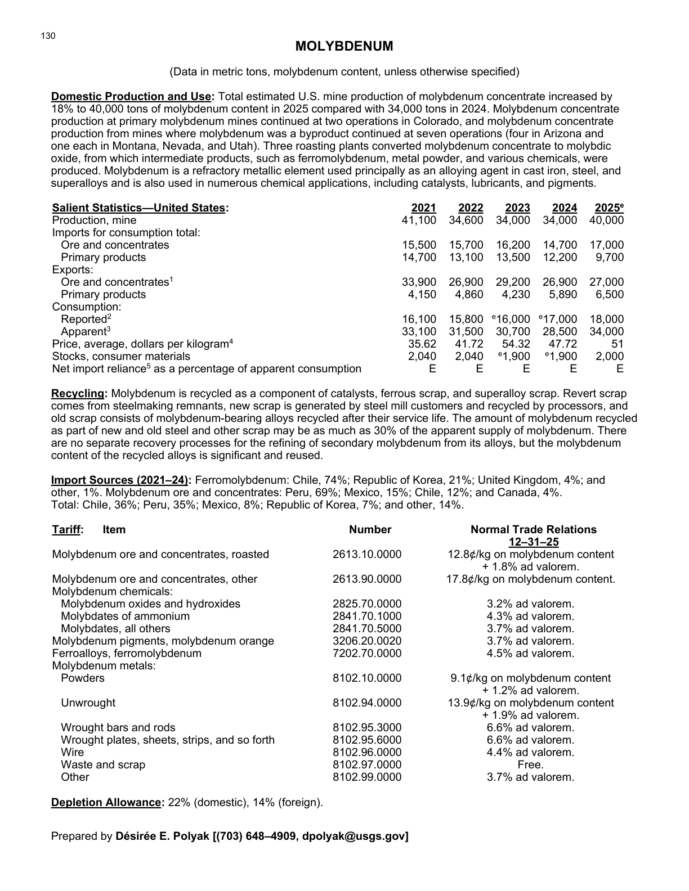
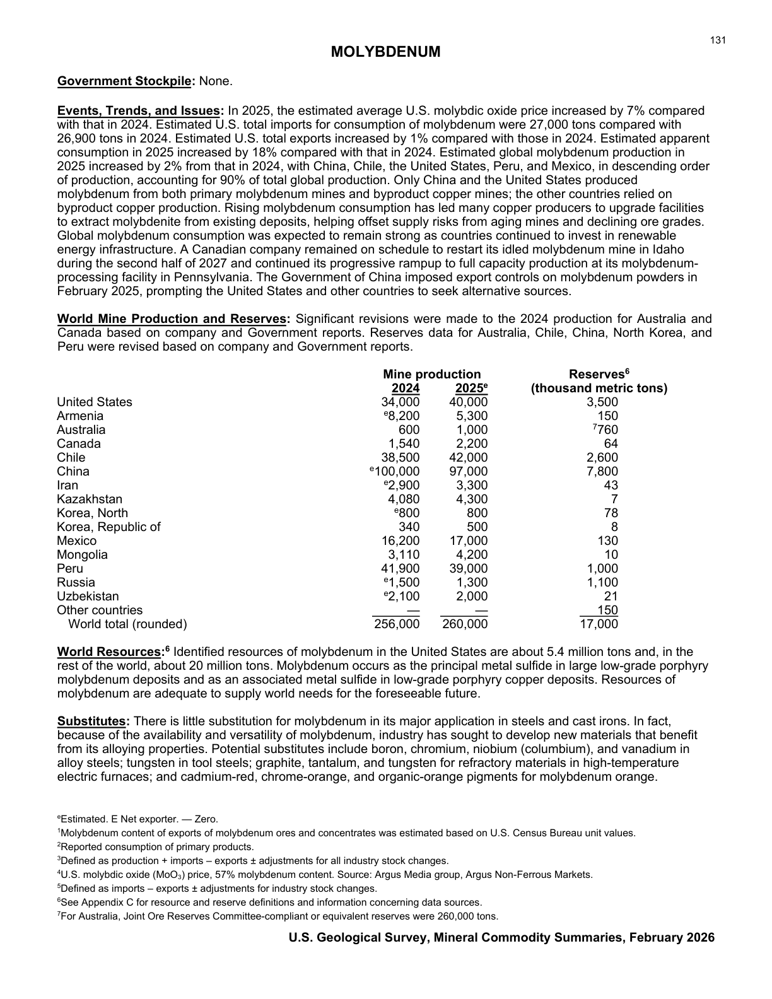

# Audit — Molybdenum (molybdenum)

- **Source**: <https://pubs.usgs.gov/periodicals/mcs2026/mcs2026-molybdenum.pdf>
- **Edition**: MCS 2026 (2026-02)
- **Captured**: 2026-05-19
- **PDF SHA-256**: `497f50f03629cccc…`
- **Pages**: 2
- **Units note (verbatim)**: (Data in metric tons, molybdenum content, unless otherwise specified)

## Latest-year US summary

| field | value |
| --- | --- |
| Mined production (US) | 40,000 |
| Primary smelting / refinery (US) | N/A |
| Secondary smelting / scrap (US) | N/A |
| Imports for consumption (total) | 26,700 |
| Exports (total) | 33,500 |
| Apparent consumption | 34,000 |
| Price, $ per pound | 51 |
| Net import reliance (% of apparent consumption) | N/A |

## Salient Statistics (US) — full table

| Row | Footnote | 2021 | 2022 | 2023 | 2024 | 2025e |
| --- | --- | ---: | ---: | ---: | ---: | ---: |
| Production, mine |  | 41,100 | 34,600 | 34,000 | 34,000 | 40,000 |
| Ore and concentrates |  | 15,500 | 15,700 | 16,200 | 14,700 | 17,000 |
| Primary products |  | 14,700 | 13,100 | 13,500 | 12,200 | 9,700 |
| Ore and concentrates | 1 | 33,900 | 26,900 | 29,200 | 26,900 | 27,000 |
| Primary products |  | 4,150 | 4,860 | 4,230 | 5,890 | 6,500 |
| Reported | 2 | 16,100 | 15,800 | 16,000 | 17,000 | 18,000 |
| Apparent | 3 | 33,100 | 31,500 | 30,700 | 28,500 | 34,000 |
| Price, average, dollars per kilogram | 4 | 35.62 | 41.72 | 54.32 | 47.72 | 51 |
| Stocks, consumer materials |  | 2,040 | 2,040 | 1,900 | 1,900 | 2,000 |
| Net import reliance as a percentage of apparent consumption |  | E | E | E | E | E |

## Import Sources (2021-24)

**Ferromolybdenum**
- Chile: 74%
- Republic of Korea: 21%
- United Kingdom: 4%
- other: 1%

**Molybdenum ore and concentrates**
- Peru: 69%
- Mexico: 15%
- Chile: 12%
- Canada: 4%

**Total**
- Chile: 36%
- Peru: 35%
- Mexico: 8%
- Republic of Korea: 7%
- other: 14%

## World Mine Production and Reserves

| country | prev-yr | latest-yr | capacity | reserves | note |
| --- | ---: | ---: | ---: | ---: | --- |
| 2024 | 2,025 | N/A | N/A | N/A |  |
| United States | 34,000 | 40,000 | N/A | 3,500 |  |
| Armenia | 8,200 | 5,300 | N/A | 150 |  |
| Australia | 600 | 1,000 | N/A | 760 | footnote 7 |
| Canada | 1,540 | 2,200 | N/A | 64 |  |
| Chile | 38,500 | 42,000 | N/A | 2,600 |  |
| China | 100,000 | 97,000 | N/A | 7,800 |  |
| Iran | 2,900 | 3,300 | N/A | 43 |  |
| Kazakhstan | 4,080 | 4,300 | N/A | 7 |  |
| Korea, North | 800 | 800 | N/A | 78 |  |
| Korea, Republic of | 340 | 500 | N/A | 8 |  |
| Mexico | 16,200 | 17,000 | N/A | 130 |  |
| Mongolia | 3,110 | 4,200 | N/A | 10 |  |
| Peru | 41,900 | 39,000 | N/A | 1,000 |  |
| Russia | 1,500 | 1,300 | N/A | 1,100 |  |
| Uzbekistan | 2,100 | 2,000 | N/A | 21 |  |
| Other countries | 0 | 0 | N/A | 150 |  |
| World total (rounded) | 256,000 | 260,000 | N/A | 17,000 |  |

## Footnotes (verbatim)

- **1**: Molybdenum content of exports of molybdenum ores and concentrates was estimated based on U.S. Census Bureau unit values.
- **2**: Reported consumption of primary products.
- **3**: Defined as production + imports – exports ± adjustments for all industry stock changes.
- **4**: U.S. molybdic oxide (MoO) price, 57% molybdenum content. Source: Argus Media group, Argus Non-Ferrous Markets.
- **5**: Defined as imports – exports ± adjustments for industry stock changes.
- **6**: See Appendix C for resource and reserve definitions and information concerning data sources.
- **7**: For Australia, Joint Ore Reserves Committee-compliant or equivalent reserves were 260,000 tons. 131
- **e**: Estimated. E Net exporter. — Zero.

## Source page screenshots

### Page 1

### Page 2

