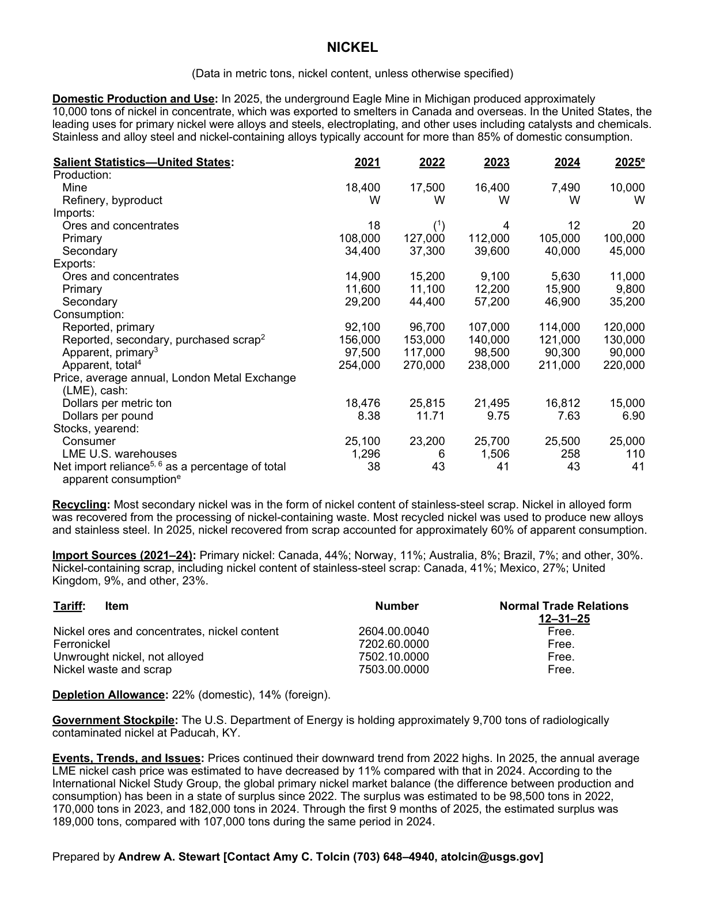
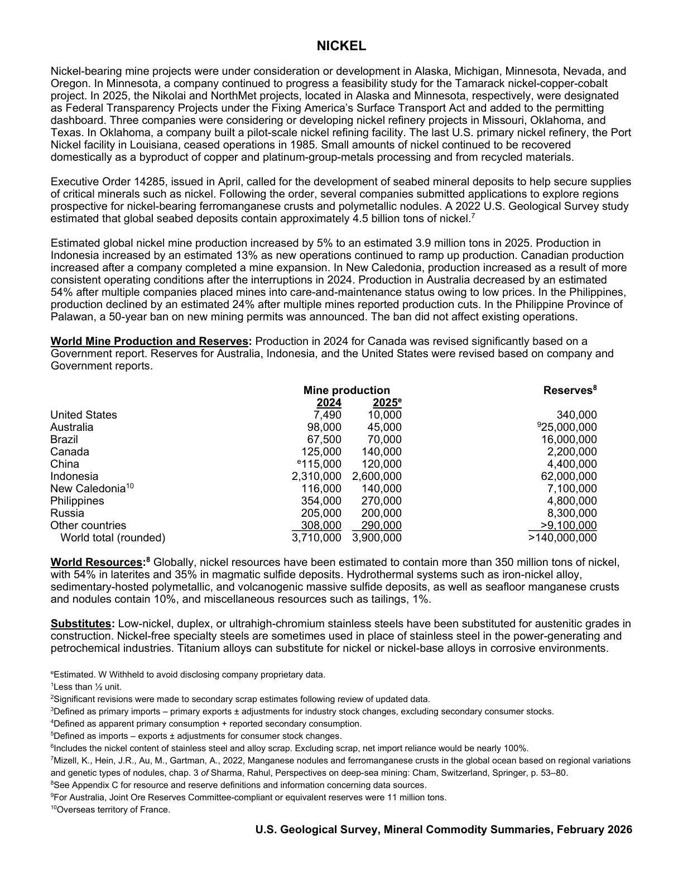

# Audit — Nickel (nickel)

- **Source**: <https://pubs.usgs.gov/periodicals/mcs2026/mcs2026-nickel.pdf>
- **Edition**: MCS 2026 (2026-02)
- **Captured**: 2026-05-19
- **PDF SHA-256**: `70aab7644bc8b43f…`
- **Pages**: 2
- **Units note (verbatim)**: (Data in metric tons, nickel content, unless otherwise specified)

## Latest-year US summary

| field | value |
| --- | --- |
| Mined production (US) | 10,000 |
| Primary smelting / refinery (US) | N/A |
| Secondary smelting / scrap (US) | 45,000 |
| Imports for consumption (total) | 145,000 |
| Exports (total) | 56,000 |
| Apparent consumption | 90,000 |
| Price, $ per pound | 15,000 |
| Net import reliance (% of apparent consumption) | 41 |

## Salient Statistics (US) — full table

_`2025e` = 2025 USGS estimate (preliminary); 2021–2024 are reported actuals._

| Row | Footnote | 2021 | 2022 | 2023 | 2024 | 2025e |
| --- | --- | ---: | ---: | ---: | ---: | ---: |
| Mine |  | 18,400 | 17,500 | 16,400 | 7,490 | 10,000 |
| Refinery, byproduct |  | W | W | W | W | W |
| 20 Primary |  | 108,000 | 127,000 | 112,000 | 105,000 | 100,000 |
| Secondary |  | 34,400 | 37,300 | 39,600 | 40,000 | 45,000 |
| Ores and concentrates |  | 14,900 | 15,200 | 9,100 | 5,630 | 11,000 |
| Primary |  | 11,600 | 11,100 | 12,200 | 15,900 | 9,800 |
| Secondary |  | 29,200 | 44,400 | 57,200 | 46,900 | 35,200 |
| Reported, primary |  | 92,100 | 96,700 | 107,000 | 114,000 | 120,000 |
| Reported, secondary, purchased scrap | 2 | 156,000 | 153,000 | 140,000 | 121,000 | 130,000 |
| Apparent, primary | 3 | 97,500 | 117,000 | 98,500 | 90,300 | 90,000 |
| Apparent, total | 4 | 254,000 | 270,000 | 238,000 | 211,000 | 220,000 |
| Dollars per metric ton |  | 18,476 | 25,815 | 21,495 | 16,812 | 15,000 |
| Dollars per pound |  | 8.38 | 11.71 | 9.75 | 7.63 | 6.90 |
| Consumer |  | 25,100 | 23,200 | 25,700 | 25,500 | 25,000 |
| LME U.S. warehouses |  | 1,296 | 6 | 1,506 | 258 | 110 |
| Net import reliance as a percentage of total apparent consumption |  | 38 | 43 | 41 | 43 | 41 |

## Import Sources (2021-24)

**Primary nickel**
- Canada: 44%
- Norway: 11%
- Australia: 8%
- Brazil: 7%
- other: 30%

**Nickel-containing scrap, including nickel content of stainless-steel scrap**
- Canada: 41%
- Mexico: 27%
- United Kingdom: 9%
- other: 23%

## World Mine Production and Reserves

| country | prev-yr | latest-yr | capacity | reserves | note |
| --- | ---: | ---: | ---: | ---: | --- |
| United States | 7,490 | 10,000 | N/A | 340,000 |  |
| Australia | 98,000 | 45,000 | N/A | 25,000,000 | footnote 9 |
| Brazil | 67,500 | 70,000 | N/A | 16,000,000 |  |
| Canada | 125,000 | 140,000 | N/A | 2,200,000 |  |
| China | 115,000 | 120,000 | N/A | 4,400,000 |  |
| Indonesia | 2,310,000 | 2,600,000 | N/A | 62,000,000 |  |
| New Caledonia | 116,000 | 140,000 | N/A | 7,100,000 | footnote 10 |
| Philippines | 354,000 | 270,000 | N/A | 4,800,000 |  |
| Russia | 205,000 | 200,000 | N/A | 8,300,000 |  |
| Other countries | 308,000 | 290,000 | N/A | >9,100,000 |  |
| World total (rounded) | 3,710,000 | 3,900,000 | N/A | >140,000,000 |  |

## Footnotes (verbatim)

- **1**: Less than ½ unit.
- **2**: Significant revisions were made to secondary scrap estimates following review of updated data.
- **3**: Defined as primary imports – primary exports ± adjustments for industry stock changes, excluding secondary consumer stocks.
- **4**: Defined as apparent primary consumption + reported secondary consumption.
- **5**: Defined as imports – exports ± adjustments for consumer stock changes.
- **6**: Includes the nickel content of stainless steel and alloy scrap. Excluding scrap, net import reliance would be nearly 100%.
- **7**: Mizell, K., Hein, J.R., Au, M., Gartman, A., 2022, Manganese nodules and ferromanganese crusts in the global ocean based on regional variations and genetic types of nodules, chap. 3 of Sharma, Rahul, Perspectives on deep-sea mining: Cham, Switzerland, Springer, p. 53–80.
- **8**: See Appendix C for resource and reserve definitions and information concerning data sources.
- **9**: For Australia, Joint Ore Reserves Committee-compliant or equivalent reserves were 11 million tons.
- **10**: Overseas territory of France.
- **e**: Estimated. W Withheld to avoid disclosing company proprietary data.

## Source page screenshots

### Page 1

### Page 2

