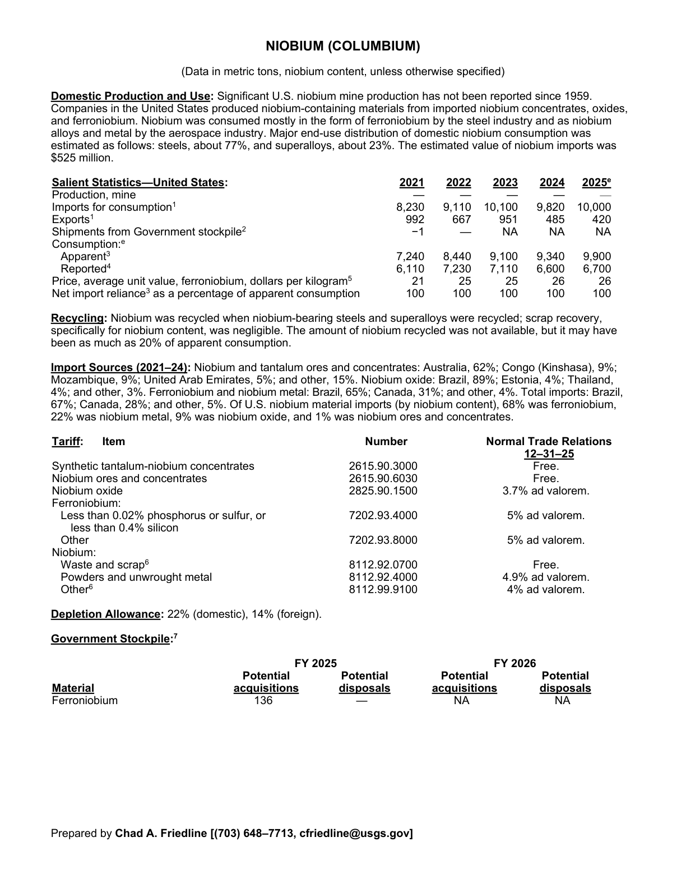
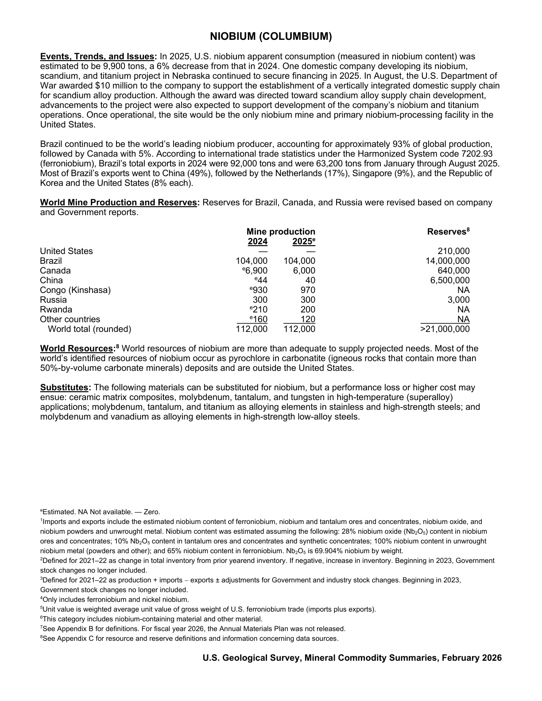

# Audit — Niobium (columbium) (niobium)

- **Source**: <https://pubs.usgs.gov/periodicals/mcs2026/mcs2026-niobium.pdf>
- **Edition**: MCS 2026 (2026-02)
- **Captured**: 2026-05-19
- **PDF SHA-256**: `c4b8bcabd8901289…`
- **Pages**: 2
- **Units note (verbatim)**: (Data in metric tons, niobium content, unless otherwise specified)

## Latest-year US summary

| field | value |
| --- | --- |
| Mined production (US) | 0 |
| Primary smelting / refinery (US) | N/A |
| Secondary smelting / scrap (US) | N/A |
| Imports for consumption (total) | 10,000 |
| Exports (total) | 420 |
| Apparent consumption | 9,900 |
| Price, $ per pound | 26 |
| Net import reliance (% of apparent consumption) | 100 |

## Salient Statistics (US) — full table

_`2025e` = 2025 USGS estimate (preliminary); 2021–2024 are reported actuals._

| Row | Footnote | 2021 | 2022 | 2023 | 2024 | 2025e |
| --- | --- | ---: | ---: | ---: | ---: | ---: |
| Production, mine |  | 0 | 0 | 0 | 0 | 0 |
| Imports for consumption | 1 | 8,230 | 9,110 | 10,100 | 9,820 | 10,000 |
| Exports | 1 | 992 | 667 | 951 | 485 | 420 |
| Apparent | 3 | 7,240 | 8,440 | 9,100 | 9,340 | 9,900 |
| Reported | 4 | 6,110 | 7,230 | 7,110 | 6,600 | 6,700 |
| Price, average unit value, ferroniobium, dollars per kilogram | 5 | 21 | 25 | 25 | 26 | 26 |
| Net import reliance as a percentage of apparent consumption |  | 100 | 100 | 100 | 100 | 100 |

## Import Sources (2021-24)

**Niobium and tantalum ores and concentrates**
- Australia: 62%
- Congo (Kinshasa): 9%
- Mozambique: 9%
- United Arab Emirates: 5%
- other: 15%

**Niobium oxide**
- Brazil: 89%
- Estonia: 4%
- Thailand: 4%
- other: 3%

**Ferroniobium and niobium metal**
- Brazil: 65%
- Canada: 31%
- other: 4%

**Total imports**
- Brazil: 67%
- Canada: 28%
- other: 5%

## World Mine Production and Reserves

| country | prev-yr | latest-yr | capacity | reserves | note |
| --- | ---: | ---: | ---: | ---: | --- |
| United States | 0 | 0 | N/A | 210,000 |  |
| Brazil | 104,000 | 104,000 | N/A | 14,000,000 |  |
| Canada | 6,900 | 6,000 | N/A | 640,000 |  |
| China | 44 | 40 | N/A | 6,500,000 |  |
| Congo (Kinshasa) | 930 | 970 | N/A | NA |  |
| Russia | 300 | 300 | N/A | 3,000 |  |
| Rwanda | 210 | 200 | N/A | NA |  |
| Other countries | 160 | 120 | N/A | NA |  |
| World total (rounded) | 112,000 | 112,000 | N/A | >21,000,000 |  |

## Footnotes (verbatim)

- **1**: Imports and exports include the estimated niobium content of ferroniobium, niobium and tantalum ores and concentrates, niobium oxide, and niobium powders and unwrought metal. Niobium content was estimated assuming the following: 28% niobium oxide (NbO) content in niobium ores and concentrates; 10% NbO content in tantalum ores and concentrates and synthetic concentrates; 100% niobium content in unwrought niobium metal (powders and other); and 65% niobium content in ferroniobium. NbO is 69.904% niobium by weight.
- **2**: Defined for 2021–22 as change in total inventory from prior yearend inventory. If negative, increase in inventory. Beginning in 2023, Government stock changes no longer included.
- **3**: Defined for 2021–22 as production + imports − exports ± adjustments for Government and industry stock changes. Beginning in 2023, Government stock changes no longer included.
- **4**: Only includes ferroniobium and nickel niobium.
- **5**: Unit value is weighted average unit value of gross weight of U.S. ferroniobium trade (imports plus exports).
- **6**: This category includes niobium-containing material and other material.
- **7**: See Appendix B for definitions. For fiscal year 2026, the Annual Materials Plan was not released.
- **8**: See Appendix C for resource and reserve definitions and information concerning data sources.
- **e**: Estimated. NA Not available. — Zero.

## Source page screenshots

### Page 1

### Page 2

