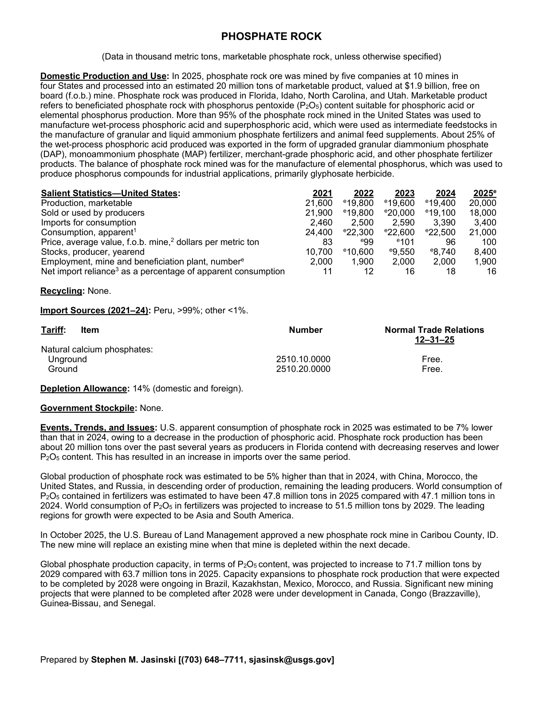
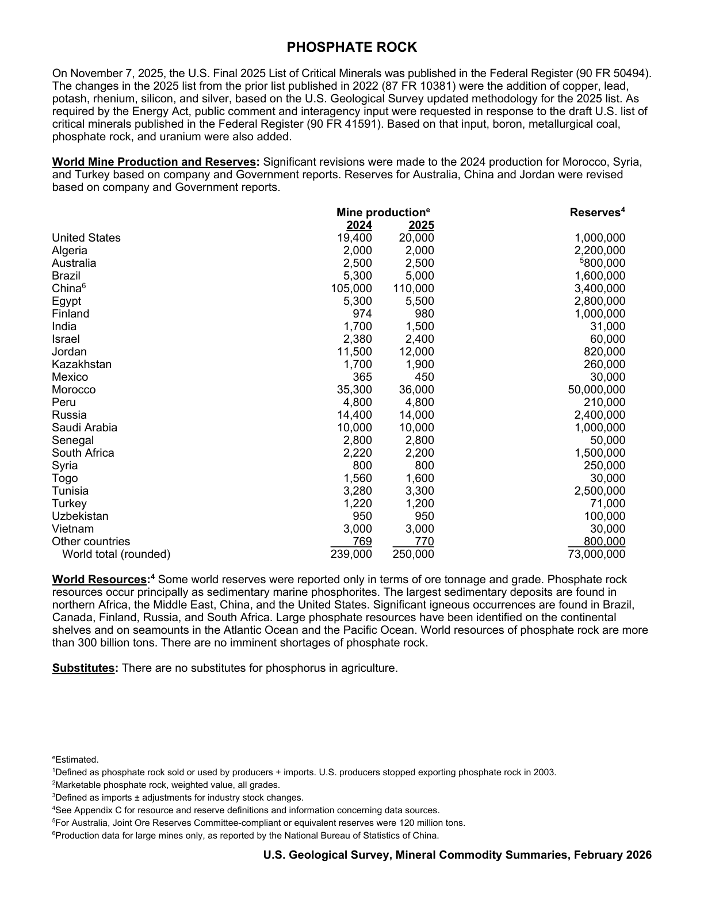

# Audit — Phosphate rock (phosphate)

- **Source**: <https://pubs.usgs.gov/periodicals/mcs2026/mcs2026-phosphate.pdf>
- **Edition**: MCS 2026 (2026-02)
- **Captured**: 2026-06-02
- **PDF SHA-256**: `6aec496668eb9d9e…`
- **Pages**: 2
- **Units note (verbatim)**: (Data in thousand metric tons, marketable phosphate rock, unless otherwise specified)

## Latest-year US summary

| field | value |
| --- | --- |
| Mined production (US) | N/A |
| Primary smelting / refinery (US) | N/A |
| Secondary smelting / scrap (US) | N/A |
| Imports for consumption (total) | 3,400 |
| Exports (total) | N/A |
| Apparent consumption | 21,000 |
| Price, $ per pound | 100 |
| Net import reliance (% of apparent consumption) | 16 |

## Salient Statistics (US) — full table

_`2025e` = 2025 USGS estimate (preliminary); 2021–2024 are reported actuals._

| Row | Footnote | 2021 | 2022 | 2023 | 2024 | 2025e |
| --- | --- | ---: | ---: | ---: | ---: | ---: |
| Production, marketable |  | 21,600 | 19,800 | 19,600 | 19,400 | 20,000 |
| Sold or used by producers |  | 21,900 | 19,800 | 20,000 | 19,100 | 18,000 |
| Imports for consumption |  | 2,460 | 2,500 | 2,590 | 3,390 | 3,400 |
| Consumption, apparent | 1 | 24,400 | 22,300 | 22,600 | 22,500 | 21,000 |
| Price, average value, f.o.b. mine, dollars per metric ton |  | 83 | 99 | 101 | 96 | 100 |
| Stocks, producer, yearend |  | 10,700 | 10,600 | 9,550 | 8,740 | 8,400 |
| Employment, mine and beneficiation plant, number |  | 2,000 | 1,900 | 2,000 | 2,000 | 1,900 |
| Net import reliance as a percentage of apparent consumption |  | 11 | 12 | 16 | 18 | 16 |

## Import Sources (2021-24)

**(all)**
- Peru: 99%

## World Mine Production and Reserves

| country | prev-yr | latest-yr | capacity | reserves | note |
| --- | ---: | ---: | ---: | ---: | --- |
| United States | 19,400 | 20,000 | N/A | 1,000,000 |  |
| Algeria | 2,000 | 2,000 | N/A | 2,200,000 |  |
| Australia | 2,500 | 2,500 | N/A | 800,000 | footnote 5 |
| Brazil | 5,300 | 5,000 | N/A | 1,600,000 |  |
| China | 105,000 | 110,000 | N/A | 3,400,000 | footnote 6 |
| Egypt | 5,300 | 5,500 | N/A | 2,800,000 |  |
| Finland | 974 | 980 | N/A | 1,000,000 |  |
| India | 1,700 | 1,500 | N/A | 31,000 |  |
| Israel | 2,380 | 2,400 | N/A | 60,000 |  |
| Jordan | 11,500 | 12,000 | N/A | 820,000 |  |
| Kazakhstan | 1,700 | 1,900 | N/A | 260,000 |  |
| Mexico | 365 | 450 | N/A | 30,000 |  |
| Morocco | 35,300 | 36,000 | N/A | 50,000,000 |  |
| Peru | 4,800 | 4,800 | N/A | 210,000 |  |
| Russia | 14,400 | 14,000 | N/A | 2,400,000 |  |
| Saudi Arabia | 10,000 | 10,000 | N/A | 1,000,000 |  |
| Senegal | 2,800 | 2,800 | N/A | 50,000 |  |
| South Africa | 2,220 | 2,200 | N/A | 1,500,000 |  |
| Syria | 800 | 800 | N/A | 250,000 |  |
| Togo | 1,560 | 1,600 | N/A | 30,000 |  |
| Tunisia | 3,280 | 3,300 | N/A | 2,500,000 |  |
| Turkey | 1,220 | 1,200 | N/A | 71,000 |  |
| Uzbekistan | 950 | 950 | N/A | 100,000 |  |
| Vietnam | 3,000 | 3,000 | N/A | 30,000 |  |
| Other countries | 769 | 770 | N/A | 800,000 |  |
| World total (rounded) | 239,000 | 250,000 | N/A | 73,000,000 |  |

## Footnotes (verbatim)

- **1**: Defined as phosphate rock sold or used by producers + imports. U.S. producers stopped exporting phosphate rock in 2003.
- **2**: Marketable phosphate rock, weighted value, all grades.
- **3**: Defined as imports ± adjustments for industry stock changes.
- **4**: See Appendix C for resource and reserve definitions and information concerning data sources.
- **5**: For Australia, Joint Ore Reserves Committee-compliant or equivalent reserves were 120 million tons.
- **6**: Production data for large mines only, as reported by the National Bureau of Statistics of China.
- **e**: Estimated.

## Source page screenshots

### Page 1

### Page 2

