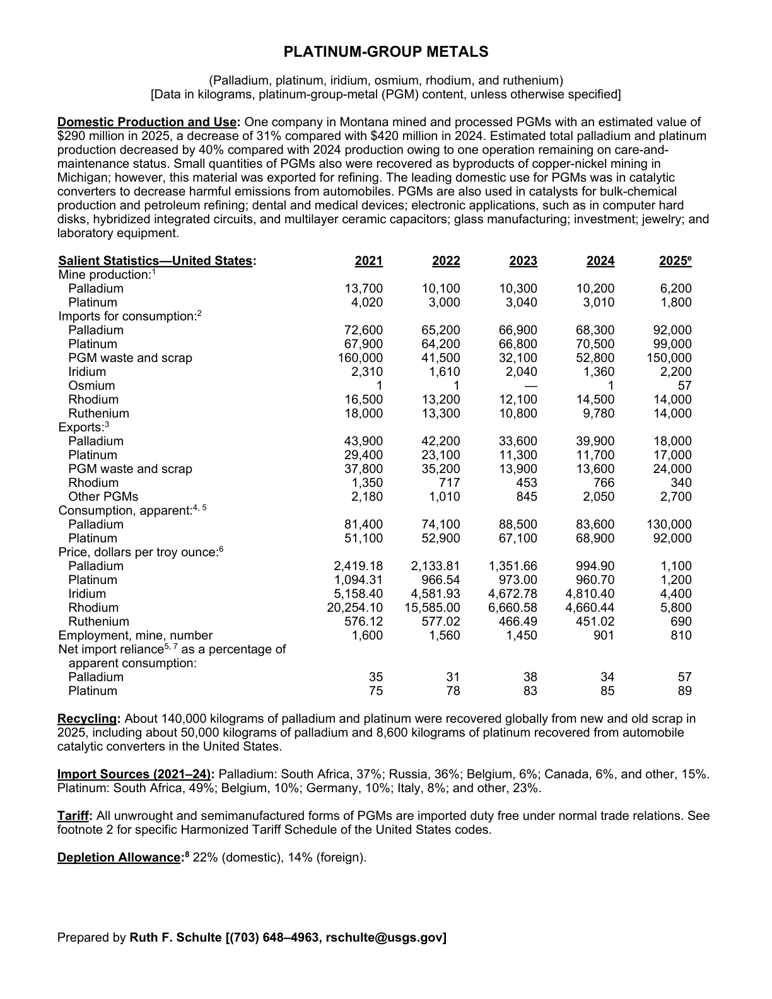
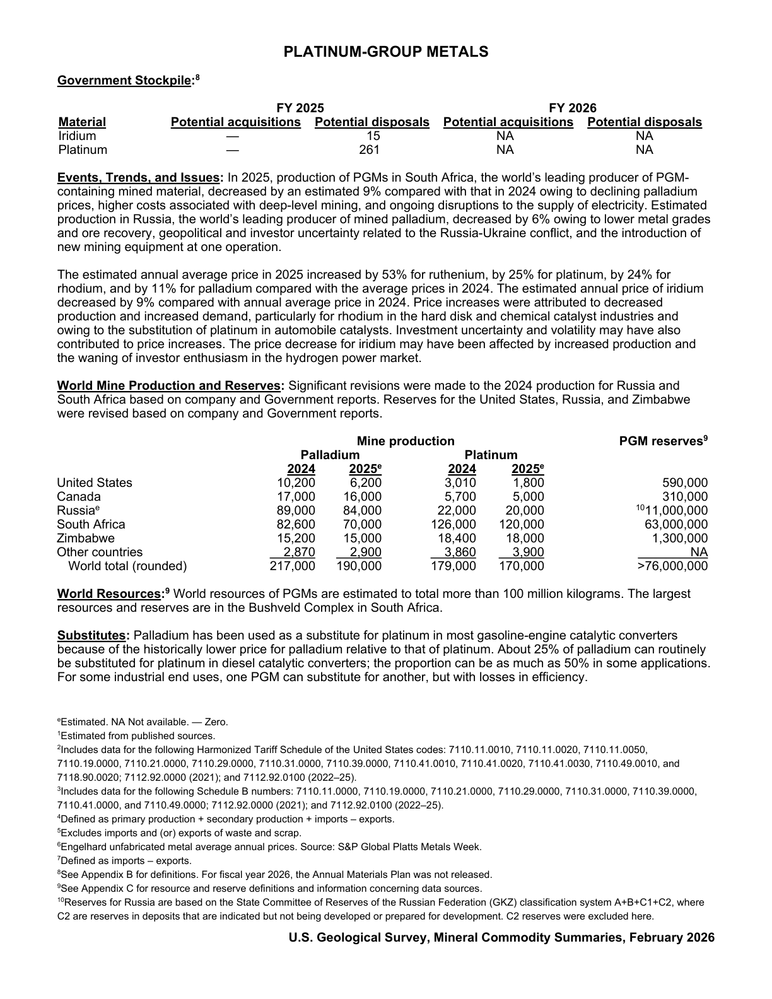

# Audit — Platinum-group metals (grouped) (platinum-group-metals)

- **Source**: <https://pubs.usgs.gov/periodicals/mcs2026/mcs2026-platinum-group.pdf>
- **Edition**: MCS 2026 (2026-02)
- **Captured**: 2026-05-19
- **PDF SHA-256**: `e28369fb9be476bb…`
- **Pages**: 2
- **Units note (verbatim)**: (Palladium, platinum, iridium, osmium, rhodium, and ruthenium)

## Latest-year US summary

| field | value |
| --- | --- |
| Mined production (US) | N/A |
| Primary smelting / refinery (US) | N/A |
| Secondary smelting / scrap (US) | N/A |
| Imports for consumption (total) | 371,257 |
| Exports (total) | 62,040 |
| Apparent consumption | N/A |
| Price, $ per pound | 1,100 |
| Net import reliance (% of apparent consumption) | 57 |

## Salient Statistics (US) — full table

_`2025e` = 2025 USGS estimate (preliminary); 2021–2024 are reported actuals._

| Row | Footnote | 2021 | 2022 | 2023 | 2024 | 2025e |
| --- | --- | ---: | ---: | ---: | ---: | ---: |
| Palladium |  | 13,700 | 10,100 | 10,300 | 10,200 | 6,200 |
| Platinum |  | 4,020 | 3,000 | 3,040 | 3,010 | 1,800 |
| Palladium |  | 72,600 | 65,200 | 66,900 | 68,300 | 92,000 |
| Platinum |  | 67,900 | 64,200 | 66,800 | 70,500 | 99,000 |
| PGM waste and scrap |  | 160,000 | 41,500 | 32,100 | 52,800 | 150,000 |
| Iridium |  | 2,310 | 1,610 | 2,040 | 1,360 | 2,200 |
| Osmium |  | 1 | 1 | 0 | 1 | 57 |
| Rhodium |  | 16,500 | 13,200 | 12,100 | 14,500 | 14,000 |
| Ruthenium |  | 18,000 | 13,300 | 10,800 | 9,780 | 14,000 |
| Palladium |  | 43,900 | 42,200 | 33,600 | 39,900 | 18,000 |
| Platinum |  | 29,400 | 23,100 | 11,300 | 11,700 | 17,000 |
| PGM waste and scrap |  | 37,800 | 35,200 | 13,900 | 13,600 | 24,000 |
| Rhodium |  | 1,350 | 717 | 453 | 766 | 340 |
| Other PGMs |  | 2,180 | 1,010 | 845 | 2,050 | 2,700 |
| Palladium |  | 81,400 | 74,100 | 88,500 | 83,600 | 130,000 |
| Platinum |  | 51,100 | 52,900 | 67,100 | 68,900 | 92,000 |
| Palladium |  | 2,419.18 | 2,133.81 | 1,351.66 | 994.90 | 1,100 |
| Platinum |  | 1,094.31 | 966.54 | 973 | 960.70 | 1,200 |
| Iridium |  | 5,158.40 | 4,581.93 | 4,672.78 | 4,810.40 | 4,400 |
| Rhodium |  | 20,254.10 | 15,585 | 6,660.58 | 4,660.44 | 5,800 |
| Ruthenium |  | 576.12 | 577.02 | 466.49 | 451.02 | 690 |
| Employment, mine, number |  | 1,600 | 1,560 | 1,450 | 901 | 810 |
| Palladium |  | 35 | 31 | 38 | 34 | 57 |
| Platinum |  | 75 | 78 | 83 | 85 | 89 |

## Import Sources (2021-24)

**Palladium**
- South Africa: 37%
- Russia: 36%
- Belgium: 6%
- Canada: 6%
- other: 15%

**Platinum**
- South Africa: 49%
- Belgium: 10%
- Germany: 10%
- Italy: 8%
- other: 23%

## World Mine Production and Reserves

| country | prev-yr | latest-yr | capacity | reserves | note |
| --- | ---: | ---: | ---: | ---: | --- |
| United States | 10,200 | 6,200 | N/A | 590,000 |  |
| Canada | 17,000 | 16,000 | N/A | 310,000 |  |
| Russia | 89,000 | 84,000 | N/A | 11,000,000 | footnote 10 |
| South Africa | 82,600 | 70,000 | N/A | 63,000,000 |  |
| Zimbabwe | 15,200 | 15,000 | N/A | 1,300,000 |  |
| Other countries | 2,870 | 2,900 | N/A | NA |  |
| World total (rounded) | 217,000 | 190,000 | N/A | >76,000,000 |  |

## Footnotes (verbatim)

- **1**: Estimated from published sources.
- **2**: Includes data for the following Harmonized Tariff Schedule of the United States codes: 7110.11.0010, 7110.11.0020, 7110.11.0050, 7110.19.0000, 7110.21.0000, 7110.29.0000, 7110.31.0000, 7110.39.0000, 7110.41.0010, 7110.41.0020, 7110.41.0030, 7110.49.0010, and 7118.90.0020; 7112.92.0000 (2021); and 7112.92.0100 (2022–25).
- **3**: Includes data for the following Schedule B numbers: 7110.11.0000, 7110.19.0000, 7110.21.0000, 7110.29.0000, 7110.31.0000, 7110.39.0000, 7110.41.0000, and 7110.49.0000; 7112.92.0000 (2021); and 7112.92.0100 (2022–25).
- **4**: Defined as primary production + secondary production + imports – exports.
- **5**: Excludes imports and (or) exports of waste and scrap.
- **6**: Engelhard unfabricated metal average annual prices. Source: S&P Global Platts Metals Week.
- **7**: Defined as imports – exports.
- **8**: See Appendix B for definitions. For fiscal year 2026, the Annual Materials Plan was not released.
- **9**: See Appendix C for resource and reserve definitions and information concerning data sources.
- **10**: Reserves for Russia are based on the State Committee of Reserves of the Russian Federation (GKZ) classification system A+B+C1+C2, where C2 are reserves in deposits that are indicated but not being developed or prepared for development. C2 reserves were excluded here.
- **e**: Estimated. NA Not available. — Zero.

## Source page screenshots

### Page 1

### Page 2

