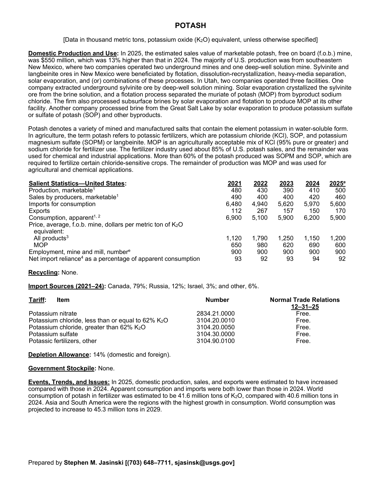
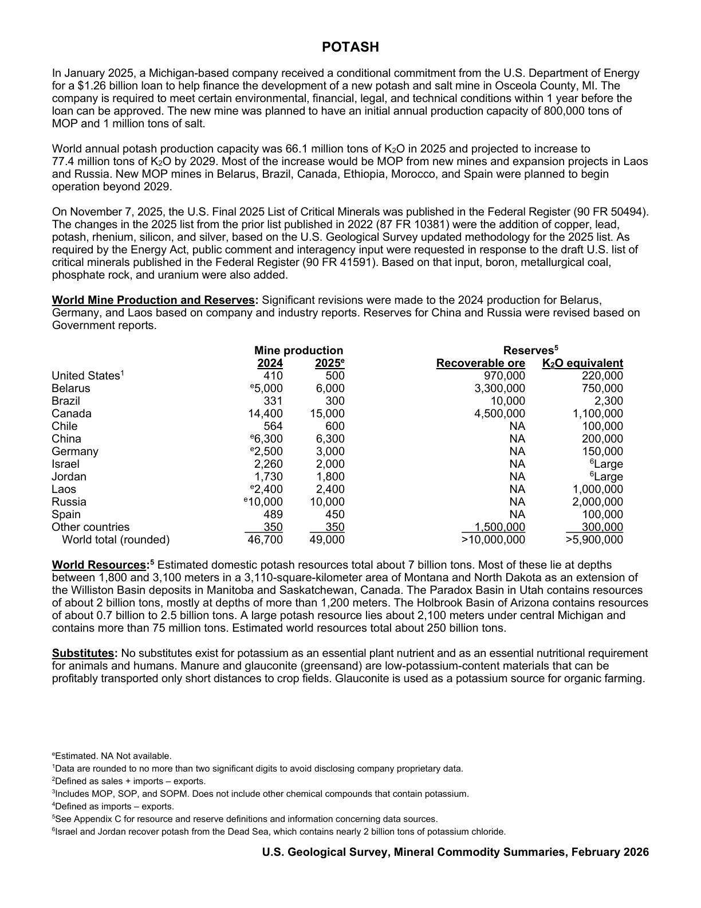

# Audit — Potash (potash)

- **Source**: <https://pubs.usgs.gov/periodicals/mcs2026/mcs2026-potash.pdf>
- **Edition**: MCS 2026 (2026-02)
- **Captured**: 2026-06-02
- **PDF SHA-256**: `c2e6605e30ef764f…`
- **Pages**: 2
- **Units note (verbatim)**: [Data in thousand metric tons, potassium oxide (KO) equivalent, unless otherwise specified]

## Latest-year US summary

| field | value |
| --- | --- |
| Mined production (US) | N/A |
| Primary smelting / refinery (US) | N/A |
| Secondary smelting / scrap (US) | N/A |
| Imports for consumption (total) | 5,600 |
| Exports (total) | 170 |
| Apparent consumption | 5,900 |
| Price, $ per pound | 1,200 |
| Net import reliance (% of apparent consumption) | 92 |

## Salient Statistics (US) — full table

_`2025e` = 2025 USGS estimate (preliminary); 2021–2024 are reported actuals._

| Row | Footnote | 2021 | 2022 | 2023 | 2024 | 2025e |
| --- | --- | ---: | ---: | ---: | ---: | ---: |
| Production, marketable | 1 | 480 | 430 | 390 | 410 | 500 |
| Sales by producers, marketable | 1 | 490 | 400 | 400 | 420 | 460 |
| Imports for consumption |  | 6,480 | 4,940 | 5,620 | 5,970 | 5,600 |
| Exports |  | 112 | 267 | 157 | 150 | 170 |
| Consumption, apparent |  | 6,900 | 5,100 | 5,900 | 6,200 | 5,900 |
| All products | 3 | 1,120 | 1,790 | 1,250 | 1,150 | 1,200 |
| MOP |  | 650 | 980 | 620 | 690 | 600 |
| Employment, mine and mill, number |  | 900 | 900 | 900 | 900 | 900 |
| Net import reliance as a percentage of apparent consumption |  | 93 | 92 | 93 | 94 | 92 |

## Import Sources (2021-24)

**(all)**
- Canada: 79%
- Russia: 12%
- Israel: 3%
- other: 6%

## World Mine Production and Reserves

| country | prev-yr | latest-yr | capacity | reserves | note |
| --- | ---: | ---: | ---: | ---: | --- |
| United States | 410 | 500 | N/A | 970,000 | footnote 1 |
| Belarus | 5,000 | 6,000 | N/A | 3,300,000 |  |
| Brazil | 331 | 300 | N/A | 10,000 |  |
| Canada | 14,400 | 15,000 | N/A | 4,500,000 |  |
| Chile | 564 | 600 | N/A | NA |  |
| China | 6,300 | 6,300 | N/A | NA |  |
| Germany | 2,500 | 3,000 | N/A | NA |  |
| Israel | 2,260 | 2,000 | N/A | NA | footnote 6 |
| Jordan | 1,730 | 1,800 | N/A | NA | footnote 6 |
| Laos | 2,400 | 2,400 | N/A | NA |  |
| Russia | 10,000 | 10,000 | N/A | NA |  |
| Spain | 489 | 450 | N/A | NA |  |
| Other countries | 350 | 350 | N/A | 1,500,000 |  |
| World total (rounded) | 46,700 | 49,000 | N/A | >10,000,000 |  |

## Footnotes (verbatim)

- **1**: Data are rounded to no more than two significant digits to avoid disclosing company proprietary data.
- **2**: Defined as sales + imports – exports.
- **3**: Includes MOP, SOP, and SOPM. Does not include other chemical compounds that contain potassium.
- **4**: Defined as imports – exports.
- **5**: See Appendix C for resource and reserve definitions and information concerning data sources.
- **6**: Israel and Jordan recover potash from the Dead Sea, which contains nearly 2 billion tons of potassium chloride.
- **e**: Estimated. NA Not available.

## Source page screenshots

### Page 1

### Page 2

