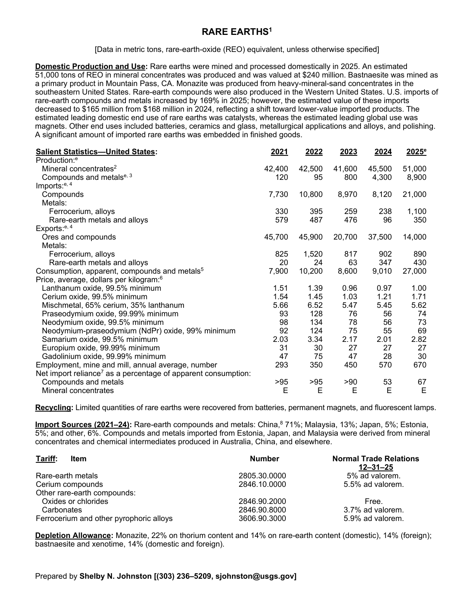
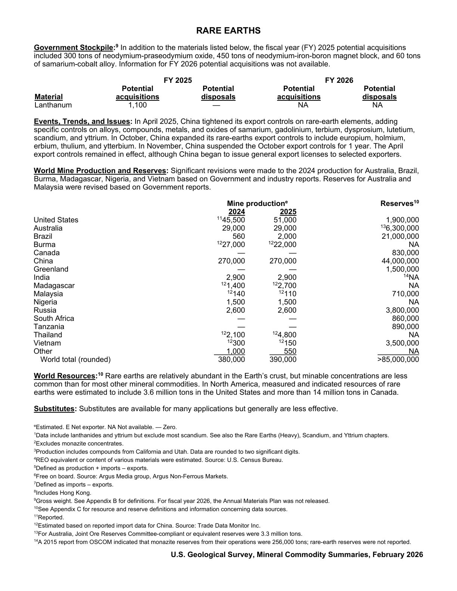

# Audit — Rare Earths (grouped) (rare-earths)

- **Source**: <https://pubs.usgs.gov/periodicals/mcs2026/mcs2026-rare-earths.pdf>
- **Edition**: MCS 2026 (2026-02)
- **Captured**: 2026-05-19
- **PDF SHA-256**: `a733c264883a3acb…`
- **Pages**: 2
- **Units note (verbatim)**: [Data in metric tons, rare-earth-oxide (REO) equivalent, unless otherwise specified]

## Latest-year US summary

| field | value |
| --- | --- |
| Mined production (US) | 51,000 |
| Primary smelting / refinery (US) | 8,900 |
| Secondary smelting / scrap (US) | N/A |
| Imports for consumption (total) | 22,450 |
| Exports (total) | 15,320 |
| Apparent consumption | 27,000 |
| Price, $ per pound | N/A |
| Net import reliance (% of apparent consumption) | 67 |

## Salient Statistics (US) — full table

| Row | Footnote | 2021 | 2022 | 2023 | 2024 | 2025e |
| --- | --- | ---: | ---: | ---: | ---: | ---: |
| Mineral concentrates | 2 | 42,400 | 42,500 | 41,600 | 45,500 | 51,000 |
| Compounds and metals |  | 120 | 95 | 800 | 4,300 | 8,900 |
| Compounds |  | 7,730 | 10,800 | 8,970 | 8,120 | 21,000 |
| Ferrocerium, alloys |  | 330 | 395 | 259 | 238 | 1,100 |
| Rare-earth metals and alloys |  | 579 | 487 | 476 | 96 | 350 |
| Ores and compounds |  | 45,700 | 45,900 | 20,700 | 37,500 | 14,000 |
| Ferrocerium, alloys |  | 825 | 1,520 | 817 | 902 | 890 |
| Rare-earth metals and alloys |  | 20 | 24 | 63 | 347 | 430 |
| Consumption, apparent, compounds and metals | 5 | 7,900 | 10,200 | 8,600 | 9,010 | 27,000 |
| Lanthanum oxide, 99.5% minimum |  | 1.51 | 1.39 | 0.96 | 0.97 | 1 |
| Cerium oxide, 99.5% minimum |  | 1.54 | 1.45 | 1.03 | 1.21 | 1.71 |
| Mischmetal, 65% cerium, 35% lanthanum |  | 5.66 | 6.52 | 5.47 | 5.45 | 5.62 |
| Praseodymium oxide, 99.99% minimum |  | 93 | 128 | 76 | 56 | 74 |
| Neodymium oxide, 99.5% minimum |  | 98 | 134 | 78 | 56 | 73 |
| Neodymium-praseodymium (NdPr) oxide, 99% minimum |  | 92 | 124 | 75 | 55 | 69 |
| Samarium oxide, 99.5% minimum |  | 2.03 | 3.34 | 2.17 | 2.01 | 2.82 |
| Europium oxide, 99.99% minimum |  | 31 | 30 | 27 | 27 | 27 |
| Gadolinium oxide, 99.99% minimum |  | 47 | 75 | 47 | 28 | 30 |
| Employment, mine and mill, annual average, number |  | 293 | 350 | 450 | 570 | 670 |
| Compounds and metals |  | >95 | >95 | >90 | 53 | 67 |
| Mineral concentrates |  | E | E | E | E | E |

## Import Sources (2021-24)

**Rare-earth compounds and metals**
- China: 71%
- Malaysia: 13%
- Japan: 5%
- Estonia: 5%
- other: 6%

## World Mine Production and Reserves

| country | prev-yr | latest-yr | capacity | reserves | note |
| --- | ---: | ---: | ---: | ---: | --- |
| United States | 45,500 | 51,000 | N/A | 1,900,000 | footnote 11 |
| Australia | 29,000 | 29,000 | N/A | 6,300,000 | footnote 13 |
| Brazil | 560 | 2,000 | N/A | 21,000,000 |  |
| Burma | 27,000 | 22,000 | N/A | NA | footnote 12 |
| Canada | 0 | 0 | N/A | 830,000 |  |
| China | 270,000 | 270,000 | N/A | 44,000,000 |  |
| Greenland | 0 | 0 | N/A | 1,500,000 |  |
| India | 2,900 | 2,900 | N/A | NA | footnote 14 |
| Madagascar | 1,400 | 2,700 | N/A | NA | footnote 12 |
| Malaysia | 140 | 110 | N/A | 710,000 | footnote 12 |
| Nigeria | 1,500 | 1,500 | N/A | NA |  |
| Russia | 2,600 | 2,600 | N/A | 3,800,000 |  |
| South Africa | 0 | 0 | N/A | 860,000 |  |
| Tanzania | 0 | 0 | N/A | 890,000 |  |
| Thailand | 2,100 | 4,800 | N/A | NA | footnote 12 |
| Vietnam | 300 | 150 | N/A | 3,500,000 | footnote 12 |
| Other | 1,000 | 550 | N/A | NA |  |
| World total (rounded) | 380,000 | 390,000 | N/A | >85,000,000 |  |

## Footnotes (verbatim)

- **1**: Data include lanthanides and yttrium but exclude most scandium. See also the Rare Earths (Heavy), Scandium, and Yttrium chapters.
- **2**: Excludes monazite concentrates.
- **3**: Production includes compounds from California and Utah. Data are rounded to two significant digits.
- **4**: REO equivalent or content of various materials were estimated. Source: U.S. Census Bureau.
- **5**: Defined as production + imports – exports.
- **6**: Free on board. Source: Argus Media group, Argus Non-Ferrous Markets.
- **7**: Defined as imports – exports.
- **8**: Includes Hong Kong.
- **9**: Gross weight. See Appendix B for definitions. For fiscal year 2026, the Annual Materials Plan was not released.
- **10**: See Appendix C for resource and reserve definitions and information concerning data sources.
- **11**: Reported.
- **12**: Estimated based on reported import data for China. Source: Trade Data Monitor Inc.
- **13**: For Australia, Joint Ore Reserves Committee-compliant or equivalent reserves were 3.3 million tons.
- **14**: A 2015 report from OSCOM indicated that monazite reserves from their operations were 256,000 tons; rare-earth reserves were not reported.
- **e**: Estimated. E Net exporter. NA Not available. — Zero.

## Source page screenshots

### Page 1

### Page 2

