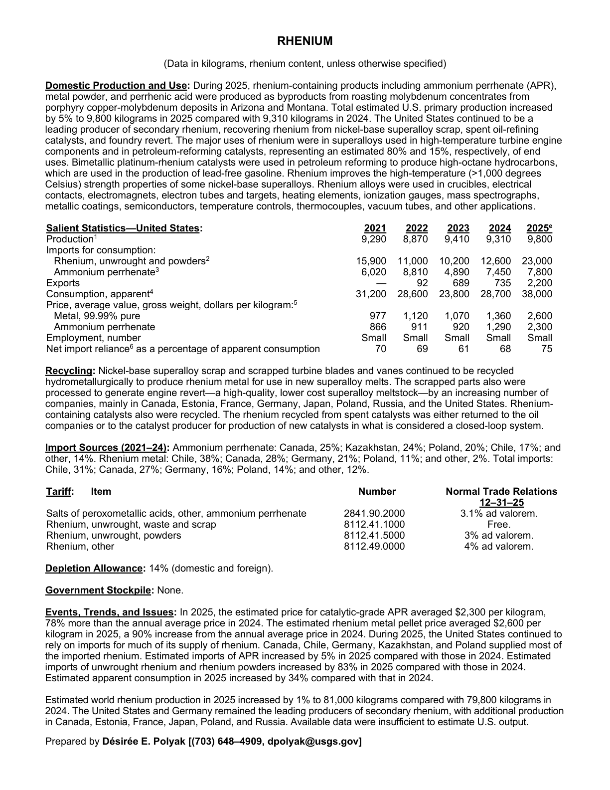
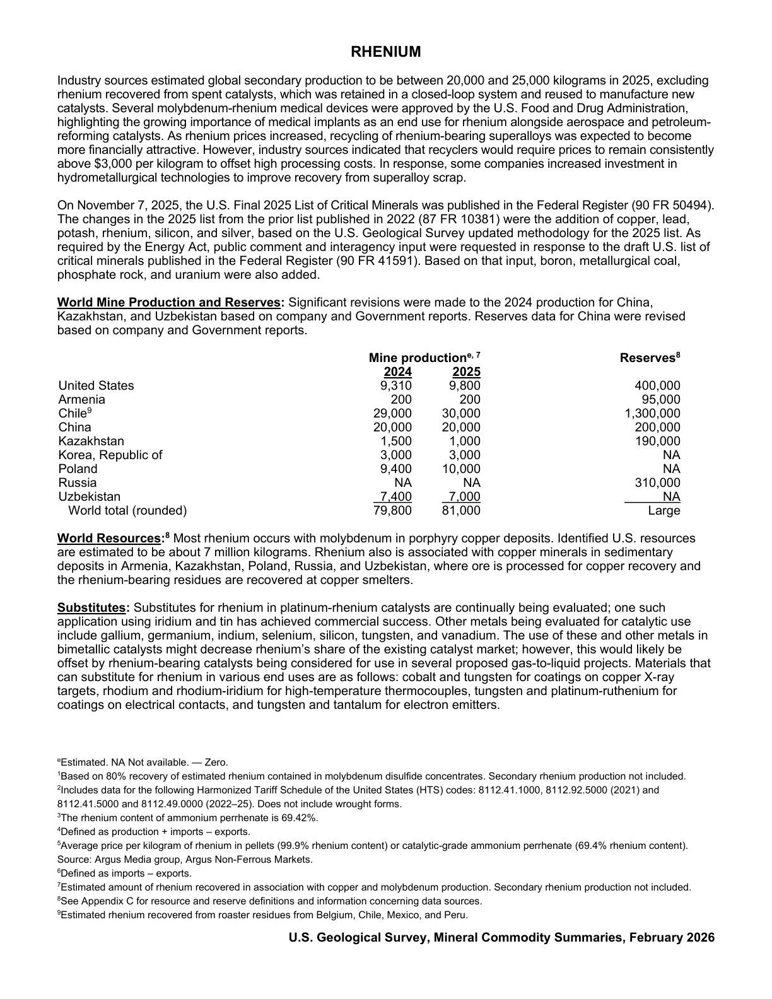

# Audit — Rhenium (rhenium)

- **Source**: <https://pubs.usgs.gov/periodicals/mcs2026/mcs2026-rhenium.pdf>
- **Edition**: MCS 2026 (2026-02)
- **Captured**: 2026-05-19
- **PDF SHA-256**: `c2bd5ce5e85c6337…`
- **Pages**: 2
- **Units note (verbatim)**: (Data in kilograms, rhenium content, unless otherwise specified)

## Latest-year US summary

| field | value |
| --- | --- |
| Mined production (US) | N/A |
| Primary smelting / refinery (US) | N/A |
| Secondary smelting / scrap (US) | N/A |
| Imports for consumption (total) | 30,800 |
| Exports (total) | 2,200 |
| Apparent consumption | 38,000 |
| Price, $ per pound | 2,600 |
| Net import reliance (% of apparent consumption) | 75 |

## Salient Statistics (US) — full table

_`2025e` = 2025 USGS estimate (preliminary); 2021–2024 are reported actuals._

| Row | Footnote | 2021 | 2022 | 2023 | 2024 | 2025e |
| --- | --- | ---: | ---: | ---: | ---: | ---: |
| Production | 1 | 9,290 | 8,870 | 9,410 | 9,310 | 9,800 |
| Rhenium, unwrought and powders | 2 | 15,900 | 11,000 | 10,200 | 12,600 | 23,000 |
| Ammonium perrhenate | 3 | 6,020 | 8,810 | 4,890 | 7,450 | 7,800 |
| Exports |  | 0 | 92 | 689 | 735 | 2,200 |
| Consumption, apparent | 4 | 31,200 | 28,600 | 23,800 | 28,700 | 38,000 |
| Metal, 99.99% pure |  | 977 | 1,120 | 1,070 | 1,360 | 2,600 |
| Ammonium perrhenate |  | 866 | 911 | 920 | 1,290 | 2,300 |
| Small Net import reliance as a percentage of apparent consumption |  | 70 | 69 | 61 | 68 | 75 |

## Import Sources (2021-24)

**Ammonium perrhenate**
- Canada: 25%
- Kazakhstan: 24%
- Poland: 20%
- Chile: 17%
- other: 14%

**Rhenium metal**
- Chile: 38%
- Canada: 28%
- Germany: 21%
- Poland: 11%
- other: 2%

**Total imports**
- Chile: 31%
- Canada: 27%
- Germany: 16%
- Poland: 14%
- other: 12%

## World Mine Production and Reserves

| country | prev-yr | latest-yr | capacity | reserves | note |
| --- | ---: | ---: | ---: | ---: | --- |
| United States | 9,310 | 9,800 | N/A | 400,000 |  |
| Armenia | 200 | 200 | N/A | 95,000 |  |
| Chile | 29,000 | 30,000 | N/A | 1,300,000 | footnote 9 |
| China | 20,000 | 20,000 | N/A | 200,000 |  |
| Kazakhstan | 1,500 | 1,000 | N/A | 190,000 |  |
| Korea, Republic of | 3,000 | 3,000 | N/A | NA |  |
| Poland | 9,400 | 10,000 | N/A | NA |  |
| Russia | NA | NA | N/A | 310,000 |  |
| Uzbekistan | 7,400 | 7,000 | N/A | NA |  |
| World total (rounded) | 79,800 | 81,000 | N/A | N/A |  |

## Footnotes (verbatim)

- **1**: Based on 80% recovery of estimated rhenium contained in molybdenum disulfide concentrates. Secondary rhenium production not included.
- **2**: Includes data for the following Harmonized Tariff Schedule of the United States (HTS) codes: 8112.41.1000, 8112.92.5000 (2021) and 8112.41.5000 and 8112.49.0000 (2022–25). Does not include wrought forms.
- **3**: The rhenium content of ammonium perrhenate is 69.42%.
- **4**: Defined as production + imports – exports.
- **5**: Average price per kilogram of rhenium in pellets (99.9% rhenium content) or catalytic-grade ammonium perrhenate (69.4% rhenium content). Source: Argus Media group, Argus Non-Ferrous Markets.
- **6**: Defined as imports – exports.
- **7**: Estimated amount of rhenium recovered in association with copper and molybdenum production. Secondary rhenium production not included.
- **8**: See Appendix C for resource and reserve definitions and information concerning data sources.
- **9**: Estimated rhenium recovered from roaster residues from Belgium, Chile, Mexico, and Peru.
- **e**: Estimated. NA Not available. — Zero.

## Source page screenshots

### Page 1

### Page 2

