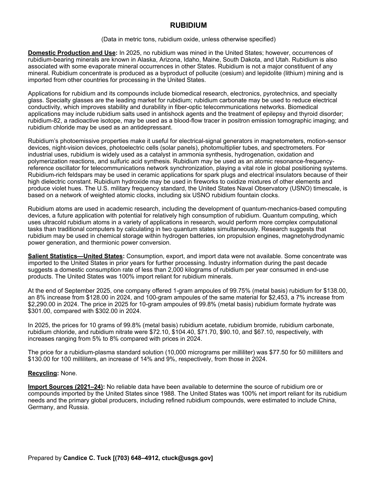
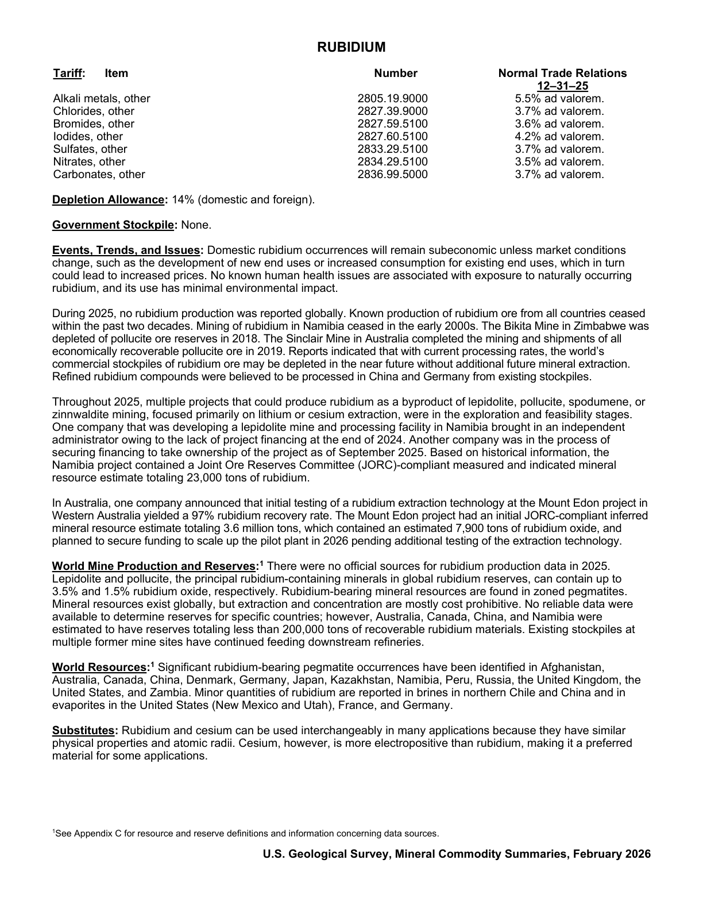

# Audit — Rubidium (rubidium)

- **Source**: <https://pubs.usgs.gov/periodicals/mcs2026/mcs2026-rubidium.pdf>
- **Edition**: MCS 2026 (2026-02)
- **Captured**: 2026-06-02
- **PDF SHA-256**: `8934a0109d0a7d4b…`
- **Pages**: 2
- **Units note (verbatim)**: (Data in metric tons, rubidium oxide, unless otherwise specified)

## Latest-year US summary

| field | value |
| --- | --- |
| Mined production (US) | N/A |
| Primary smelting / refinery (US) | N/A |
| Secondary smelting / scrap (US) | N/A |
| Imports for consumption (total) | N/A |
| Exports (total) | N/A |
| Apparent consumption | N/A |
| Price, $ per pound | N/A |
| Net import reliance (% of apparent consumption) | N/A |

## Salient Statistics (US) — full table

_`2025e` = 2025 USGS estimate (preliminary); 2021–2024 are reported actuals._

| Row | Footnote | 2021 | 2022 | 2023 | 2024 | 2025e |
| --- | --- | ---: | ---: | ---: | ---: | ---: |

## Import Sources (2021-24)

_Not reported._

## World Mine Production and Reserves

_Not reported._

## Footnotes (verbatim)

- **1**: See Appendix C for resource and reserve definitions and information concerning data sources.

## Source page screenshots

### Page 1

### Page 2

