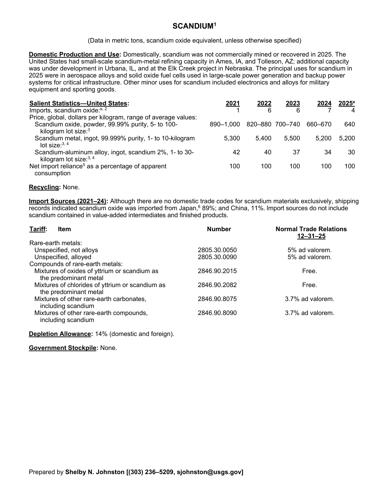
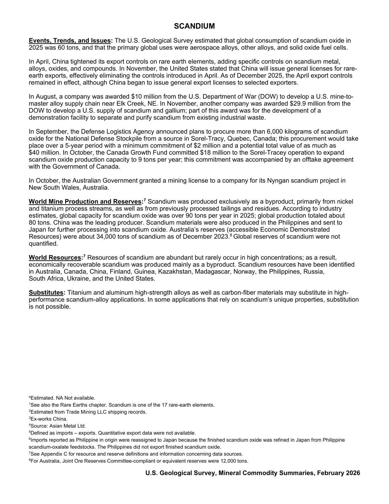

# Audit — Scandium (scandium)

- **Source**: <https://pubs.usgs.gov/periodicals/mcs2026/mcs2026-scandium.pdf>
- **Edition**: MCS 2026 (2026-02)
- **Captured**: 2026-05-19
- **PDF SHA-256**: `b68e156704a9f38a…`
- **Pages**: 2
- **Units note (verbatim)**: (Data in metric tons, scandium oxide equivalent, unless otherwise specified)

## Latest-year US summary

| field | value |
| --- | --- |
| Mined production (US) | N/A |
| Primary smelting / refinery (US) | N/A |
| Secondary smelting / scrap (US) | N/A |
| Imports for consumption (total) | 4 |
| Exports (total) | N/A |
| Apparent consumption | 100 |
| Price, $ per pound | 640 |
| Net import reliance (% of apparent consumption) | 100 |

## Salient Statistics (US) — full table

| Row | Footnote | 2021 | 2022 | 2023 | 2024 | 2025e |
| --- | --- | ---: | ---: | ---: | ---: | ---: |
| Imports, scandium oxide |  | 1 | 6 | 6 | 7 | 4 |
| Scandium oxide, powder, 99.99% purity, 5- to 100- kilogram lot size | 3 | 945 | 850 | 720 | 665 | 640 |
| Scandium metal, ingot, 99.999% purity, 1- to 10-kilogram lot size |  | 5,300 | 5,400 | 5,500 | 5,200 | 5,200 |
| Scandium-aluminum alloy, ingot, scandium 2%, 1- to 30- kilogram lot size |  | 42 | 40 | 37 | 34 | 30 |
| Net import reliance as a percentage of apparent consumption |  | 100 | 100 | 100 | 100 | 100 |

## Import Sources (2021-24)

**(all)**
- Although there are no domestic trade codes for scandium materials exclusively, shipping records indicated scandium oxide was imported from Japan: 89%
- China: 11%

## World Mine Production and Reserves

_Not reported._

## Footnotes (verbatim)

- **1**: See also the Rare Earths chapter. Scandium is one of the 17 rare-earth elements.
- **2**: Estimated from Trade Mining LLC shipping records.
- **3**: Ex-works China.
- **4**: Source: Asian Metal Ltd.
- **5**: Defined as imports – exports. Quantitative export data were not available.
- **6**: Imports reported as Philippine in origin were reassigned to Japan because the finished scandium oxide was refined in Japan from Philippine scandium-oxalate feedstocks. The Philippines did not export finished scandium oxide.
- **7**: See Appendix C for resource and reserve definitions and information concerning data sources.
- **8**: For Australia, Joint Ore Reserves Committee-compliant or equivalent reserves were 12,000 tons.
- **e**: Estimated. NA Not available.

## Source page screenshots

### Page 1

### Page 2

