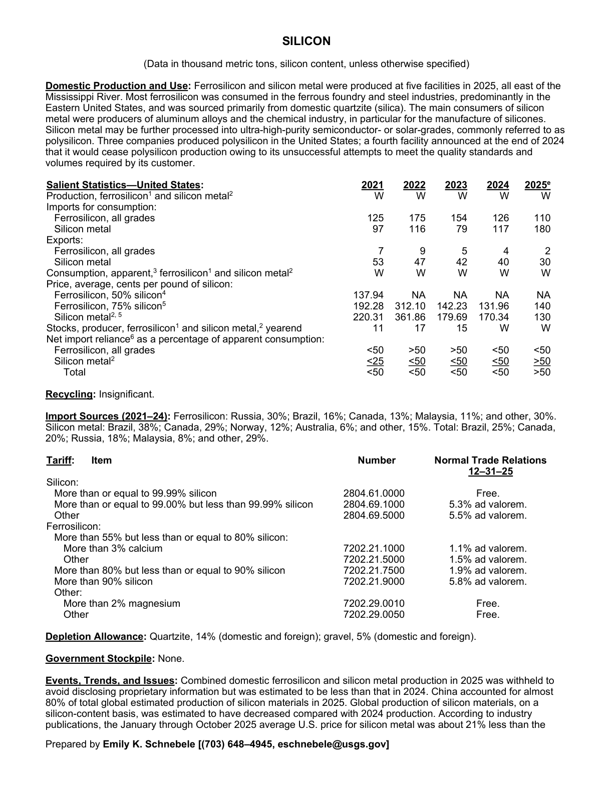
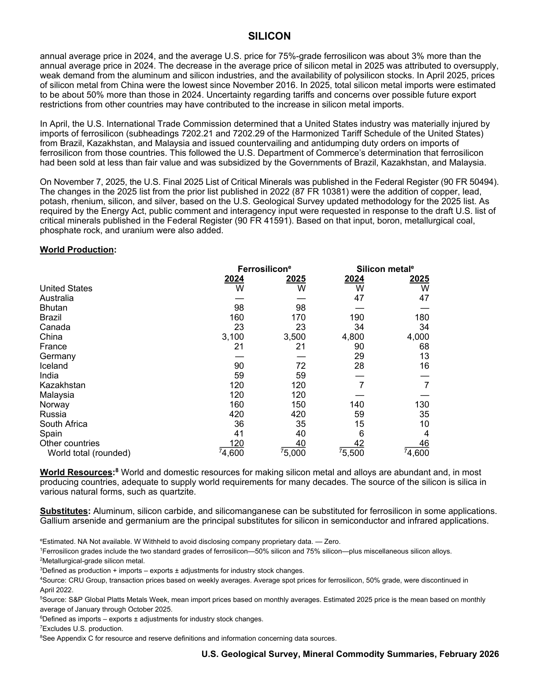

# Audit — Silicon (silicon)

- **Source**: <https://pubs.usgs.gov/periodicals/mcs2026/mcs2026-silicon.pdf>
- **Edition**: MCS 2026 (2026-02)
- **Captured**: 2026-05-19
- **PDF SHA-256**: `985d56cd7c662343…`
- **Pages**: 2
- **Units note (verbatim)**: (Data in thousand metric tons, silicon content, unless otherwise specified)

## Latest-year US summary

| field | value |
| --- | --- |
| Mined production (US) | N/A |
| Primary smelting / refinery (US) | N/A |
| Secondary smelting / scrap (US) | N/A |
| Imports for consumption (total) | 290 |
| Exports (total) | 32 |
| Apparent consumption | N/A |
| Price, $ per pound | 140 |
| Net import reliance (% of apparent consumption) | 50 |

## Salient Statistics (US) — full table

| Row | Footnote | 2021 | 2022 | 2023 | 2024 | 2025e |
| --- | --- | ---: | ---: | ---: | ---: | ---: |
| Production, ferrosilicon and silicon metal | 2 | W | W | W | W | W |
| Ferrosilicon, all grades |  | 125 | 175 | 154 | 126 | 110 |
| Silicon metal |  | 97 | 116 | 79 | 117 | 180 |
| Ferrosilicon, all grades |  | 7 | 9 | 5 | 4 | 2 |
| Silicon metal |  | 53 | 47 | 42 | 40 | 30 |
| Consumption, apparent, ferrosilicon and silicon metal | 2 | W | W | W | W | W |
| Ferrosilicon, 50% silicon | 4 | 137.94 | NA | NA | NA | NA |
| Ferrosilicon, 75% silicon | 5 | 192.28 | 312.10 | 142.23 | 131.96 | 140 |
| Silicon metal |  | 220.31 | 361.86 | 179.69 | 170.34 | 130 |
| Stocks, producer, ferrosilicon and silicon metal, yearend |  | 11 | 17 | 15 | W | W |
| Ferrosilicon, all grades |  | <50 | >50 | >50 | <50 | <50 |
| Silicon metal | 2 | <25 | <50 | <50 | <50 | >50 |
| Total |  | <50 | <50 | <50 | <50 | >50 |

## Import Sources (2021-24)

**Ferrosilicon**
- Russia: 30%
- Brazil: 16%
- Canada: 13%
- Malaysia: 11%
- other: 30%

**Silicon metal**
- Brazil: 38%
- Canada: 29%
- Norway: 12%
- Australia: 6%
- other: 15%

**Total**
- Brazil: 25%
- Canada: 20%
- Russia: 18%
- Malaysia: 8%
- other: 29%

## World Production

| country | prev-yr | latest-yr | capacity | reserves | note |
| --- | ---: | ---: | ---: | ---: | --- |
| United States | W | W | N/A | N/A |  |
| Australia | 0 | 0 | N/A | N/A |  |
| Bhutan | 98 | 98 | N/A | N/A |  |
| Brazil | 160 | 170 | N/A | N/A |  |
| Canada | 23 | 23 | N/A | N/A |  |
| China | 3,100 | 3,500 | N/A | N/A |  |
| France | 21 | 21 | N/A | N/A |  |
| Germany | 0 | 0 | N/A | N/A |  |
| Iceland | 90 | 72 | N/A | N/A |  |
| India | 59 | 59 | N/A | N/A |  |
| Kazakhstan | 120 | 120 | N/A | N/A |  |
| Malaysia | 120 | 120 | N/A | N/A |  |
| Norway | 160 | 150 | N/A | N/A |  |
| Russia | 420 | 420 | N/A | N/A |  |
| South Africa | 36 | 35 | N/A | N/A |  |
| Spain | 41 | 40 | N/A | N/A |  |
| Other countries | 120 | 40 | N/A | N/A |  |
| World total (rounded) | 4,600 | 5,000 | N/A | N/A | footnote 7 |

## Footnotes (verbatim)

- **1**: Ferrosilicon grades include the two standard grades of ferrosilicon—50% silicon and 75% silicon—plus miscellaneous silicon alloys.
- **2**: Metallurgical-grade silicon metal.
- **3**: Defined as production + imports – exports ± adjustments for industry stock changes.
- **4**: Source: CRU Group, transaction prices based on weekly averages. Average spot prices for ferrosilicon, 50% grade, were discontinued in April 2022.
- **5**: Source: S&P Global Platts Metals Week, mean import prices based on monthly averages. Estimated 2025 price is the mean based on monthly average of January through October 2025.
- **6**: Defined as imports – exports ± adjustments for industry stock changes.
- **7**: Excludes U.S. production.
- **8**: See Appendix C for resource and reserve definitions and information concerning data sources.
- **e**: Estimated. NA Not available. W Withheld to avoid disclosing company proprietary data. — Zero.

## Source page screenshots

### Page 1

### Page 2

