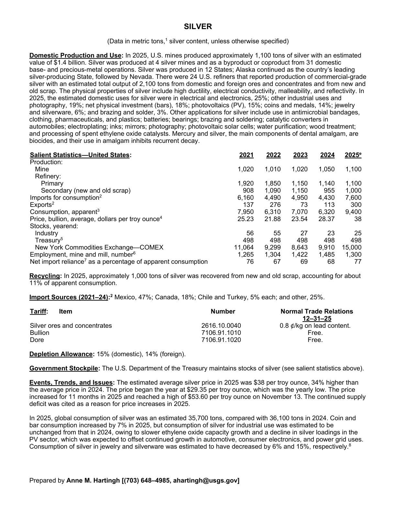
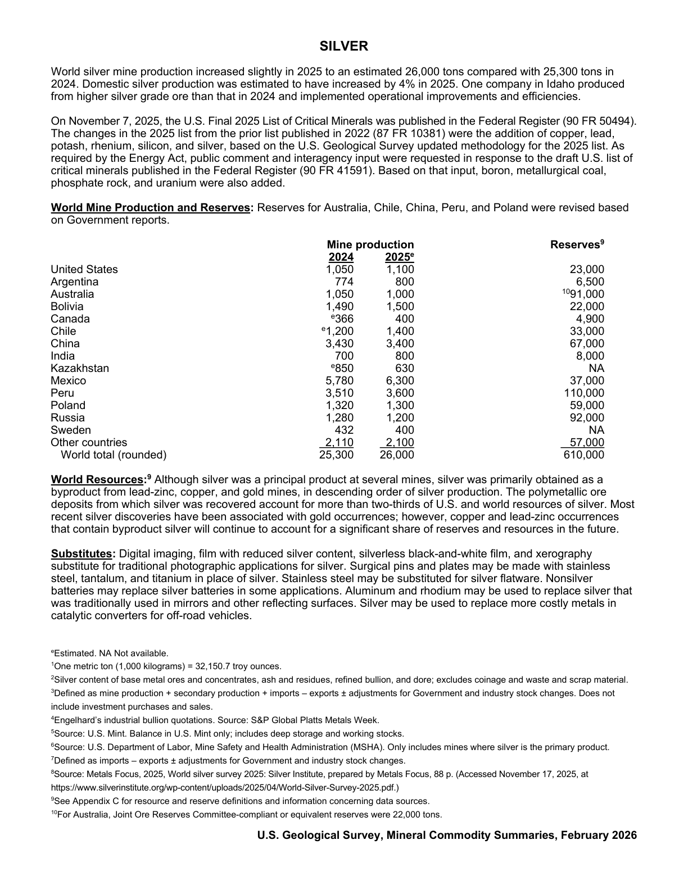

# Audit — Silver (silver)

- **Source**: <https://pubs.usgs.gov/periodicals/mcs2026/mcs2026-silver.pdf>
- **Edition**: MCS 2026 (2026-02)
- **Captured**: 2026-05-19
- **PDF SHA-256**: `f0dfe407304855a5…`
- **Pages**: 2
- **Units note (verbatim)**: (Data in metric tons, silver content, unless otherwise specified)

## Latest-year US summary

| field | value |
| --- | --- |
| Mined production (US) | 1,100 |
| Primary smelting / refinery (US) | 1,100 |
| Secondary smelting / scrap (US) | 1,000 |
| Imports for consumption (total) | 7,600 |
| Exports (total) | 300 |
| Apparent consumption | 9,400 |
| Price, $ per pound | 38 |
| Net import reliance (% of apparent consumption) | 77 |

## Salient Statistics (US) — full table

_`2025e` = 2025 USGS estimate (preliminary); 2021–2024 are reported actuals._

| Row | Footnote | 2021 | 2022 | 2023 | 2024 | 2025e |
| --- | --- | ---: | ---: | ---: | ---: | ---: |
| Mine |  | 1,020 | 1,010 | 1,020 | 1,050 | 1,100 |
| Primary |  | 1,920 | 1,850 | 1,150 | 1,140 | 1,100 |
| Secondary (new and old scrap) |  | 908 | 1,090 | 1,150 | 955 | 1,000 |
| Imports for consumption | 2 | 6,160 | 4,490 | 4,950 | 4,430 | 7,600 |
| Exports | 2 | 137 | 276 | 73 | 113 | 300 |
| Consumption, apparent | 3 | 7,950 | 6,310 | 7,070 | 6,320 | 9,400 |
| Price, bullion, average, dollars per troy ounce | 4 | 25.23 | 21.88 | 23.54 | 28.37 | 38 |
| Industry |  | 56 | 55 | 27 | 23 | 25 |
| Treasury | 5 | 498 | 498 | 498 | 498 | 498 |
| New York Commodities Exchange—COMEX |  | 11,064 | 9,299 | 8,643 | 9,910 | 15,000 |
| Employment, mine and mill, number | 6 | 1,265 | 1,304 | 1,422 | 1,485 | 1,300 |
| Net import reliance as a percentage of apparent consumption |  | 76 | 67 | 69 | 68 | 77 |

## Import Sources (2021-24)

**(all)**
- Mexico: 47%
- Canada: 18%
- Chile and Turkey: 5%
- other: 25%

## World Mine Production and Reserves

| country | prev-yr | latest-yr | capacity | reserves | note |
| --- | ---: | ---: | ---: | ---: | --- |
| United States | 1,050 | 1,100 | N/A | 23,000 |  |
| Argentina | 774 | 800 | N/A | 6,500 |  |
| Australia | 1,050 | 1,000 | N/A | 91,000 | footnote 10 |
| Bolivia | 1,490 | 1,500 | N/A | 22,000 |  |
| Canada | 366 | 400 | N/A | 4,900 |  |
| Chile | 1,200 | 1,400 | N/A | 33,000 |  |
| China | 3,430 | 3,400 | N/A | 67,000 |  |
| India | 700 | 800 | N/A | 8,000 |  |
| Kazakhstan | 850 | 630 | N/A | NA |  |
| Mexico | 5,780 | 6,300 | N/A | 37,000 |  |
| Peru | 3,510 | 3,600 | N/A | 110,000 |  |
| Poland | 1,320 | 1,300 | N/A | 59,000 |  |
| Russia | 1,280 | 1,200 | N/A | 92,000 |  |
| Sweden | 432 | 400 | N/A | NA |  |
| Other countries | 2,110 | 2,100 | N/A | 57,000 |  |
| World total (rounded) | 25,300 | 26,000 | N/A | 610,000 |  |

## Footnotes (verbatim)

- **1**: One metric ton (1,000 kilograms) = 32,150.7 troy ounces.
- **2**: Silver content of base metal ores and concentrates, ash and residues, refined bullion, and dore; excludes coinage and waste and scrap material.
- **3**: Defined as mine production + secondary production + imports – exports ± adjustments for Government and industry stock changes. Does not include investment purchases and sales.
- **4**: Engelhard’s industrial bullion quotations. Source: S&P Global Platts Metals Week.
- **5**: Source: U.S. Mint. Balance in U.S. Mint only; includes deep storage and working stocks.
- **6**: Source: U.S. Department of Labor, Mine Safety and Health Administration (MSHA). Only includes mines where silver is the primary product.
- **7**: Defined as imports – exports ± adjustments for Government and industry stock changes.
- **8**: Source: Metals Focus, 2025, World silver survey 2025: Silver Institute, prepared by Metals Focus, 88 p. (Accessed November 17, 2025, at https://www.silverinstitute.org/wp-content/uploads/2025/04/World-Silver-Survey-2025.pdf.)
- **9**: See Appendix C for resource and reserve definitions and information concerning data sources.
- **10**: For Australia, Joint Ore Reserves Committee-compliant or equivalent reserves were 22,000 tons.
- **e**: Estimated. NA Not available.

## Source page screenshots

### Page 1

### Page 2

