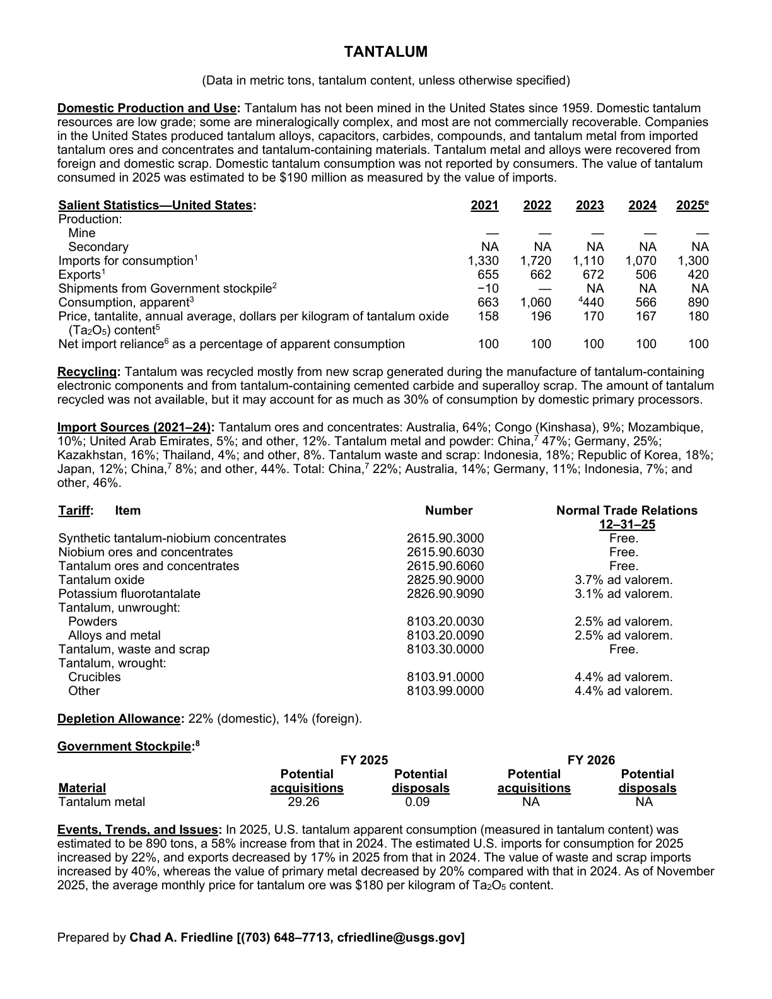
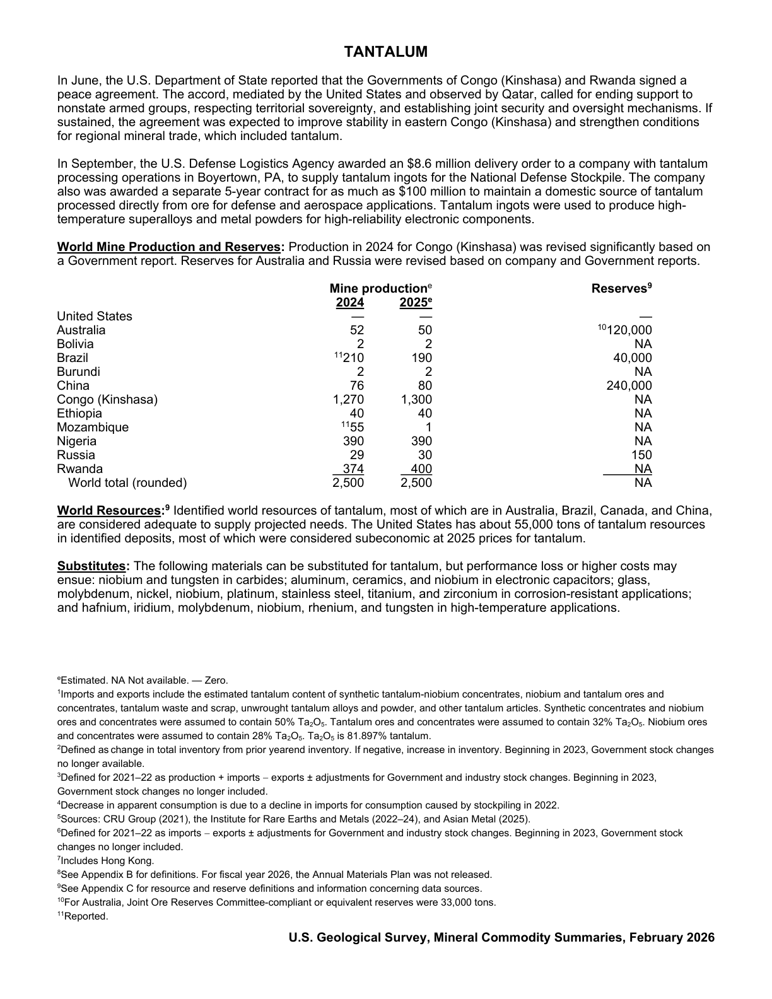

# Audit — Tantalum (tantalum)

- **Source**: <https://pubs.usgs.gov/periodicals/mcs2026/mcs2026-tantalum.pdf>
- **Edition**: MCS 2026 (2026-02)
- **Captured**: 2026-05-19
- **PDF SHA-256**: `ddcfdf129bf67c2c…`
- **Pages**: 2
- **Units note (verbatim)**: (Data in metric tons, tantalum content, unless otherwise specified)

## Latest-year US summary

| field | value |
| --- | --- |
| Mined production (US) | 0 |
| Primary smelting / refinery (US) | N/A |
| Secondary smelting / scrap (US) | N/A |
| Imports for consumption (total) | 1,300 |
| Exports (total) | 420 |
| Apparent consumption | 890 |
| Price, $ per pound | 180 |
| Net import reliance (% of apparent consumption) | 100 |

## Salient Statistics (US) — full table

_`2025e` = 2025 USGS estimate (preliminary); 2021–2024 are reported actuals._

| Row | Footnote | 2021 | 2022 | 2023 | 2024 | 2025e |
| --- | --- | ---: | ---: | ---: | ---: | ---: |
| Mine |  | 0 | 0 | 0 | 0 | 0 |
| Secondary |  | NA | NA | NA | NA | NA |
| Imports for consumption | 1 | 1,330 | 1,720 | 1,110 | 1,070 | 1,300 |
| Exports | 1 | 655 | 662 | 672 | 506 | 420 |
| NA Consumption, apparent | 3 | 663 | 1,060 | 440 | 566 | 890 |
| Price, tantalite, annual average, dollars per kilogram of tantalum oxide (TaO) content | 5 | 158 | 196 | 170 | 167 | 180 |
| Net import reliance as a percentage of apparent consumption |  | 100 | 100 | 100 | 100 | 100 |

## Import Sources (2021-24)

**Tantalum ores and concentrates**
- Australia: 64%
- Congo (Kinshasa): 9%
- Mozambique: 10%
- United Arab Emirates: 5%
- other: 12%

**Tantalum metal and powder**
- China: 47%
- Germany: 25%
- Kazakhstan: 16%
- Thailand: 4%
- other: 8%

**Tantalum waste and scrap**
- Indonesia: 18%
- Republic of Korea: 18%
- Japan: 12%
- China: 8%
- other: 44%

**Total**
- China: 22%
- Australia: 14%
- Germany: 11%
- Indonesia: 7%
- other: 46%

## World Mine Production and Reserves

| country | prev-yr | latest-yr | capacity | reserves | note |
| --- | ---: | ---: | ---: | ---: | --- |
| United States | 0 | 0 | N/A | 0 |  |
| Australia | 52 | 50 | N/A | 120,000 | footnote 10 |
| Bolivia | 2 | 2 | N/A | NA |  |
| Brazil | 210 | 190 | N/A | 40,000 | footnote 11 |
| Burundi | 2 | 2 | N/A | NA |  |
| China | 76 | 80 | N/A | 240,000 |  |
| Congo (Kinshasa) | 1,270 | 1,300 | N/A | NA |  |
| Ethiopia | 40 | 40 | N/A | NA |  |
| Mozambique | 55 | 1 | N/A | NA | footnote 11 |
| Nigeria | 390 | 390 | N/A | NA |  |
| Russia | 29 | 30 | N/A | 150 |  |
| Rwanda | 374 | 400 | N/A | NA |  |
| World total (rounded) | 2,500 | 2,500 | N/A | NA |  |

## Footnotes (verbatim)

- **1**: Imports and exports include the estimated tantalum content of synthetic tantalum-niobium concentrates, niobium and tantalum ores and concentrates, tantalum waste and scrap, unwrought tantalum alloys and powder, and other tantalum articles. Synthetic concentrates and niobium ores and concentrates were assumed to contain 50% TaO. Tantalum ores and concentrates were assumed to contain 32% TaO. Niobium ores and concentrates were assumed to contain 28% TaO. TaO is 81.897% tantalum.
- **2**: Defined aschange in total inventory from prior yearend inventory. If negative, increase in inventory. Beginning in 2023, Government stock changes no longer available.
- **3**: Defined for 2021–22 as production + imports − exports ± adjustments for Government and industry stock changes. Beginning in 2023, Government stock changes no longer included.
- **4**: Decrease in apparent consumption is due to a decline in imports for consumption caused by stockpiling in 2022.
- **5**: Sources: CRU Group (2021), the Institute for Rare Earths and Metals (2022–24), and Asian Metal (2025).
- **6**: Defined for 2021–22 as imports − exports ± adjustments for Government and industry stock changes. Beginning in 2023, Government stock changes no longer included.
- **7**: Includes Hong Kong.
- **8**: See Appendix B for definitions. For fiscal year 2026, the Annual Materials Plan was not released.
- **9**: See Appendix C for resource and reserve definitions and information concerning data sources.
- **10**: For Australia, Joint Ore Reserves Committee-compliant or equivalent reserves were 33,000 tons.
- **11**: Reported.
- **e**: Estimated. NA Not available. — Zero.

## Source page screenshots

### Page 1

### Page 2

