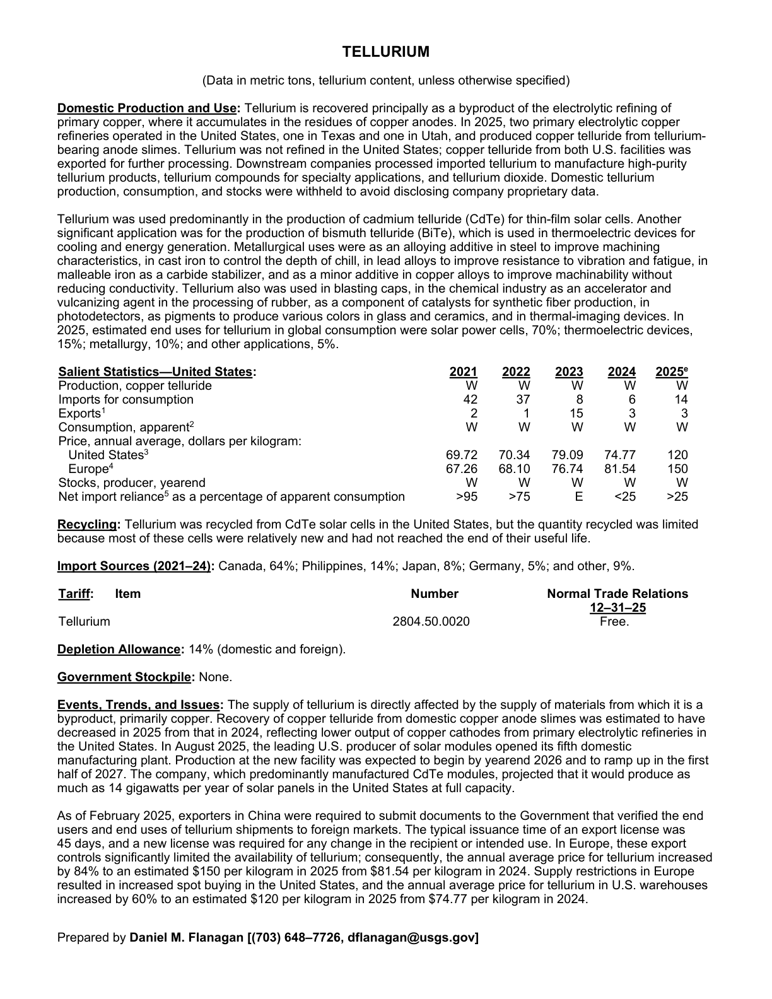
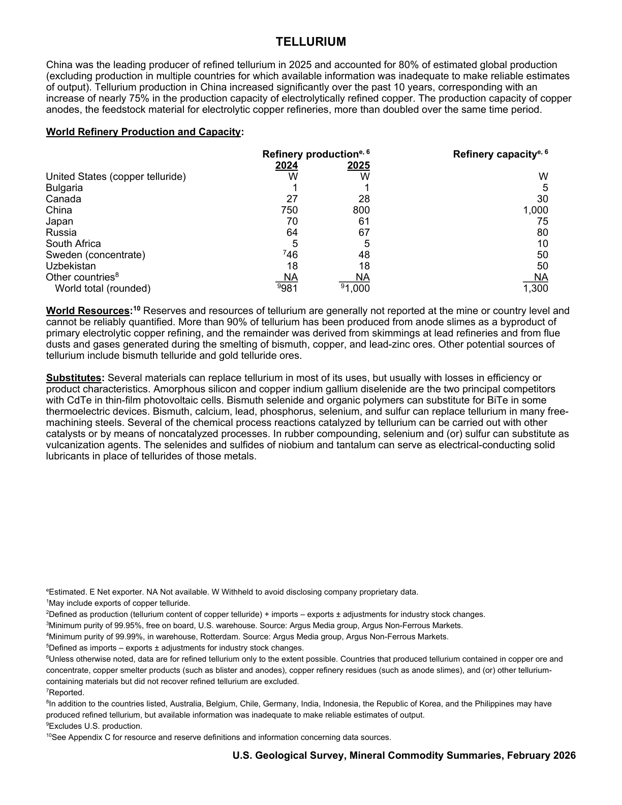

# Audit — Tellurium (tellurium)

- **Source**: <https://pubs.usgs.gov/periodicals/mcs2026/mcs2026-tellurium.pdf>
- **Edition**: MCS 2026 (2026-02)
- **Captured**: 2026-05-19
- **PDF SHA-256**: `9207db697705244b…`
- **Pages**: 2
- **Units note (verbatim)**: (Data in metric tons, tellurium content, unless otherwise specified)

## Latest-year US summary

| field | value |
| --- | --- |
| Mined production (US) | N/A |
| Primary smelting / refinery (US) | N/A |
| Secondary smelting / scrap (US) | N/A |
| Imports for consumption (total) | 14 |
| Exports (total) | 3 |
| Apparent consumption | N/A |
| Price, $ per pound | 120 |
| Net import reliance (% of apparent consumption) | 25 |

## Salient Statistics (US) — full table

| Row | Footnote | 2021 | 2022 | 2023 | 2024 | 2025e |
| --- | --- | ---: | ---: | ---: | ---: | ---: |
| Production, copper telluride |  | W | W | W | W | W |
| Imports for consumption |  | 42 | 37 | 8 | 6 | 14 |
| Exports | 1 | 2 | 1 | 15 | 3 | 3 |
| Consumption, apparent | 2 | W | W | W | W | W |
| United States | 3 | 69.72 | 70.34 | 79.09 | 74.77 | 120 |
| Europe | 4 | 67.26 | 68.10 | 76.74 | 81.54 | 150 |
| Stocks, producer, yearend |  | W | W | W | W | W |
| Net import reliance as a percentage of apparent consumption |  | >95 | >75 | E | <25 | >25 |

## Import Sources (2021-24)

**(all)**
- Canada: 64%
- Philippines: 14%
- Japan: 8%
- Germany: 5%
- other: 9%

## World Refinery Production and Capacity

| country | prev-yr | latest-yr | capacity | reserves | note |
| --- | ---: | ---: | ---: | ---: | --- |
| United States (copper telluride) | W | W | N/A | N/A |  |
| Bulgaria | 1 | 1 | N/A | N/A |  |
| Canada | 27 | 28 | N/A | N/A |  |
| China | 750 | 800 | N/A | N/A |  |
| Japan | 70 | 61 | N/A | N/A |  |
| Russia | 64 | 67 | N/A | N/A |  |
| South Africa | 5 | 5 | N/A | N/A |  |
| Sweden (concentrate) | 46 | 48 | N/A | N/A | footnote 7 |
| Uzbekistan | 18 | 18 | N/A | N/A |  |
| Other countries | NA | NA | N/A | N/A | footnote 8 |
| World total (rounded) | 981 | 1,000 | N/A | N/A | footnote 9 |

## Footnotes (verbatim)

- **1**: May include exports of copper telluride.
- **2**: Defined as production (tellurium content of copper telluride) + imports – exports ± adjustments for industry stock changes.
- **3**: Minimum purity of 99.95%, free on board, U.S. warehouse. Source: Argus Media group, Argus Non-Ferrous Markets.
- **4**: Minimum purity of 99.99%, in warehouse, Rotterdam. Source: Argus Media group, Argus Non-Ferrous Markets.
- **5**: Defined as imports – exports ± adjustments for industry stock changes.
- **6**: Unless otherwise noted, data are for refined tellurium only to the extent possible. Countries that produced tellurium contained in copper ore and concentrate, copper smelter products (such as blister and anodes), copper refinery residues (such as anode slimes), and (or) other tellurium- containing materials but did not recover refined tellurium are excluded.
- **7**: Reported.
- **8**: In addition to the countries listed, Australia, Belgium, Chile, Germany, India, Indonesia, the Republic of Korea, and the Philippines may have produced refined tellurium, but available information was inadequate to make reliable estimates of output.
- **9**: Excludes U.S. production.
- **10**: See Appendix C for resource and reserve definitions and information concerning data sources.
- **e**: Estimated. E Net exporter. NA Not available. W Withheld to avoid disclosing company proprietary data.

## Source page screenshots

### Page 1

### Page 2

