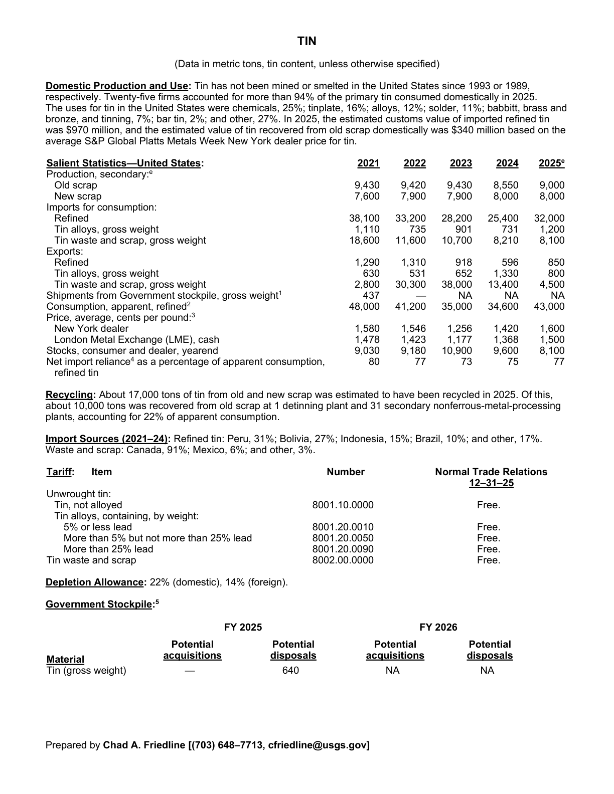
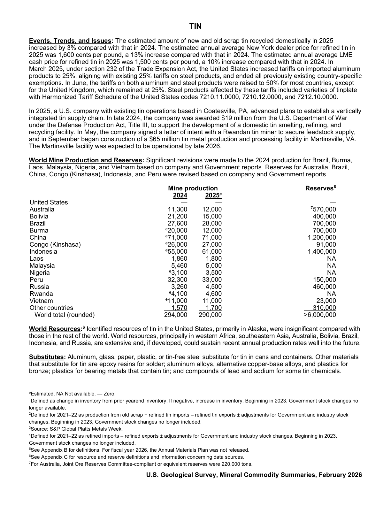

# Audit — Tin (tin)

- **Source**: <https://pubs.usgs.gov/periodicals/mcs2026/mcs2026-tin.pdf>
- **Edition**: MCS 2026 (2026-02)
- **Captured**: 2026-05-19
- **PDF SHA-256**: `659ee022301fcd3e…`
- **Pages**: 2
- **Units note (verbatim)**: 

## Latest-year US summary

| field | value |
| --- | --- |
| Mined production (US) | N/A |
| Primary smelting / refinery (US) | N/A |
| Secondary smelting / scrap (US) | N/A |
| Imports for consumption (total) | 41,300 |
| Exports (total) | 6,150 |
| Apparent consumption | 43,000 |
| Price, $ per pound | 1,600 |
| Net import reliance (% of apparent consumption) | 77 |

## Salient Statistics (US) — full table

_`2025e` = 2025 USGS estimate (preliminary); 2021–2024 are reported actuals._

| Row | Footnote | 2021 | 2022 | 2023 | 2024 | 2025e |
| --- | --- | ---: | ---: | ---: | ---: | ---: |
| Old scrap |  | 9,430 | 9,420 | 9,430 | 8,550 | 9,000 |
| New scrap |  | 7,600 | 7,900 | 7,900 | 8,000 | 8,000 |
| Refined |  | 38,100 | 33,200 | 28,200 | 25,400 | 32,000 |
| Tin alloys, gross weight |  | 1,110 | 735 | 901 | 731 | 1,200 |
| Tin waste and scrap, gross weight |  | 18,600 | 11,600 | 10,700 | 8,210 | 8,100 |
| Refined |  | 1,290 | 1,310 | 918 | 596 | 850 |
| Tin alloys, gross weight |  | 630 | 531 | 652 | 1,330 | 800 |
| Tin waste and scrap, gross weight |  | 2,800 | 30,300 | 38,000 | 13,400 | 4,500 |
| Shipments from Government stockpile, gross weight | 1 | 437 | 0 | NA | NA | NA |
| Consumption, apparent, refined | 2 | 48,000 | 41,200 | 35,000 | 34,600 | 43,000 |
| New York dealer |  | 1,580 | 1,546 | 1,256 | 1,420 | 1,600 |
| London Metal Exchange (LME), cash |  | 1,478 | 1,423 | 1,177 | 1,368 | 1,500 |
| Stocks, consumer and dealer, yearend |  | 9,030 | 9,180 | 10,900 | 9,600 | 8,100 |
| Net import reliance as a percentage of apparent consumption, refined tin |  | 80 | 77 | 73 | 75 | 77 |

## Import Sources (2021-24)

**Refined tin**
- Peru: 31%
- Bolivia: 27%
- Indonesia: 15%
- Brazil: 10%
- other: 17%

**Waste and scrap**
- Canada: 91%
- Mexico: 6%
- other: 3%

## World Mine Production and Reserves

| country | prev-yr | latest-yr | capacity | reserves | note |
| --- | ---: | ---: | ---: | ---: | --- |
| United States | 0 | 0 | N/A | 0 |  |
| Australia | 11,300 | 12,000 | N/A | 570,000 | footnote 7 |
| Bolivia | 21,200 | 15,000 | N/A | 400,000 |  |
| Brazil | 27,600 | 28,000 | N/A | 700,000 |  |
| Burma | 20,000 | 12,000 | N/A | 700,000 |  |
| China | 71,000 | 71,000 | N/A | 1,200,000 |  |
| Congo (Kinshasa) | 26,000 | 27,000 | N/A | 91,000 |  |
| Indonesia | 55,000 | 61,000 | N/A | 1,400,000 |  |
| Laos | 1,860 | 1,800 | N/A | NA |  |
| Malaysia | 5,460 | 5,000 | N/A | NA |  |
| Nigeria | 3,100 | 3,500 | N/A | NA |  |
| Peru | 32,300 | 33,000 | N/A | 150,000 |  |
| Russia | 3,260 | 4,500 | N/A | 460,000 |  |
| Rwanda | 4,100 | 4,600 | N/A | NA |  |
| Vietnam | 11,000 | 11,000 | N/A | 23,000 |  |
| Other countries | 1,570 | 1,700 | N/A | 310,000 |  |
| World total (rounded) | 294,000 | 290,000 | N/A | >6,000,000 |  |

## Footnotes (verbatim)

- **1**: Defined as change in inventory from prior yearend inventory. If negative, increase in inventory. Beginning in 2023, Government stock changes no longer available.
- **2**: Defined for 2021–22 as production from old scrap + refined tin imports – refined tin exports ± adjustments for Government and industry stock changes. Beginning in 2023, Government stock changes no longer included.
- **3**: Source: S&P Global Platts Metals Week.
- **4**: Defined for 2021–22 as refined imports – refined exports ± adjustments for Government and industry stock changes. Beginning in 2023, Government stock changes no longer included.
- **5**: See Appendix B for definitions. For fiscal year 2026, the Annual Materials Plan was not released.
- **6**: See Appendix C for resource and reserve definitions and information concerning data sources.
- **7**: For Australia, Joint Ore Reserves Committee-compliant or equivalent reserves were 220,000 tons.
- **e**: Estimated. NA Not available. — Zero.

## Source page screenshots

### Page 1

### Page 2

