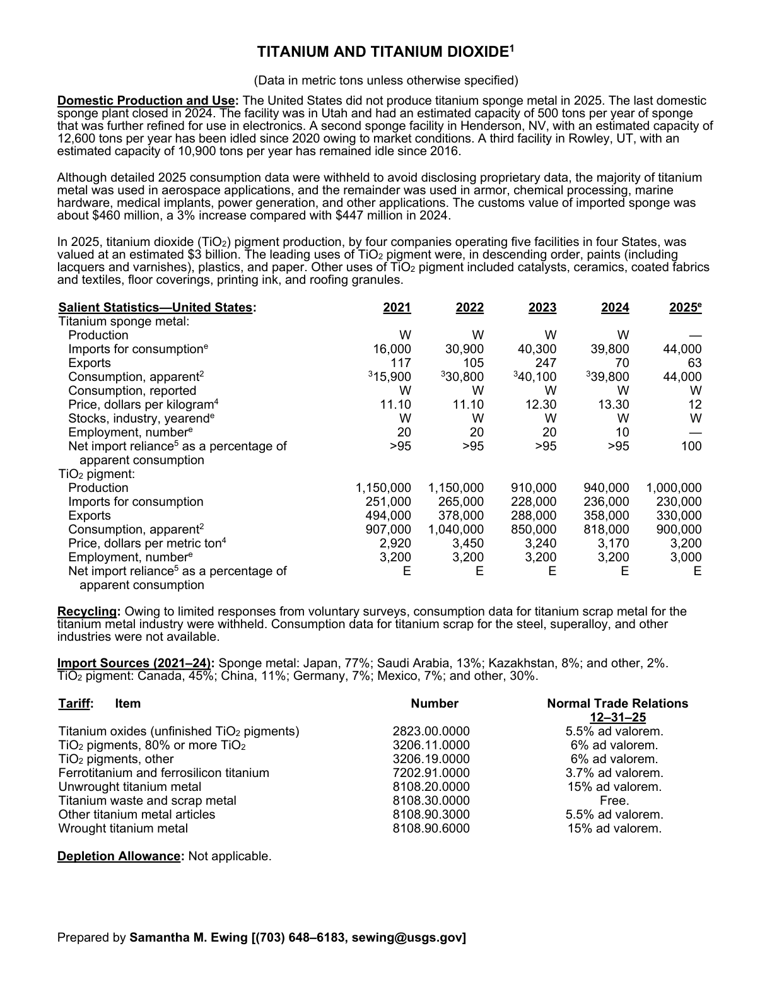
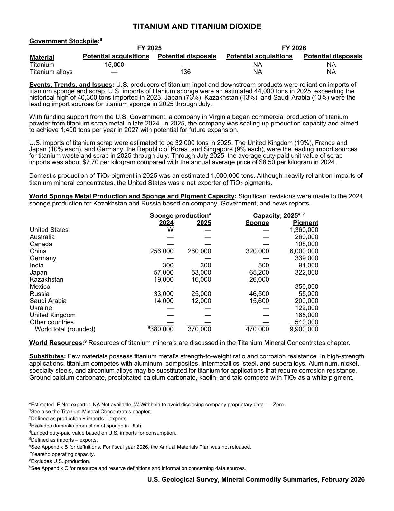

# Audit — Titanium (titanium)

- **Source**: <https://pubs.usgs.gov/periodicals/mcs2026/mcs2026-titanium.pdf>
- **Edition**: MCS 2026 (2026-02)
- **Captured**: 2026-05-19
- **PDF SHA-256**: `c93f5a562e3b3270…`
- **Pages**: 2
- **Units note (verbatim)**: (Data in metric tons unless otherwise specified)

## Latest-year US summary

| field | value |
| --- | --- |
| Mined production (US) | N/A |
| Primary smelting / refinery (US) | N/A |
| Secondary smelting / scrap (US) | N/A |
| Imports for consumption (total) | N/A |
| Exports (total) | N/A |
| Apparent consumption | N/A |
| Price, $ per pound | N/A |
| Net import reliance (% of apparent consumption) | N/A |

## Salient Statistics (US) — full table

_`2025e` = 2025 USGS estimate (preliminary); 2021–2024 are reported actuals._

| Row | Footnote | 2021 | 2022 | 2023 | 2024 | 2025e |
| --- | --- | ---: | ---: | ---: | ---: | ---: |
| Production |  | W | W | W | W | 0 |
| Imports for consumption |  | 16,000 | 30,900 | 40,300 | 39,800 | 44,000 |
| Exports |  | 117 | 105 | 247 | 70 | 63 |
| Consumption, apparent | 2 | 15,900 | 30,800 | 40,100 | 39,800 | 44,000 |
| Consumption, reported |  | W | W | W | W | W |
| Price, dollars per kilogram | 4 | 11.10 | 11.10 | 12.30 | 13.30 | 12 |
| Stocks, industry, yearend |  | W | W | W | W | W |
| Employment, number |  | 20 | 20 | 20 | 10 | 0 |
| Net import reliance as a percentage of apparent consumption |  | >95 | >95 | >95 | >95 | 100 |
| Production |  | 1,150,000 | 1,150,000 | 910,000 | 940,000 | 1,000,000 |
| Imports for consumption |  | 251,000 | 265,000 | 228,000 | 236,000 | 230,000 |
| Exports |  | 494,000 | 378,000 | 288,000 | 358,000 | 330,000 |
| Consumption, apparent | 2 | 907,000 | 1,040,000 | 850,000 | 818,000 | 900,000 |
| Price, dollars per metric ton | 4 | 2,920 | 3,450 | 3,240 | 3,170 | 3,200 |
| Employment, number |  | 3,200 | 3,200 | 3,200 | 3,200 | 3,000 |
| Net import reliance as a percentage of apparent consumption |  | E | E | E | E | E |

## Import Sources (2021-24)

**Sponge metal**
- Japan: 77%
- Saudi Arabia: 13%
- Kazakhstan: 8%
- other: 2%

**TiO pigment**
- Canada: 45%
- China: 11%
- Germany: 7%
- Mexico: 7%
- other: 30%

## World Sponge Metal Production and Sponge and Pigment Capacity

| country | prev-yr | latest-yr | capacity | reserves | note |
| --- | ---: | ---: | ---: | ---: | --- |
| United States | W | 0 | N/A | N/A |  |
| Australia | 0 | 0 | N/A | N/A |  |
| Canada | 0 | 0 | N/A | N/A |  |
| China | 256,000 | 260,000 | N/A | N/A |  |
| Germany | 0 | 0 | N/A | N/A |  |
| India | 300 | 300 | N/A | N/A |  |
| Japan | 57,000 | 53,000 | N/A | N/A |  |
| Kazakhstan | 19,000 | 16,000 | N/A | N/A |  |
| Mexico | 0 | 0 | N/A | N/A |  |
| Russia | 33,000 | 25,000 | N/A | N/A |  |
| Saudi Arabia | 14,000 | 12,000 | N/A | N/A |  |
| Ukraine | 0 | 0 | N/A | N/A |  |
| United Kingdom | 0 | 0 | N/A | N/A |  |
| Other countries | 0 | 0 | N/A | N/A |  |
| World total (rounded) | 380,000 | 370,000 | N/A | N/A | footnote 8 |

## Footnotes (verbatim)

- **1**: See also the Titanium Mineral Concentrates chapter.
- **2**: Defined as production + imports – exports.
- **3**: Excludes domestic production of sponge in Utah.
- **4**: Landed duty-paid value based on U.S. imports for consumption.
- **5**: Defined as imports – exports.
- **6**: See Appendix B for definitions. For fiscal year 2026, the Annual Materials Plan was not released.
- **7**: Yearend operating capacity.
- **8**: Excludes U.S. production.
- **9**: See Appendix C for resource and reserve definitions and information concerning data sources.
- **e**: Estimated. E Net exporter. NA Not available. W Withheld to avoid disclosing company proprietary data. — Zero.

## Source page screenshots

### Page 1

### Page 2

