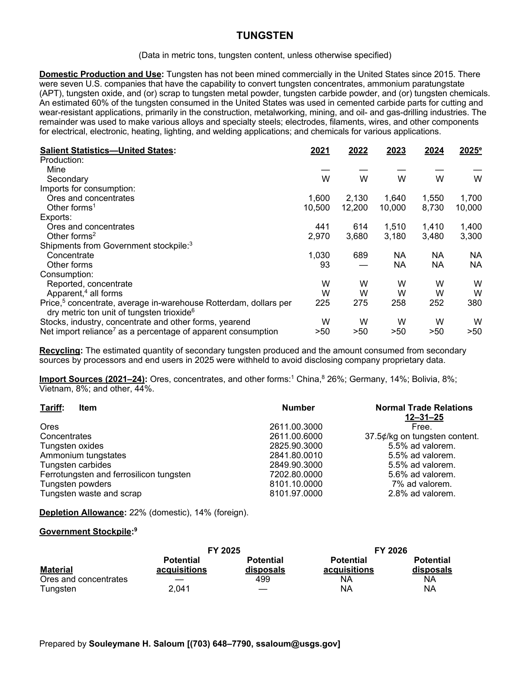
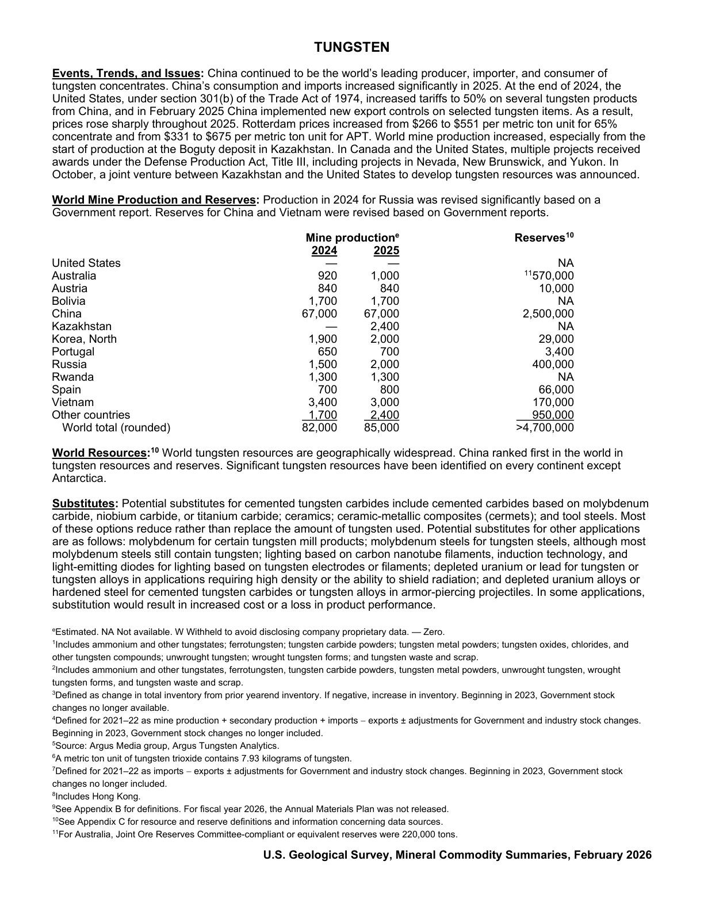

# Audit — Tungsten (tungsten)

- **Source**: <https://pubs.usgs.gov/periodicals/mcs2026/mcs2026-tungsten.pdf>
- **Edition**: MCS 2026 (2026-02)
- **Captured**: 2026-05-18
- **PDF SHA-256**: `c33271f3529cc546…`
- **Pages**: 2
- **Units note (verbatim)**: (Data in metric tons, tungsten content, unless otherwise specified)

## Latest-year US summary

| field | value |
| --- | --- |
| Mined production (US) | 0 |
| Primary smelting / refinery (US) | _Not available_ |
| Secondary smelting / scrap (US) | _Not available_ |
| Imports for consumption (total) | 11,700 |
| Exports (total) | 4,700 |
| Apparent consumption | _Not available_ |
| Price, $ per pound | 380 |
| Net import reliance (% of apparent consumption) | 50 |

## Salient Statistics (US) — full table

| Row | Footnote | 2021 | 2022 | 2023 | 2024 | 2025e |
| --- | --- | ---: | ---: | ---: | ---: | ---: |
| Mine |  | 0 | 0 | 0 | 0 | 0 |
| Secondary |  | _Not available_ | _Not available_ | _Not available_ | _Not available_ | _Not available_ |
| Ores and concentrates |  | 1,600 | 2,130 | 1,640 | 1,550 | 1,700 |
| Other forms | 1 | 10,500 | 12,200 | 10,000 | 8,730 | 10,000 |
| Ores and concentrates |  | 441 | 614 | 1,510 | 1,410 | 1,400 |
| Other forms | 2 | 2,970 | 3,680 | 3,180 | 3,480 | 3,300 |
| Concentrate |  | 1,030 | 689 | _Not available_ | _Not available_ | _Not available_ |
| Other forms |  | 93 | 0 | _Not available_ | _Not available_ | _Not available_ |
| Reported, concentrate |  | _Not available_ | _Not available_ | _Not available_ | _Not available_ | _Not available_ |
| Apparent, all forms |  | _Not available_ | _Not available_ | _Not available_ | _Not available_ | _Not available_ |
| Price, concentrate, average in-warehouse Rotterdam, dollars per dry metric ton unit of tungsten trioxide | 6 | 225 | 275 | 258 | 252 | 380 |
| Stocks, industry, concentrate and other forms, yearend |  | _Not available_ | _Not available_ | _Not available_ | _Not available_ | _Not available_ |
| Net import reliance as a percentage of apparent consumption |  | 50 | 50 | 50 | 50 | 50 |

## Import Sources (2021-24)

**Ores, concentrates, and other forms**
- China: 26%
- Germany: 14%
- Bolivia: 8%
- Vietnam: 8%
- other: 44%

## World Mine Production and Reserves

| country | prev-yr | latest-yr | capacity | reserves | note |
| --- | ---: | ---: | ---: | ---: | --- |
| United States | 0 | 0 | _Not available_ | _Not available_ |  |
| Australia | 920 | 1,000 | _Not available_ | 570,000 | footnote 11 |
| Austria | 840 | 840 | _Not available_ | 10,000 |  |
| Bolivia | 1,700 | 1,700 | _Not available_ | _Not available_ |  |
| China | 67,000 | 67,000 | _Not available_ | 2,500,000 |  |
| Kazakhstan | 0 | 2,400 | _Not available_ | _Not available_ |  |
| Korea, North | 1,900 | 2,000 | _Not available_ | 29,000 |  |
| Portugal | 650 | 700 | _Not available_ | 3,400 |  |
| Russia | 1,500 | 2,000 | _Not available_ | 400,000 |  |
| Rwanda | 1,300 | 1,300 | _Not available_ | _Not available_ |  |
| Spain | 700 | 800 | _Not available_ | 66,000 |  |
| Vietnam | 3,400 | 3,000 | _Not available_ | 170,000 |  |
| Other countries | 1,700 | 2,400 | _Not available_ | 950,000 |  |
| World total (rounded) | 82,000 | 85,000 | _Not available_ | 4,700,000 |  |

## Footnotes (verbatim)

- **1**: Includes ammonium and other tungstates; ferrotungsten; tungsten carbide powders; tungsten metal powders; tungsten oxides, chlorides, and other tungsten compounds; unwrought tungsten; wrought tungsten forms; and tungsten waste and scrap.
- **2**: Includes ammonium and other tungstates, ferrotungsten, tungsten carbide powders, tungsten metal powders, unwrought tungsten, wrought tungsten forms, and tungsten waste and scrap.
- **3**: Defined as change in total inventory from prior yearend inventory. If negative, increase in inventory. Beginning in 2023, Government stock changes no longer available.
- **4**: Defined for 2021–22 as mine production + secondary production + imports − exports ± adjustments for Government and industry stock changes. Beginning in 2023, Government stock changes no longer included.
- **5**: Source: Argus Media group, Argus Tungsten Analytics.
- **6**: A metric ton unit of tungsten trioxide contains 7.93 kilograms of tungsten.
- **7**: Defined for 2021–22 as imports − exports ± adjustments for Government and industry stock changes. Beginning in 2023, Government stock changes no longer included.
- **8**: Includes Hong Kong.
- **9**: See Appendix B for definitions. For fiscal year 2026, the Annual Materials Plan was not released.
- **10**: See Appendix C for resource and reserve definitions and information concerning data sources.
- **11**: For Australia, Joint Ore Reserves Committee-compliant or equivalent reserves were 220,000 tons.
- **e**: Estimated. NA Not available. W Withheld to avoid disclosing company proprietary data. — Zero.

## Source page screenshots

### Page 1

### Page 2

