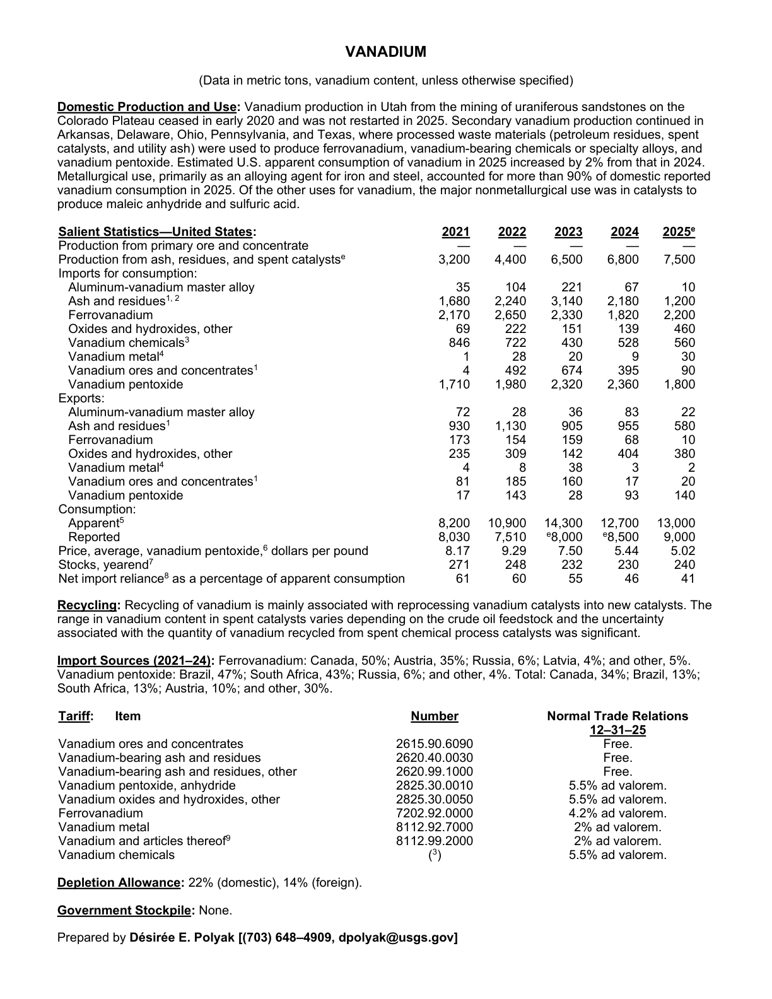
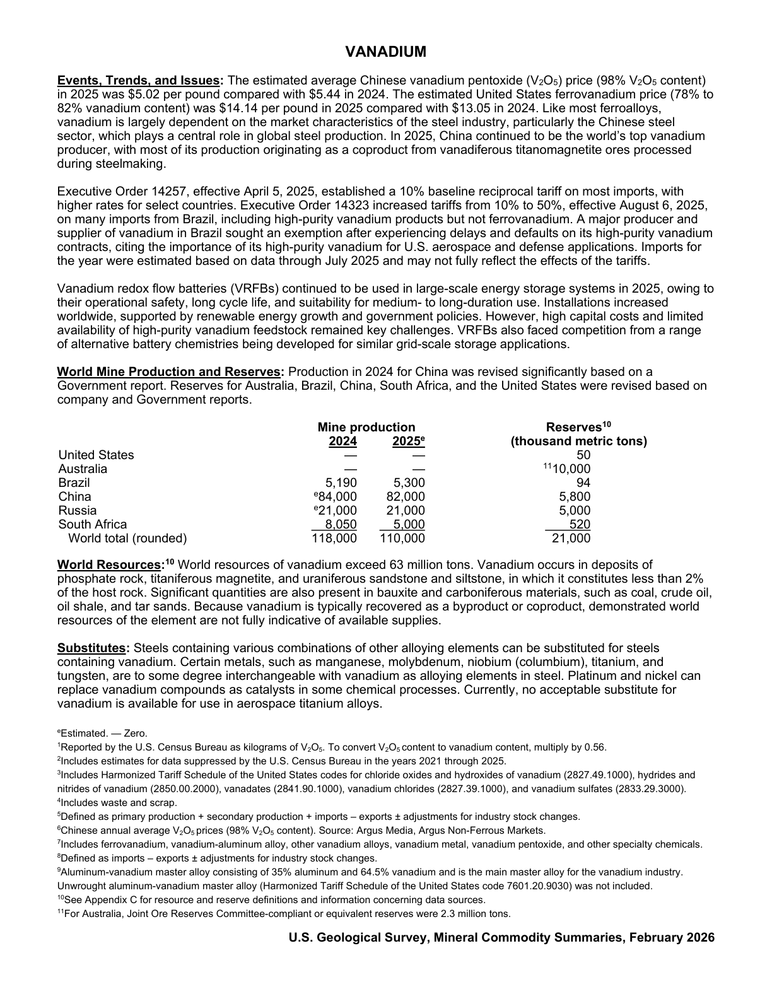

# Audit — Vanadium (vanadium)

- **Source**: <https://pubs.usgs.gov/periodicals/mcs2026/mcs2026-vanadium.pdf>
- **Edition**: MCS 2026 (2026-02)
- **Captured**: 2026-05-19
- **PDF SHA-256**: `8ffc21c8a35caeec…`
- **Pages**: 2
- **Units note (verbatim)**: (Data in metric tons, vanadium content, unless otherwise specified)

## Latest-year US summary

| field | value |
| --- | --- |
| Mined production (US) | N/A |
| Primary smelting / refinery (US) | 0 |
| Secondary smelting / scrap (US) | N/A |
| Imports for consumption (total) | 6,350 |
| Exports (total) | 1,154 |
| Apparent consumption | 13,000 |
| Price, $ per pound | 5.02 |
| Net import reliance (% of apparent consumption) | 41 |

## Salient Statistics (US) — full table

_`2025e` = 2025 USGS estimate (preliminary); 2021–2024 are reported actuals._

| Row | Footnote | 2021 | 2022 | 2023 | 2024 | 2025e |
| --- | --- | ---: | ---: | ---: | ---: | ---: |
| Production from primary ore and concentrate |  | 0 | 0 | 0 | 0 | 0 |
| Production from ash, residues, and spent catalysts |  | 3,200 | 4,400 | 6,500 | 6,800 | 7,500 |
| Aluminum-vanadium master alloy |  | 35 | 104 | 221 | 67 | 10 |
| Ash and residues |  | 1,680 | 2,240 | 3,140 | 2,180 | 1,200 |
| Ferrovanadium |  | 2,170 | 2,650 | 2,330 | 1,820 | 2,200 |
| Oxides and hydroxides, other |  | 69 | 222 | 151 | 139 | 460 |
| Vanadium chemicals | 3 | 846 | 722 | 430 | 528 | 560 |
| Vanadium metal | 4 | 1 | 28 | 20 | 9 | 30 |
| Vanadium ores and concentrates | 1 | 4 | 492 | 674 | 395 | 90 |
| Vanadium pentoxide |  | 1,710 | 1,980 | 2,320 | 2,360 | 1,800 |
| Aluminum-vanadium master alloy |  | 72 | 28 | 36 | 83 | 22 |
| Ash and residues | 1 | 930 | 1,130 | 905 | 955 | 580 |
| Ferrovanadium |  | 173 | 154 | 159 | 68 | 10 |
| Oxides and hydroxides, other |  | 235 | 309 | 142 | 404 | 380 |
| Vanadium metal | 4 | 4 | 8 | 38 | 3 | 2 |
| Vanadium ores and concentrates | 1 | 81 | 185 | 160 | 17 | 20 |
| Vanadium pentoxide |  | 17 | 143 | 28 | 93 | 140 |
| Apparent | 5 | 8,200 | 10,900 | 14,300 | 12,700 | 13,000 |
| Reported |  | 8,030 | 7,510 | 8,000 | 8,500 | 9,000 |
| Price, average, vanadium pentoxide, dollars per pound |  | 8.17 | 9.29 | 7.50 | 5.44 | 5.02 |
| Stocks, yearend | 7 | 271 | 248 | 232 | 230 | 240 |
| Net import reliance as a percentage of apparent consumption |  | 61 | 60 | 55 | 46 | 41 |

## Import Sources (2021-24)

**Ferrovanadium**
- Canada: 50%
- Austria: 35%
- Russia: 6%
- Latvia: 4%
- other: 5%

**Vanadium pentoxide**
- Brazil: 47%
- South Africa: 43%
- Russia: 6%
- other: 4%

**Total**
- Canada: 34%
- Brazil: 13%
- South Africa: 13%
- Austria: 10%
- other: 30%

## World Mine Production and Reserves

| country | prev-yr | latest-yr | capacity | reserves | note |
| --- | ---: | ---: | ---: | ---: | --- |
| United States | 0 | 0 | N/A | 50 |  |
| Australia | 0 | 0 | N/A | 10,000 | footnote 11 |
| Brazil | 5,190 | 5,300 | N/A | 94 |  |
| China | 84,000 | 82,000 | N/A | 5,800 |  |
| Russia | 21,000 | 21,000 | N/A | 5,000 |  |
| South Africa | 8,050 | 5,000 | N/A | 520 |  |
| World total (rounded) | 118,000 | 110,000 | N/A | 21,000 |  |

## Footnotes (verbatim)

- **1**: Reported by the U.S. Census Bureau as kilograms of VO. To convert VOcontent to vanadium content, multiply by 0.56.
- **2**: Includes estimates for data suppressed by the U.S. Census Bureau in the years 2021 through 2025.
- **3**: Includes Harmonized Tariff Schedule of the United States codes for chloride oxides and hydroxides of vanadium (2827.49.1000), hydrides and nitrides of vanadium (2850.00.2000), vanadates (2841.90.1000), vanadium chlorides (2827.39.1000), and vanadium sulfates (2833.29.3000).
- **4**: Includes waste and scrap.
- **5**: Defined as primary production + secondary production + imports – exports ± adjustments for industry stock changes.
- **6**: Chinese annual average VOprices (98% VO content). Source: Argus Media, Argus Non-Ferrous Markets.
- **7**: Includes ferrovanadium, vanadium-aluminum alloy, other vanadium alloys, vanadium metal, vanadium pentoxide, and other specialty chemicals.
- **8**: Defined as imports – exports ± adjustments for industry stock changes.
- **9**: Aluminum-vanadium master alloy consisting of 35% aluminum and 64.5% vanadium and is the main master alloy for the vanadium industry. Unwrought aluminum-vanadium master alloy (Harmonized Tariff Schedule of the United States code 7601.20.9030) was not included.
- **10**: See Appendix C for resource and reserve definitions and information concerning data sources.
- **11**: For Australia, Joint Ore Reserves Committee-compliant or equivalent reserves were 2.3 million tons.
- **e**: Estimated. — Zero.

## Source page screenshots

### Page 1

### Page 2

