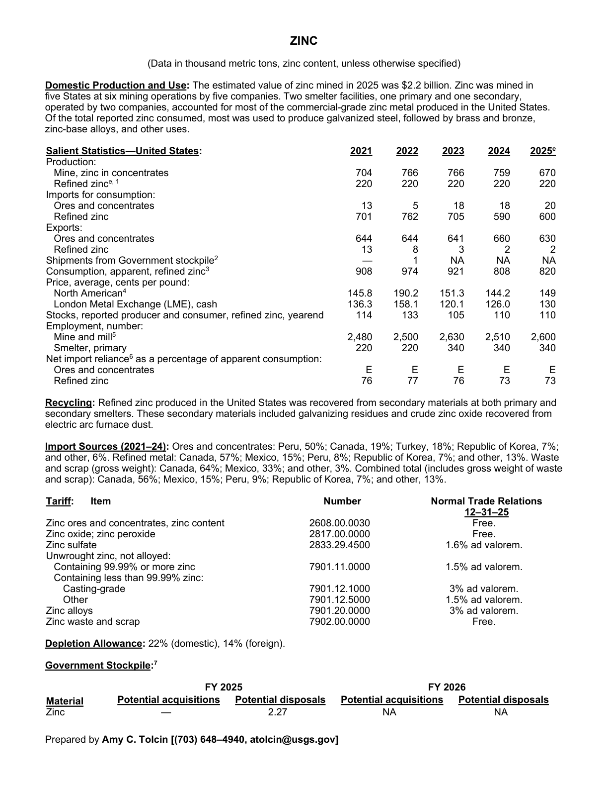
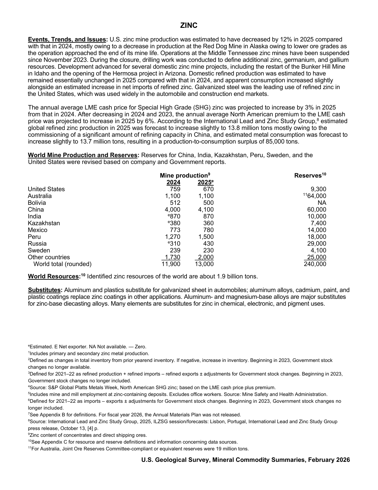

# Audit — Zinc (zinc)

- **Source**: <https://pubs.usgs.gov/periodicals/mcs2026/mcs2026-zinc.pdf>
- **Edition**: MCS 2026 (2026-02)
- **Captured**: 2026-05-19
- **PDF SHA-256**: `81f42c706a239392…`
- **Pages**: 2
- **Units note (verbatim)**: (Data in thousand metric tons, zinc content, unless otherwise specified)

## Latest-year US summary

| field | value |
| --- | --- |
| Mined production (US) | 670 |
| Primary smelting / refinery (US) | 220 |
| Secondary smelting / scrap (US) | N/A |
| Imports for consumption (total) | 620 |
| Exports (total) | 632 |
| Apparent consumption | 820 |
| Price, $ per pound | 149 |
| Net import reliance (% of apparent consumption) | N/A |

## Salient Statistics (US) — full table

| Row | Footnote | 2021 | 2022 | 2023 | 2024 | 2025e |
| --- | --- | ---: | ---: | ---: | ---: | ---: |
| Mine, zinc in concentrates |  | 704 | 766 | 766 | 759 | 670 |
| Refined zinc |  | 220 | 220 | 220 | 220 | 220 |
| Ores and concentrates |  | 13 | 5 | 18 | 18 | 20 |
| Refined zinc |  | 701 | 762 | 705 | 590 | 600 |
| Ores and concentrates |  | 644 | 644 | 641 | 660 | 630 |
| Refined zinc |  | 13 | 8 | 3 | 2 | 2 |
| Shipments from Government stockpile | 2 | 0 | 1 | NA | NA | NA |
| Consumption, apparent, refined zinc | 3 | 908 | 974 | 921 | 808 | 820 |
| North American | 4 | 145.80 | 190.20 | 151.30 | 144.20 | 149 |
| London Metal Exchange (LME), cash |  | 136.30 | 158.10 | 120.10 | 126 | 130 |
| Stocks, reported producer and consumer, refined zinc, yearend |  | 114 | 133 | 105 | 110 | 110 |
| Mine and mill | 5 | 2,480 | 2,500 | 2,630 | 2,510 | 2,600 |
| Smelter, primary |  | 220 | 220 | 340 | 340 | 340 |
| Ores and concentrates |  | E | E | E | E | E |
| Refined zinc |  | 76 | 77 | 76 | 73 | 73 |

## Import Sources (2021-24)

**Ores and concentrates**
- Peru: 50%
- Canada: 19%
- Turkey: 18%
- Republic of Korea: 7%
- other: 6%

**Refined metal**
- Canada: 57%
- Mexico: 15%
- Peru: 8%
- Republic of Korea: 7%
- other: 13%

**Waste and scrap (gross weight)**
- Canada: 64%
- Mexico: 33%
- other: 3%

**Combined total (includes gross weight of waste and scrap)**
- Canada: 56%
- Mexico: 15%
- Peru: 9%
- Republic of Korea: 7%
- other: 13%

## World Mine Production and Reserves

| country | prev-yr | latest-yr | capacity | reserves | note |
| --- | ---: | ---: | ---: | ---: | --- |
| United States | 759 | 670 | N/A | 9,300 |  |
| Australia | 1,100 | 1,100 | N/A | 64,000 | footnote 11 |
| Bolivia | 512 | 500 | N/A | NA |  |
| China | 4,000 | 4,100 | N/A | 60,000 |  |
| India | 870 | 870 | N/A | 10,000 |  |
| Kazakhstan | 380 | 360 | N/A | 7,400 |  |
| Mexico | 773 | 780 | N/A | 14,000 |  |
| Peru | 1,270 | 1,500 | N/A | 18,000 |  |
| Russia | 310 | 430 | N/A | 29,000 |  |
| Sweden | 239 | 230 | N/A | 4,100 |  |
| Other countries | 1,730 | 2,000 | N/A | 25,000 |  |
| World total (rounded) | 11,900 | 13,000 | N/A | 240,000 |  |

## Footnotes (verbatim)

- **1**: Includes primary and secondary zinc metal production.
- **2**: Defined as changes in total inventory from prior yearend inventory. If negative, increase in inventory. Beginning in 2023, Government stock changes no longer available.
- **3**: Defined for 2021–22 as refined production + refined imports – refined exports ± adjustments for Government stock changes. Beginning in 2023, Government stock changes no longer included.
- **4**: Source: S&P Global Platts Metals Week, North American SHG zinc; based on the LME cash price plus premium.
- **5**: Includes mine and mill employment at zinc-containing deposits. Excludes office workers. Source: Mine Safety and Health Administration.
- **6**: Defined for 2021–22 as imports – exports ± adjustments for Government stock changes. Beginning in 2023, Government stock changes no longer included.
- **7**: See Appendix B for definitions. For fiscal year 2026, the Annual Materials Plan was not released.
- **8**: Source: International Lead and Zinc Study Group, 2025, ILZSG session/forecasts: Lisbon, Portugal, International Lead and Zinc Study Group press release, October 13, [4] p.
- **9**: Zinc content of concentrates and direct shipping ores.
- **10**: See Appendix C for resource and reserve definitions and information concerning data sources.
- **11**: For Australia, Joint Ore Reserves Committee-compliant or equivalent reserves were 19 million tons.
- **e**: Estimated. E Net exporter. NA Not available. — Zero.

## Source page screenshots

### Page 1

### Page 2

