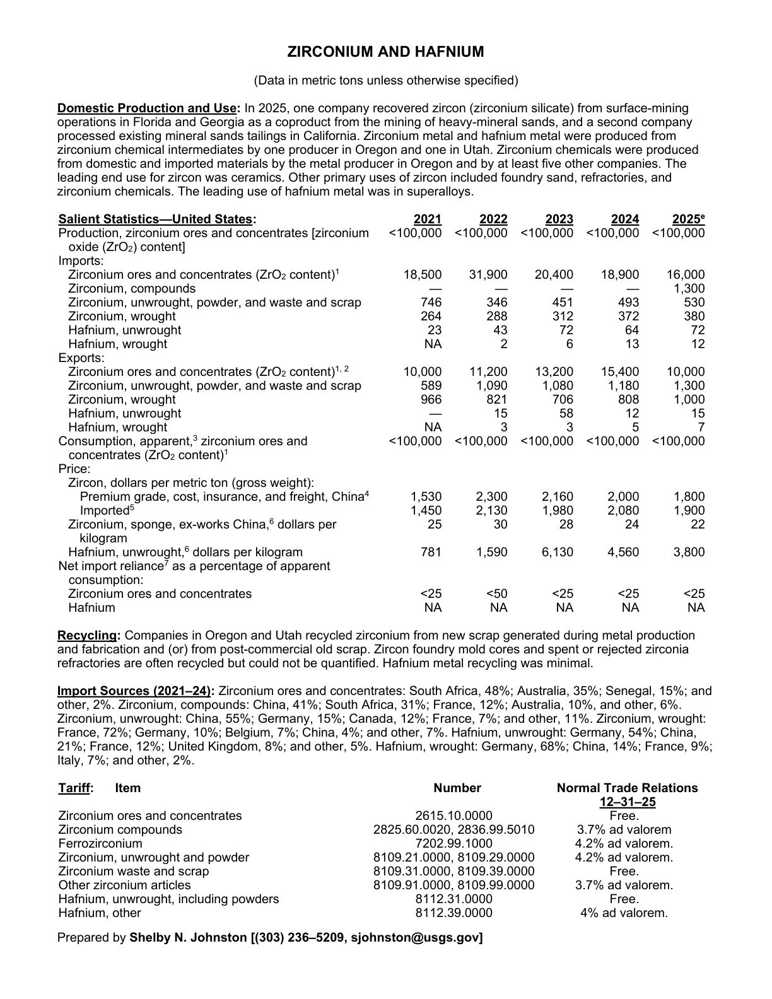
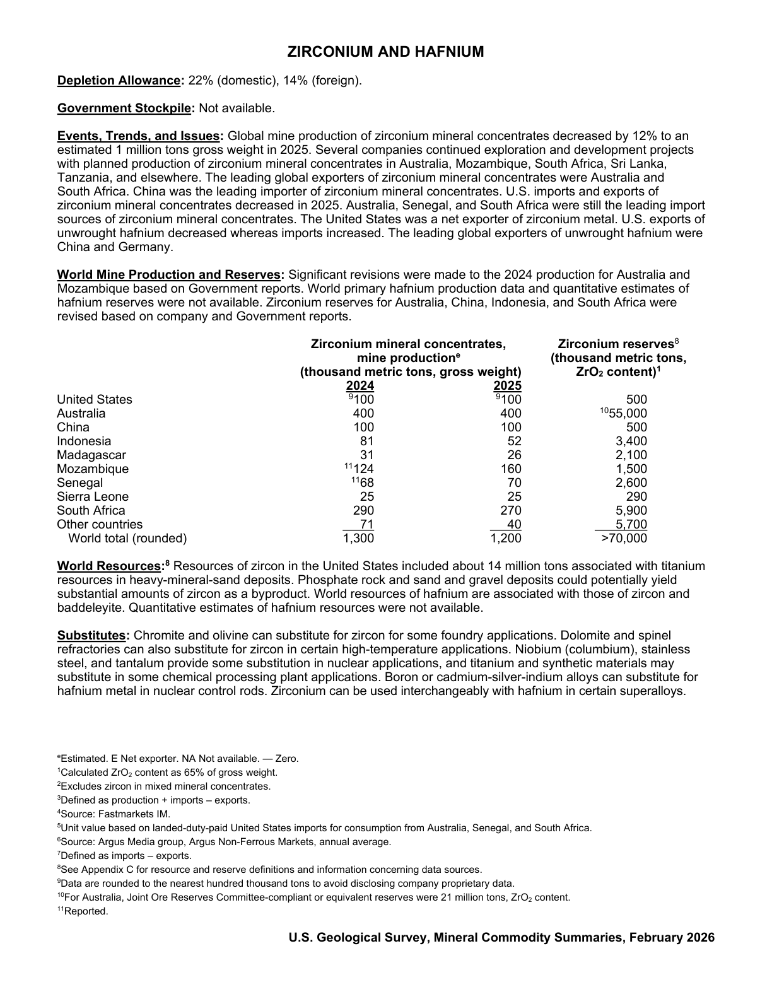

# Audit — Zirconium and hafnium (grouped) (zirconium-and-hafnium)

- **Source**: <https://pubs.usgs.gov/periodicals/mcs2026/mcs2026-zirconium-hafnium.pdf>
- **Edition**: MCS 2026 (2026-02)
- **Captured**: 2026-05-19
- **PDF SHA-256**: `6a1196f46b40d676…`
- **Pages**: 2
- **Units note (verbatim)**: (Data in metric tons unless otherwise specified)

## Latest-year US summary

| field | value |
| --- | --- |
| Mined production (US) | N/A |
| Primary smelting / refinery (US) | N/A |
| Secondary smelting / scrap (US) | N/A |
| Imports for consumption (total) | 18,294 |
| Exports (total) | 12,322 |
| Apparent consumption | 100,000 |
| Price, $ per pound | 1,800 |
| Net import reliance (% of apparent consumption) | N/A |

## Salient Statistics (US) — full table

_`2025e` = 2025 USGS estimate (preliminary); 2021–2024 are reported actuals._

| Row | Footnote | 2021 | 2022 | 2023 | 2024 | 2025e |
| --- | --- | ---: | ---: | ---: | ---: | ---: |
| Production, zirconium ores and concentrates [zirconium oxide (ZrO) content] |  | <100,000 | <100,000 | <100,000 | <100,000 | <100,000 |
| Zirconium ores and concentrates (ZrO content) | 1 | 18,500 | 31,900 | 20,400 | 18,900 | 16,000 |
| Zirconium, compounds |  | 0 | 0 | 0 | 0 | 1,300 |
| Zirconium, unwrought, powder, and waste and scrap |  | 746 | 346 | 451 | 493 | 530 |
| Zirconium, wrought |  | 264 | 288 | 312 | 372 | 380 |
| Hafnium, unwrought |  | 23 | 43 | 72 | 64 | 72 |
| Hafnium, wrought |  | NA | 2 | 6 | 13 | 12 |
| Zirconium ores and concentrates (ZrO content) |  | 10,000 | 11,200 | 13,200 | 15,400 | 10,000 |
| Zirconium, unwrought, powder, and waste and scrap |  | 589 | 1,090 | 1,080 | 1,180 | 1,300 |
| Zirconium, wrought |  | 966 | 821 | 706 | 808 | 1,000 |
| Hafnium, unwrought |  | 0 | 15 | 58 | 12 | 15 |
| Hafnium, wrought |  | NA | 3 | 3 | 5 | 7 |
| Consumption, apparent, zirconium ores and concentrates (ZrO content) | 1 | <100,000 | <100,000 | <100,000 | <100,000 | <100,000 |
| Premium grade, cost, insurance, and freight, China | 4 | 1,530 | 2,300 | 2,160 | 2,000 | 1,800 |
| Imported | 5 | 1,450 | 2,130 | 1,980 | 2,080 | 1,900 |
| Zirconium, sponge, ex-works China, dollars per kilogram |  | 25 | 30 | 28 | 24 | 22 |
| Hafnium, unwrought, dollars per kilogram |  | 781 | 1,590 | 6,130 | 4,560 | 3,800 |
| Zirconium ores and concentrates |  | <25 | <50 | <25 | <25 | <25 |
| Hafnium |  | NA | NA | NA | NA | NA |

## Import Sources (2021-24)

**Zirconium ores and concentrates**
- South Africa: 48%
- Australia: 35%
- Senegal: 15%
- other: 2%

**Zirconium, compounds**
- China: 41%
- South Africa: 31%
- France: 12%
- Australia: 10%

**Zirconium, unwrought**
- China: 55%
- Germany: 15%
- Canada: 12%
- France: 7%
- other: 11%

**Zirconium, wrought**
- France: 72%
- Germany: 10%
- Belgium: 7%
- China: 4%
- other: 7%

**Hafnium, unwrought**
- Germany: 54%
- China: 21%
- France: 12%
- United Kingdom: 8%
- other: 5%

**Hafnium, wrought**
- Germany: 68%
- China: 14%
- France: 9%
- Italy: 7%
- other: 2%

## World Mine Production and Reserves

| country | prev-yr | latest-yr | capacity | reserves | note |
| --- | ---: | ---: | ---: | ---: | --- |
| United States | 100 | 100 | N/A | N/A | footnote 9 |
| Australia | 400 | 400 | N/A | N/A | footnote 10 |
| China | 100 | 100 | N/A | N/A |  |
| Indonesia | 81 | 52 | N/A | N/A |  |
| Madagascar | 31 | 26 | N/A | N/A |  |
| Mozambique | 124 | 160 | N/A | N/A | footnote 11 |
| Senegal | 68 | 70 | N/A | N/A | footnote 11 |
| Sierra Leone | 25 | 25 | N/A | N/A |  |
| South Africa | 290 | 270 | N/A | N/A |  |
| Other countries | 71 | 40 | N/A | N/A |  |
| World total (rounded) | 1,300 | 1,200 | N/A | N/A |  |

## Footnotes (verbatim)

- **1**: Calculated ZrO content as 65% of gross weight.
- **2**: Excludes zircon in mixed mineral concentrates.
- **3**: Defined as production + imports – exports.
- **4**: Source: Fastmarkets IM.
- **5**: Unit value based on landed-duty-paid United States imports for consumption from Australia, Senegal, and South Africa.
- **6**: Source: Argus Media group, Argus Non-Ferrous Markets, annual average.
- **7**: Defined as imports – exports.
- **8**: See Appendix C for resource and reserve definitions and information concerning data sources.
- **9**: Data are rounded to the nearest hundred thousand tons to avoid disclosing company proprietary data.
- **10**: For Australia, Joint Ore Reserves Committee-compliant or equivalent reserves were 21 million tons, ZrO content.
- **11**: Reported.
- **e**: Estimated. E Net exporter. NA Not available. — Zero.

## Source page screenshots

### Page 1

### Page 2

